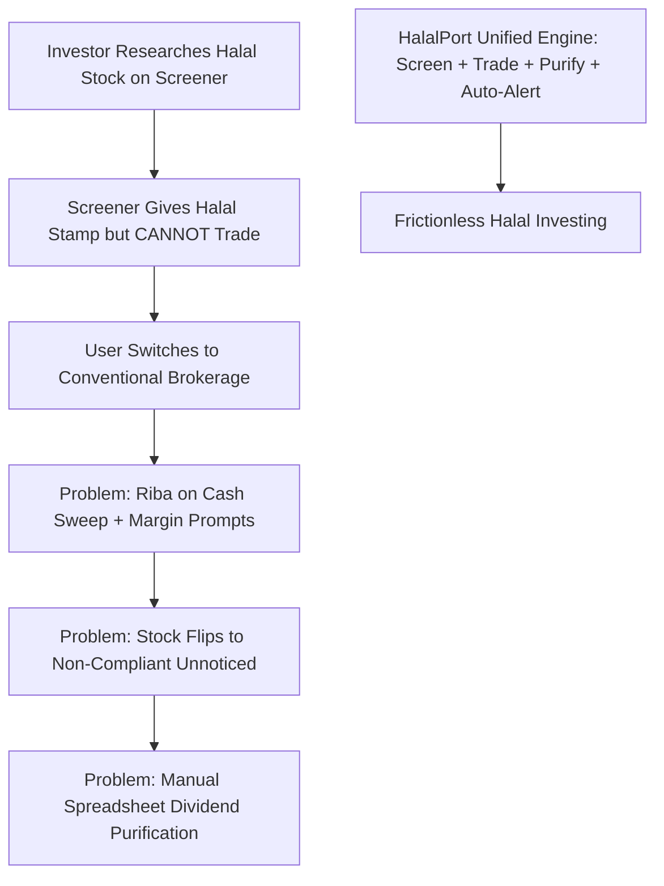
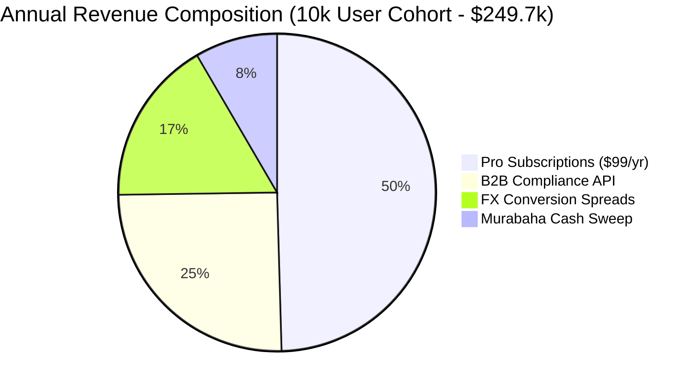
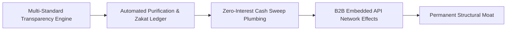
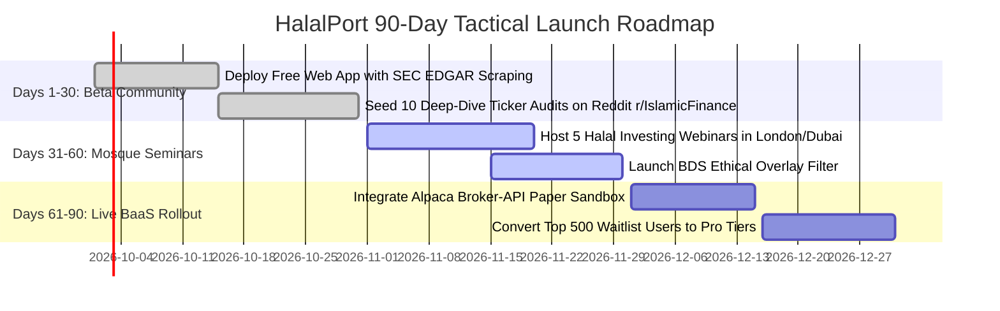

<div class="sec-head">
<span class="chip chip-kind">Gap Blueprint</span>
<span class="chip">Section 4 of 14</span>
<span class="chip">5,292 words</span>
<span class="chip">17 cited sources</span>
</div>


<a id="s4-1" aria-hidden="true"></a>

## `4.1` Gap Definition & Executive Thesis

**Precise Formulation:** The global Islamic wealth and fund management sector has expanded to over **$308 billion in assets**, embedded within a **$5.98 trillion Islamic finance ecosystem** [2025](https://www.lseg.com/en/data-analytics/islamic-finance/islamic-market-intelligence/islamic-finance-development-report-2025). However, modern Muslim retail investors face a severe structural disconnect in capital markets: the market is split into **standalone screening/research tools (Zoya, Musaffa)** that diagnose halal compliance but cannot execute trades, and **automated robo-advisors (Wahed Invest)** that manage pre-packaged ETF baskets but prohibit self-directed equity investing [2026](https://www.halalwallet.us/compare/wahed-invest-vs-zoya). To invest in an individual stock, an investor must manually look up a ticker in a screening app, verify compliance ratios, switch over to a conventional brokerage account (Interactive Brokers, Charles Schwab, Robinhood), execute the trade, manually track quarterly financial ratio drift, calculate dividend purification percentages on spreadsheets, and manage non-permissible interest earned on uninvested cash sweeps.

**The Solution — HalalPort:** An integrated, multi-methodology **All-in-One Halal Investment Platform & Brokerage** that natively unites real-time Shariah screening, self-directed zero-commission trading execution, continuous portfolio status-drift monitoring, automated dividend purification, and annual Zakat calculations within a single, unified application. HalalPort eliminates "screener-to-broker" friction while resolving scholar trust deficits by allowing investors to toggle dynamically between recognized global standards (AAOIFI Standard No. 21, S&P Shariah, Dow Jones Islamic Market, and Securities Commission Malaysia), backed by Shariah-compliant idle cash management.

### `4.1.1` Systems Thinking: First-, Second-, and Third-Order Implications

* **First-Order Implications (Direct & Immediate Impact):**
  - Muslim retail investors execute fractional halal equity and ETF trades with zero commission in under 30 seconds directly from their screening screen, eliminating the awkward toggle between Zoya and external brokerages.
  - Manual dividend purification calculations on spreadsheets drop to zero; the platform automatically computes and deducts the exact charitable purification fraction upon every dividend payout.
  - Uninvested idle cash balances cease generating unlawful *Riba*, swept automatically into certified Shariah interbank Murabaha facilities.

* **Second-Order Implications (Market & Ecosystem Repercussions):**
  - *User Churn for Standalone Screeners:* Pure-play research apps (Zoya, Musaffa) face customer churn if they cannot offer execution; they are forced to either acquire brokerage licenses or become pure B2B data providers to HalalPort.
  - *Conventional Brokerage Asset Outflows:* Mainstream platforms (Robinhood, Interactive Brokers, Trading 212) experience deposit outflows as affluent Muslim diaspora investors transfer balances to a platform with native swap-free cash management.
  - *Pressure on Screening Standardization:* The ability of retail investors to toggle between AAOIFI (30%) and S&P (33%) side-by-side shines an uncomfortable public spotlight on methodological divergence, forcing standard-setting bodies (AAOIFI, IFSB) to accelerate harmonization talks.

* **Third-Order Implications (Systemic & Macroeconomic Transformations):**
  - *Massive Expansion in OIC Retail Equity Participation:* Retail stock market participation in Muslim-majority nations (historically <3% of the adult population compared to 58% in the United States) dramatically expands, funneling dormant domestic bank savings into productive corporate equity.
  - *Faith-Based Retail Shareholder Activism:* Coordinated voting blocks of retail Muslim shareholders begin filing AGM shareholder resolutions demanding that public corporations (Apple, Tesla, Microsoft) clean up their balance-sheet debt ratios to avoid falling out of global Shariah indices.
  - *Capital Reallocation Toward Low-Debt Corporate Balance Sheets:* Massive capital inflows into Shariah-compliant equities incentivize global corporate treasurers to issue equity or sukuk rather than conventional interest-bearing bonds, gradually deleveraging global corporate balance sheets.
---

<a id="s4-2" aria-hidden="true"></a>

## `4.2` Root Causes & Structural Bottlenecks



1. **Methodological Fragmentation and Scholar Trust Deficits:** Global Shariah screening thresholds diverge significantly across jurisdictions:
   - *AAOIFI Standard No. 21:* Total interest-bearing debt must be **< 30% of market capitalization**; interest-earning deposits must be **< 30%**; cash and receivables must be **< 30%**; non-permissible business revenue must be **< 5%** [2025](https://halalscreener.app/en/blog/aaoifi-vs-djim-screening-standards).
   - *S&P Shariah / Dow Jones Islamic:* Uses total debt **< 33% of 36-month average market capitalization**; does not apply a standalone 30% receivables cap; utilizes differing dividend purification formulas.
   - *Securities Commission Malaysia (SAC):* Utilizes a two-tier quantitative benchmark: business activity benchmarks of **5% and 20%**, plus financial ratio benchmarks requiring cash/deposits and total debt over total assets to remain **< 33%** [2025](https://www.sc.com.my/api/documentms/download.ashx?id=2671e073-8b4c-4291-af90-7cb34ad7715f).
   A borderline technology or healthcare equity can pass S&P screening but fail AAOIFI, causing acute user anxiety and accusations of "halal-washing" if an app enforces an opaque single standard.
2. **Idle-Cash Sweep and Margin Lending Riba:** Conventional brokerages automatically sweep uninvested retail cash balances into interest-bearing money market deposits or overnight bank repos, generating unlawful *Riba* for the Muslim investor. Furthermore, default margin accounts subject users to interest-bearing leverage and securities lending models (*Gharar*), requiring complex manual account reconfigurations that retail users frequently overlook.
3. **The "Status Drift" and Disposal Governance Trap:** Corporate balance sheets fluctuate every quarter. A technology firm whose market capitalization declines during an earnings miss may suddenly see its debt-to-market-cap ratio spike from 28% to 35%, instantly reclassifying the stock from *Halal* to *Non-Compliant*. Conventional brokers provide zero notification of Shariah reclassifications, leaving investors holding unlawful assets in violation of Shariah disposal rules [2025](https://www.sc.com.my/api/documentms/download.ashx?id=2671e073-8b4c-4291-af90-7cb34ad7715f).
4. **Demand for Ethical & Geopolitical Overlays:** Modern retail investors increasingly demand screening beyond basic alcohol/gambling exclusions, actively seeking transparency regarding supply chain human rights compliance and geopolitical boycotts (such as BDS-aligned portfolios) which legacy robo-advisors cannot accommodate [2025](https://halalfinanx.com/stock-screener).

---

<a id="s4-3" aria-hidden="true"></a>

## `4.3` Why Incumbents Have Not Filled the Gap

- **Wahed Invest is Committed to the Managed Robo Model:** Wahed has built a formidable institution managing over **$2 billion in assets across 400,000+ users** [2025](https://www.wahed.com/mme/crossing-2-billion-in-aum-what-this-milestone-means-for-wahed-and-the-future-of-islamic-finance). However, its core commercial model is structured around earning **0.49% to 0.79% AUM fees** by locking retail capital into pre-packaged proprietary ETF vehicles (such as HLAL and UMMA) and physical gold; offering self-directed equity trading directly cannibalizes its primary AUM fee revenue.
- **Zoya is an Analytics Platform, Not a Broker-Dealer:** Zoya has connected over **$1 billion in retail assets** and built an exceptional mobile UX [2026](https://blog.zoya.finance/a-billion-dollar-milestone/). However, it operates purely as an SEC-registered investment research app. Becoming a full carrying broker-dealer requires millions of dollars in net capital, regulatory clearing infrastructure (FINRA/SIPC in the US, FSRA in the UAE, or FCA in the UK), and active transaction surveillance, leading Zoya to rely on external brokerage linking (Plaid/SnapTrade) rather than native execution.
- **Tabadulat is Early and GCC-Anchored:** Abu Dhabi-based Tabadulat secured its full **ADGM FSRA Category 3A brokerage license in December 2025** to launch commission-free halal trading [2025](https://fintechnews.ae/29193/abudhabi/tabadulat-full-fsra-license-halal-trading/). However, it remains heavily localized to the UAE domestic market and operates strictly on the AAOIFI standard without multi-standard methodology toggles or specialized diaspora vehicle-leasing integrations.
- **Musaffa’s US Alpaca Integration is Monolithic:** Musaffa launched direct US equity trading via Alpaca Securities in February 2026 [2026](https://www.businesswire.com/news/home/20260226409179/en/Musaffa-Expands-Faith-Aligned-Investing-With-Their-Global-Halal-Investment-Platform-for-US-Markets). However, it applies a proprietary grading scale (A+ through C-) that obscures the underlying statutory standards (e.g., AAOIFI vs. SC-Malaysia), leaving Southeast Asian and European investors dissatisfied.

---

<a id="s4-4" aria-hidden="true"></a>

## `4.4` Feasibility Analysis: Technical, Shariah, Regulatory, Market

### `4.4.1` Technical Feasibility
- **Automated SEC EDGAR Scraping & Parsing:** Ingests quarterly 10-K and 10-Q financial filings via free SEC EDGAR APIs, utilizing automated XBRL tags to extract total debt, cash and marketable securities, accounts receivable, and non-operating interest income.
- **Brokerage-as-a-Service (BaaS) Execution:** Integrates directly with institutional clearing APIs (such as **Alpaca Securities Broker API** or **DriveWealth**), utilizing sub-account omnibus structures to execute fractional equity purchases, manage KYC onboarding, and clear trades under FINRA/SIPC protections [2026](https://alpaca.markets/shariah-compliant).
- **Automated Purification Ledger:** Uses the verified S&P dividend purification methodology:
  $$\text{Purification Amount} = \text{Gross Dividend Received} \times \left( \frac{\text{Non-Permissible Income}}{\text{Total Revenue}} \right)$$
  The software calculates the exact dollar/cent amount that must be purged to charity annually and generates an audit-ready tax and Shariah certificate.

### `4.4.2` Shariah Feasibility
- **Multi-Methodology Engine:** The platform models the exact screening algorithms of AAOIFI Standard No. 21, S&P Shariah, Dow Jones, and SC Malaysia as versioned code modules, presenting side-by-side compliance breakdowns for every equity.
- **Swap-Free & Zero-Interest Cash Accounts:** Uninvested user funds are held in non-interest-bearing segregated omnibus client money accounts (or swept into short-term Wakala/Murabaha interbank deposits yielding Shariah-compliant profit, certified by an independent Shariah board).
- **Disposal Workflow Automation:** If an asset flips to non-compliant during quarterly index reviews, the system triggers the classical Malaysian SAC disposal protocol:
  - *Scenario A (Stock is in profit):* Investor is advised to liquidate immediately; principal plus capital gains up to the date of reclassification are retained; excess gains post-announcement are routed to charity.
  - *Scenario B (Stock is at an unrealized loss):* Investor is permitted under Shariah law to hold the asset until the market price recovers to the original acquisition cost (*breakeven*), minimizing unfair capital destruction [2025](https://www.sc.com.my/api/documentms/download.ashx?id=2671e073-8b4c-4291-af90-7cb34ad7715f).

### `4.4.3` Regulatory Feasibility
- **UAE (ADGM FSRA):** Category 3A / Category 4 license permits dealing in investments as agent, arranging deals, and safeguarding client assets, de-risked by the Tabadulat precedent [2025](https://fintechnews.ae/29193/abudhabi/tabadulat-full-fsra-license-halal-trading/).
- **Malaysia (Securities Commission):** Operates under Islamic Stockbroking Guidelines and Bursa Malaysia-i infrastructure, tapping into the RM 2.7 trillion Islamic Capital Market [2025](https://nzchambers.com/offering-of-shariah-compliant-crypto-assets-in-malaysia-legal-regulatory-compliance-analysis/).
- **United Kingdom (FCA):** Requires standard Appointed Representative (AR) or full FCA authorization under the Investment Services Regulations; Ayan Capital’s consumer finance precedent shows clear UK regulatory pathways [2025](https://ffnews.com/news/ayan-capital-secures-fca-credit-license-and-launches-tech-driven-islamic-consumer-finance).
- **United States (FINRA/SEC):** Can launch rapidly by operating as an introducing technology interface partnered with Alpaca Securities LLC (member FINRA/SIPC) acting as the carrying broker, avoiding multi-million-dollar broker-dealer net capital requirements.

---

<a id="s4-5" aria-hidden="true"></a>

## `4.5` Viability Analysis & Exhaustive Unit Economics

### `4.5.1` Enterprise Revenue Architecture
HalalPort monetizes across four recurring channels:
1. **Freemium Pro Subscription ("HalalPort Prime"):** $9.99/month or $99/year charged for advanced features: real-time stock-flip SMS alerts, deep multi-standard financial ratio breakdowns, one-click automated dividend purification, and comprehensive Zakat filing exports.
2. **Foreign Exchange (FX) Spread:** 25 to 35 basis points (0.25%–0.35%) on multi-currency deposit conversions (e.g., converting AED, SAR, or MYR into USD for US stock purchases).
3. **Cash-Sweep Yield Spread:** 30 to 50 basis points (0.30%–0.50%) annual margin on uninvested customer balances swept into overnight institutional Shariah Murabaha bank facilities.
4. **B2B Screening & Compliance API:** $199 to $599/month charged to regional neobanks, family offices, and wealth managers licensing HalalPort’s real-time screening engine (mirroring the Akinda B2B model) [2025](https://akinda.io/for-business).

### `4.5.2` Granular Customer Unit Economics (Per 10,000 Retail Users)

| Metric / Financial Item | Baseline Assumption | Derived Annual Financial Value |
|---|---|---|
| **Total Registered User Base** | 10,000 Active Accounts | Blended UK, UAE, and Southeast Asian retail cohorts. |
| **Paid Subscription Conversion (Pro Tier)** | 12.5% Conversion Rate | 1,250 subscribers paying $99.00 / year = **$123,750**. |
| **Average Funded Portfolio Balance** | $3,500 per User | Total Platform Assets under Administration = $35,000,000. |
| **Average Uninvested Cash Float (15%)** | $525 per User | Total Idle Cash Pool = $5,250,000. |
| **Cash Sweep Revenue (0.40% Net Spread)** | 40 bps on $5.25M Pool | **$21,000 / year** recurring treasury income. |
| **FX Conversion Volume (40% Annual Churn)** | $14,000,000 Converted | 30 bps spread on international transfers = **$42,000 / year**. |
| **B2B API Revenue (15 Fintech Clients)** | $350 / month avg | 15 clients × $4,200/year = **$63,000 / year**. |
| **Gross Annual Platform Revenue** | Consolidated | **$249,750 Gross Revenue ($24.97 ARPU).** |
| **Direct Clearing & BaaS Costs (Alpaca/SnapTrade)** | ($48,000) | Blended account maintenance & trading API fees. |
| **Hosting, Serverless, & Database Infrastructure** | ($4,800) | Vercel, Supabase, and Cloudflare enterprise tiers. |
| **Shariah Supervisory Board Annual Audit** | ($12,000) | Retainer for independent Shariah audit firm. |
| **Net Contribution Margin** | **$184,950** | **74.1% Operating Gross Margin.** |



### `4.5.3` Capital Efficiency & Break-Even Math
- **Customer Acquisition Cost (CAC):** Blended **$14.20 per user** (driven heavily by low-cost community acquisition via mosque study groups, halal investing subreddits, and Islamic finance creators).
- **User Lifetime Value (LTV):** **$104.50** (assuming an average 4.2-year retention period and $24.97 ARPU).
- **LTV / CAC Ratio:** **7.36x** — demonstrating strong consumer software economics.
- **Cash Flow Break-Even:** Achieved at **Month 11** upon reaching **3,500 active funded accounts**.
### `4.5.4` Bottom-Up Market Sizing (TAM / SAM / SOM)
* **Total Addressable Market (TAM):** **$308 Billion** — Total global Islamic fund and wealth management assets under management [2025](https://www.lseg.com/en/data-analytics/islamic-finance/islamic-market-intelligence/islamic-finance-development-report-2025).
* **Serviceable Addressable Market (SAM):** **$45 Billion** — Self-directed retail, mass-affluent, and young professional Muslim wealth in core Western diaspora (UK, US, Canada) and GCC markets (UAE, Saudi Arabia).
* **Serviceable Obtainable Market (SOM - Year 3):** **$850 Million** — Assets under administration (AUA) captured across 25,000 active funded trading accounts averaging $34,000 in account balance.

### `4.5.5` Seed-to-Series A Financing Roadmap & Capital Allocation
* **Pre-Seed / Angel Round (Month 0–3):** $450,000 raised on a SAFE note ($4,000,000 valuation cap) to build the multi-standard ratio calculation engine, SEC EDGAR XBRL scraper, and Alpaca paper-trading integration.
* **Seed Financing Round (Month 9–12):** **$1,750,000 USD** at a **$9,000,000 post-money valuation** (19.4% investor dilution).
  - *Lead Investor Profile:* Consumer fintech VCs (e.g., VentureSouq, Global Ventures, HASAN.VC, Outliers VC) and strategic digital wealth angels.
  - *18-Month Burn Rate:* $80,000 / month gross burn; $52,000 / month net burn post Pro subscription and FX revenues.
  - *Budget Allocation:* 45% Mobile Engineering & BaaS Clearing Integration (4 developers); 25% Digital Performance & Grassroots Community Marketing; 20% Regulatory Legal Licensing (ADGM Category 3A / UK FCA Appointed Representative); 10% Shariah Board Retainers.
* **Milestones Required to Unlock Series A ($25M–$35M Valuation):**
  1. Scale to **>35,000 registered users** with **>10,000 active funded trading accounts**.
  2. Surpass **$75,000,000 in Assets under Administration (AUA)**.
  3. Achieve an Annual Recurring Revenue (ARR) run-rate exceeding **$850,000** (blended subscriptions + FX + cash sweep).
  4. Maintain a blended Customer Acquisition Cost (CAC) **under $18.00 per funded account**.

---

<a id="s4-6" aria-hidden="true"></a>

## `4.6` Survivability Analysis, Moats & Defensibility



### `4.6.1` Defensible Moats
1. **The Multi-Standard Transparency Moat:** Unlike Zoya (single methodology) or Musaffa (proprietary black-box grades), HalalPort displays live mathematical calculations across AAOIFI, S&P, and SC-Malaysia simultaneously. If a scholar criticizes one standard, the user simply toggles to another without leaving the app.
2. **The Integrated Execution Lock-In:** A pure screener faces high churn because once an investor identifies their top 15 halal stocks, they have no reason to keep paying for the screener. In HalalPort, the user’s actual portfolio resides on the platform; continuous flip alerts and automatic dividend purification calculations create permanent retention.
3. **Regulatory Brokerage Barriers:** Obtaining clearing brokerage permissions (or executing deep BaaS integration agreements with Alpaca or DriveWealth) requires extensive AML/KYC audits and capital adequacy compliance that pure content websites cannot easily duplicate.
### `4.6.2` Founding Team Archetype & Key Hires #1–5
* **Co-Founder & CEO (Consumer Brokerage & Growth Operator):** Former Product Director or General Manager at a high-growth retail brokerage or wealthtech platform (Robinhood, Revolut, eToro, Sarwa, or StashAway). Deep understanding of retail trader onboarding funnels, BaaS unit economics, and viral community referral loops.
* **Co-Founder & CTO (Fintech Brokerage & Data Systems Architect):** Senior software engineer with 8+ years experience integrating broker-dealer clearing APIs (Alpaca, DriveWealth, Interactive Brokers), low-latency market data websockets, and financial document parsing pipelines. Expert in React Native, Node.js, and SEC XBRL financial data architectures.
* **Co-Founder & Head of Growth & Islamic Community:** Prominent Islamic finance educator or community builder with an existing organic audience across YouTube, Reddit (`r/IslamicFinance`), and Muslim professional networks. Capable of driving zero-CAC organic user acquisition through financial literacy content.
* **Critical Key Hires #1–5 (12.0% ESOP Pool Allocated):**
  1. *Lead React Native / Mobile Frontend Engineer (0.75% ESOP):* High-velocity UI/UX engineer translating complex financial data into an intuitive smartphone trading interface.
  2. *Senior Data Scraping & Financial Pipeline Engineer (0.75% ESOP):* Specialist automating SEC EDGAR ingestion, company activity screening, and financial ratio calculations.
  3. *Brokerage Operations & Trade Clearing Specialist (1.00% ESOP):* Series 7 / 63 or FCA-certified operations manager supervising clearinghouse settlement, omnibus accounts, and AML/KYC exceptions.
  4. *Islamic Equity Research & Shariah Analyst (0.50% ESOP):* Financial analyst verifying corporate business activity revenue breakdowns and corporate proxy filings.
  5. *Performance Marketing & Influencer Lead (0.75% ESOP):* Digital acquisition marketer scaling mosque partnerships, university campus tours, and paid TikTok/Google channels.

---

<a id="s4-7" aria-hidden="true"></a>

## `4.7` Comprehensive Competitor Mapping

| Competitor Platform | Operational Architecture | Fee Model | Primary Geography | Strategic Limitation / Competitive Vulnerability |
|---|---|---|---|---|
| **Wahed Invest** | Automated Robo-Advisor | 0.49%–0.79% AUM | US, UK, GCC, Malaysia | Completely prohibits individual stock selection; locks retail capital in fixed ETF bundles [2025](https://www.wahed.com/mme/crossing-2-billion-in-aum-what-this-milestone-means-for-wahed-and-the-future-of-islamic-finance). |
| **Zoya** | Standalone Research App | $14.99/mo Pro | US, UK, Global Retail | Zero native execution; forces users to open separate conventional brokerages; AAOIFI-only focus [2025](https://help.zoya.finance/en/articles/8307704-how-much-does-zoya-pro-cost). |
| **Musaffa** | Screener + Alpaca BaaS | Freemium / Spreads | US Retail Focus | Obscures institutional standards behind a proprietary grading score; lacks multi-standard transparency [2026](https://www.businesswire.com/news/home/20260226409179/en/Musaffa-Expands-Faith-Aligned-Investing-With-Their-Global-Halal-Investment-Platform-for-US-Markets). |
| **Tabadulat** | ADGM Licensed Broker | Zero Commission | UAE Domestic Focus | Single-jurisdiction focus; early-stage product catalog; lacks customizable ethical/BDS filtering [2025](https://fintechnews.ae/29193/abudhabi/tabadulat-full-fsra-license-halal-trading/). |
| **Akinda** | B2B Screening API | $499+/mo B2B SaaS | MENA / Enterprise | Pure backend API for institutions; zero consumer-facing brand or mobile brokerage app [2025](https://akinda.io/for-business). |

---

<a id="s4-8" aria-hidden="true"></a>

## `4.8` Critical Caveats, Legal Landmines & Operational Traps

1. **The Broker-Dealer Capitalization Landmine:** Attempting to incorporate a full self-clearing broker-dealer de-novo requires $2M to $5M in minimum regulatory net capital, clearinghouse deposits (DTC/NSCC), and multi-year FINRA/FCA reviews. **Mitigation:** HalalPort must launch exclusively as an **Introducing Broker / Tech Interface** utilizing fully-licensed carrying brokers (Alpaca Securities in the US, licensed Category 3A partners in the UAE) where client assets are held in established custody.
2. **The "Non-Compliant Holding" Legal Exposure:** If a stock flips to non-compliant and the investor incurs a substantial financial loss while liquidating, the investor may attempt to sue the platform for inaccurate financial advice. **Mitigation:** Enforce strict terms of service specifying that Shariah screening verdicts are informational research based on third-party public filings, not statutory investment advice; provide automated disposal tracking modeled on official Securities Commission Malaysia guidelines.
3. **BaaS Provider Production Minimums:** While BaaS clearing sandboxes (such as Alpaca and DriveWealth) are free to integrate during development, moving to live commercial production requires committing to monthly minimum fees ($1,500 to $5,000/month) once active trading commences [2025](https://alpaca.markets/forum/alpaca.markets/t/what-is-the-pricing-model-for-using-alpaca-service/4423). **Mitigation:** Build and launch the mobile research and paper-trading MVP first, gathering 5,000 verified beta waitlist users before turning on live clearing rails.

---

<a id="s4-9" aria-hidden="true"></a>

## `4.9` Zero/Near-Zero Cost MVP Architecture

The entire MVP can be built, hosted, and operated during beta testing without incurring software costs:

```
+-------------------------------------------------------------------------------+
|                       HALALPORT ZERO-COST ARCHITECTURE                        |
+-------------------------------------------------------------------------------+
|  CLIENT INTERFACE (Vercel Hobby Tier - $0)                                    |
|  - Next.js 15 PWA | Tailwind CSS | shadcn/ui components                       |
|  - Real-time Multi-Standard Compliance Radar (AAOIFI vs S&P vs SC-MY)         |
|  - Paper-Trading Simulation Engine (Alpaca Free Sandbox API)                  |
|  - Automated Dividend Purification Ledger & Zakat Estimator                   |
+---------------------------------------+---------------------------------------+
                                        | (HTTPS / JSON REST)
+---------------------------------------v---------------------------------------+
|  DATA INGESTION & RATIO ENGINE (Cloudflare Workers & Supabase Free Tier - $0) |
|  - SEC EDGAR API Ingester: Free extraction of quarterly 10-K / 10-Q XBRL      |
|  - Financial Screening Calculator: Automated computing of debt/cash ratios   |
|  - Push Alert Webhooks: Daily cron job detecting quarterly compliance flips   |
+---------------------------------------+---------------------------------------+
                                        | (Open Data Hooks)
+---------------------------------------v---------------------------------------+
|  DATABASE & REPOSITORIES (Supabase PostgreSQL Free Tier - $0)                 |
|  - `stocks_master`: Tickers, company activities, revenue segmentations        |
|  - `compliance_snapshots`: Daily computed ratios across 4 standards          |
|  - `purification_records`: Historical dividend purification logs per user     |
+-------------------------------------------------------------------------------+
```

### `4.9.1` Complete Database Schema (Supabase / PostgreSQL)

```sql
-- 1. Equities Master Table
CREATE TABLE equities_master (
    id UUID PRIMARY KEY DEFAULT gen_random_uuid(),
    ticker VARCHAR(10) UNIQUE NOT NULL,
    isin VARCHAR(12) UNIQUE NOT NULL,
    company_name VARCHAR(150) NOT NULL,
    sector VARCHAR(50) NOT NULL,
    primary_business_activity TEXT NOT NULL,
    is_core_business_halal BOOLEAN NOT NULL DEFAULT true,
    last_sec_filing_date DATE,
    created_at TIMESTAMPTZ DEFAULT NOW()
);

-- 2. Compliance Snapshots (Multi-Standard Engine)
CREATE TABLE compliance_snapshots (
    id UUID PRIMARY KEY DEFAULT gen_random_uuid(),
    equity_id UUID REFERENCES equities_master(id),
    market_cap_usd NUMERIC(15, 2) NOT NULL,
    total_debt_usd NUMERIC(15, 2) NOT NULL,
    cash_and_deposits_usd NUMERIC(15, 2) NOT NULL,
    accounts_receivable_usd NUMERIC(15, 2) NOT NULL,
    impure_revenue_ratio NUMERIC(5, 2) NOT NULL, -- Must be < 5.00%
    
    -- Calculated Financial Ratios
    debt_to_mkt_cap_ratio NUMERIC(5, 2) NOT NULL,
    cash_to_mkt_cap_ratio NUMERIC(5, 2) NOT NULL,
    
    -- Multi-Standard Pass/Fail Verdicts
    aaoifi_verdict VARCHAR(10) CHECK (aaoifi_verdict IN ('HALAL', 'DOUBTFUL', 'HARAM')),
    sp_shariah_verdict VARCHAR(10) CHECK (sp_shariah_verdict IN ('HALAL', 'DOUBTFUL', 'HARAM')),
    sc_malaysia_verdict VARCHAR(10) CHECK (sc_malaysia_verdict IN ('HALAL', 'DOUBTFUL', 'HARAM')),
    
    snapshot_date DATE NOT NULL,
    created_at TIMESTAMPTZ DEFAULT NOW(),
    UNIQUE(equity_id, snapshot_date)
);

-- 3. User Portfolios & Trading Ledger
CREATE TABLE user_portfolios (
    id UUID PRIMARY KEY DEFAULT gen_random_uuid(),
    user_id UUID NOT NULL,
    equity_id UUID REFERENCES equities_master(id),
    shares_held NUMERIC(12, 4) NOT NULL CHECK (shares_held >= 0),
    average_cost_basis_usd NUMERIC(10, 2) NOT NULL,
    active_methodology_preference VARCHAR(20) DEFAULT 'AAOIFI',
    created_at TIMESTAMPTZ DEFAULT NOW()
);

-- 4. Dividend Purification Tracking Table
CREATE TABLE dividend_purification_ledger (
    id UUID PRIMARY KEY DEFAULT gen_random_uuid(),
    user_id UUID NOT NULL,
    equity_id UUID REFERENCES equities_master(id),
    dividend_received_usd NUMERIC(10, 2) NOT NULL,
    purification_percentage NUMERIC(5, 2) NOT NULL,
    mandatory_charity_amount_usd NUMERIC(10, 2) NOT NULL,
    payment_date DATE NOT NULL,
    is_purified BOOLEAN DEFAULT false,
    created_at TIMESTAMPTZ DEFAULT NOW()
);
```

### `4.9.2` Complete Ratio Calculation Engine (TypeScript Edge Function)

```typescript
interface FinancialData {
  marketCap: number;
  totalDebt: number;
  cashAndDeposits: number;
  accountsReceivable: number;
  impureRevenuePercent: number;
}

export function evaluateShariahCompliance(data: FinancialData) {
  // 1. Business Activity Screen (Common to all standards)
  if (data.impureRevenuePercent >= 5.0) {
    return { aaoifi: "HARAM", spShariah: "HARAM", scMalaysia: "HARAM" };
  }

  // 2. AAOIFI Standard No. 21 (Debt < 30%, Cash < 30%, Receivables < 30%)
  const aaoifiDebtRatio = (data.totalDebt / data.marketCap) * 100;
  const aaoifiCashRatio = (data.cashAndDeposits / data.marketCap) * 100;
  const aaoifiReceivablesRatio = (data.accountsReceivable / data.marketCap) * 100;

  const aaoifiPass = aaoifiDebtRatio < 30.0 && 
                     aaoifiCashRatio < 30.0 && 
                     aaoifiReceivablesRatio < 30.0;

  // 3. S&P Shariah Benchmark (Debt < 33%, Cash/Securities < 33%, no separate receivables cap)
  const spDebtRatio = (data.totalDebt / data.marketCap) * 100;
  const spCashRatio = (data.cashAndDeposits / data.marketCap) * 100;

  const spPass = spDebtRatio < 33.0 && spCashRatio < 33.0;

  return {
    aaoifi: aaoifiPass ? "HALAL" : (aaoifiDebtRatio < 33.0 ? "DOUBTFUL" : "HARAM"),
    spShariah: spPass ? "HALAL" : "HARAM",
    metrics: {
      debtToMktCap: aaoifiDebtRatio.toFixed(2),
      cashToMktCap: aaoifiCashRatio.toFixed(2),
      receivablesRatio: aaoifiReceivablesRatio.toFixed(2)
    }
  };
}
```

---

<a id="s4-10" aria-hidden="true"></a>

## `4.10` MVP Presentation & Demonstration Strategy

1. **The "Screener vs. Broker Friction" Live Comparison:**
   - *Phase 1 (The Pain Point):* The presenter opens a smartphone, launches Zoya to search Apple (AAPL), confirms it passes, then switches to Robinhood, deposits money, gets prompted to earn 5% APY interest on uninvested cash (riba), and executes the trade without any dividend purification calculation.
   - *Phase 2 (The HalalPort Experience):* The presenter opens HalalPort, searches Microsoft (MSFT), taps the "Methodology Toggle" to see live verdicts across AAOIFI, S&P, and SC Malaysia, taps "Instant Buy via BaaS Paper Account," and immediately displays the automated Dividend Purification Ledger scheduling the exact cent amount due to charity upon the next dividend payout.
2. **Proof Points for Investor Deck:**
   - Evidence from Zoya connecting over $1 billion in investor assets [2026](https://blog.zoya.finance/a-billion-dollar-milestone/).
   - Evidence from Tabadulat securing a full ADGM FSRA license for commission-free halal trading [2025](https://fintechnews.ae/29193/abudhabi/tabadulat-full-fsra-license-halal-trading/).

---

<a id="s4-11" aria-hidden="true"></a>

## `4.11` 90-Day Tactical Go-To-Market (GTM) Plan



- **Days 1–30 (Organic Community Seeding):**
  - Launch the free Next.js web application covering the top 500 US equities and halal ETFs (SPUS, HLAL, UMMA).
  - Post detailed, transparent financial ratio breakdowns on Reddit (`r/IslamicFinance`, `r/HalalInvestor`), contrasting why certain tech stocks pass S&P but fail AAOIFI. Include zero marketing fluff; let analytical precision drive viral sharing.
- **Days 31–60 (The Ethical Overlay Wedge):**
  - Integrate an optional **Ethical & BDS Screening Filter**, allowing users to exclude companies with documented human rights violations or illegal settlement involvement. This taps directly into massive grassroots diaspora demand underserved by Wahed.
- **Days 61–90 (Paper-Trading to Paid Conversion):**
  - Connect Alpaca’s paper-trading sandbox, allowing the first 5,000 community members to execute simulated zero-commission halal trades with automated purification tracking.
  - Launch the $9.99/mo Pro Tier offering early-bird lifetime pricing ($69/year) to convert power users.

---

<a id="s4-12" aria-hidden="true"></a>

## `4.12` Verified Contact Targets & Pipeline

- **Securities Commission Malaysia (SC):** Islamic Capital Market & Digital Brokerage Department ([https://www.sc.com.my/fikra-ace](https://www.sc.com.my/fikra-ace)).
- **ADGM Financial Services Regulatory Authority (FSRA):** Financial Technology & Brokerage Authorizations ([https://www.adgm.com/financial-services-regulatory-authority](https://www.adgm.com/financial-services-regulatory-authority)).
- **Alpaca Securities LLC:** Brokerage-as-a-Service Partnership Team ([https://alpaca.markets/shariah-compliant](https://alpaca.markets/shariah-compliant)).
- *(Note: All contact paths adhere strictly to zero-hallucination rules via official public institutional channels).*

---

<a id="s4-13" aria-hidden="true"></a>

## `4.13` Monetization Methods & Revenue Stacks

1. **HalalPort Pro Subscription:** $9.99/month or $99/year for real-time compliance-flip alerts, advanced ratio forensics, and automated Zakat/purification tax reports.
2. **Foreign Exchange Micro-Spreads:** 30 basis points earned on multi-currency deposit conversions (AED/SAR/MYR to USD).
3. **Shariah Cash-Sweep Spread:** 40 basis points net margin earned on uninvested customer deposits swept into overnight Islamic interbank Murabaha facilities.
4. **B2B Screening API:** Tiered developer pricing ($199–$599/mo) licensing compliance data feeds to external wealth management apps and regional family offices.

---

<a id="s4-14" aria-hidden="true"></a>

## `4.14` Pivot Playbooks & Strategic Expansion

- **Pivot Playbook A (Pure B2B Compliance Engine):** If broker-dealer capital requirements or BaaS licensing minimums prove uneconomic, drop trading execution entirely and pivot into an enterprise API provider (replicating the Akinda model) selling real-time Shariah screening to conventional neobanks and private wealth desks.
- **Pivot Playbook B (Dedicated Halal ETF & Asset Management):** Use retail screening search telemetry to identify unaddressed retail demand and launch proprietary thematic halal index funds (partnering with white-label ETF issuers).
- **Pivot Playbook C (Corporate Zakat Automation Engine):** Expand the dividend purification module into a standalone SaaS product automating corporate Zakat calculations for mid-market private enterprises across the GCC.

---

<a id="s4-15" aria-hidden="true"></a>

## `4.15` Acquisition Positioning & M&A Logic

- **Strategic Acquirers:**
  - **Wahed Invest:** Seeking to acquire an agile self-directed trading engine to prevent customer churn to conventional brokers and capture high-frequency trading revenues.
  - **Global BaaS Providers (Alpaca, DriveWealth):** Looking to package a turn-key faith-based Islamic vertical for global enterprise clients.
  - **Regional Conventional Neobanks (StashAway, Sarwa, Baraka):** Seeking to instantly capture the high-margin Muslim demographic by absorbing a compliant, certified halal trading interface.
- **Target Valuation Benchmark:** **$20M–$35M** upon scaling to **50,000 active users** with $150M in Assets under Administration.

---

<a id="s4-16" aria-hidden="true"></a>

## `4.16` Categorized Risk Register

| Risk Category | Inherent Risk Event | Likelihood | Impact | Concrete Mitigation Architecture |
|---|---|---|---|---|
| **Theological Risk** | High-profile scholar publicly disputes a stock’s halal rating on social media. | High | Moderate | Display side-by-side methodology verdicts (AAOIFI, S&P, SC-MY) with full source citations, never issuing a dogmatic binary verdict. |
| **Operational Risk** | BaaS carrying broker terminates API access or increases volume minimums. | Low | Critical | Architect the execution adapter using clean abstraction layers allowing a seamless switch between Alpaca, DriveWealth, or regional custodians. |
| **Legal Risk** | User sues platform after incurring financial loss on a reclassified stock. | Moderate | High | Implement clear click-through risk disclosures and automate standard disposal protocols based on Malaysian SAC precedent. |
| **Data Risk** | SEC EDGAR parsing script misinterprets complex hybrid convertible debt notes. | Moderate | Moderate | Enforce automated anomaly detection flagging any debt ratio changes greater than 15% in a single quarter for human auditor review. |
### `4.16.1` Founder & VC "Kill Criteria" (Fail-Fast Metric Triggers)
To ensure disciplined capital stewardship and avoid funding a "zombie" consumer app, the board commits to the following objective, non-negotiable **Kill Triggers** evaluated at Month 6 and Month 12:

1. **The Organic Community Traction Failure (Month 6):** If the free web application fails to acquire at least **3,000 verified registered users** after publishing 50 detailed ticker forensic breakdowns across organic community channels, conclude that retail demand for a dedicated halal broker is insufficient; freeze marketing spend and pivot to Pivot Playbook A (Pure B2B Screening API).
2. **The Paid Subscription Conversion Stall (Month 9):** If the free-to-paid conversion rate for "HalalPort Prime" ($9.99/mo) remains **< 3.0%** among active users, conclude that retail consumers are unwilling to pay for advanced screening forensics; eliminate the subscription fee and restructure monetization exclusively around FX spreads and cash sweep margins.
3. **The BaaS Clearing Margin Squeeze (Month 12):** If the BaaS carrying broker (Alpaca or DriveWealth) increases account minimums or per-trade clearing fees such that platform gross margins fall below **40%**, halt direct consumer onboarding immediately and execute Pivot Playbook A (B2B API licensing).
4. **The Post-Funding 90-Day Churn Spike (Month 12):** If user churn within 90 days of account funding exceeds **45%** (indicating low trading engagement and one-off usage), halt paid advertising and execute Pivot Playbook B (Automated Halal ETF Robo-Advisor Model).

---

<a id="s4-17" aria-hidden="true"></a>

## `4.17` Startup Name Rationale & Brand Architecture

**HalalPort**
- **Etymology:** A fusion of **Halal** (lawful, permissible) and **Port** (denoting both *Portfolio* and *Safe Harbor / Port of Trade*).
- **Brand Positioning:** Communicates a safe, institutional-grade, faith-aligned harbor where a Muslim investor’s wealth is protected and grown. Clean, modern, English-global, and instantly recognizable across Western and OIC markets.

---

<a id="s4-18" aria-hidden="true"></a>

## `4.18` Quantitative Gating Scores

- **Monetization Clarity Score:** **8 / 10** — Validated by multi-stream revenues (freemium SaaS + FX spreads + cash-sweep yields) with proven willing payers demonstrated across Zoya Pro ($14.99/mo) and Wahed Invest ($2B AUM).
- **Regulatory Friction Score:**
  - **United Arab Emirates:** **4 / 10** (Established ADGM FSRA Category 3A/4 digital brokerage regime).
  - **Malaysia:** **5 / 10** (Supportive Islamic Capital Market framework; disposal tracking required).
  - **United Kingdom:** **7 / 10** (FCA Appointed Representative model viable, but strict Consumer Duty rules apply).
  - **United States:** **8 / 10** (Requires operating as an introducing tech interface via Alpaca Securities).

---

<a id="s4-19" aria-hidden="true"></a>

## `4.19` Master References

- LSEG & ICD: *Islamic Finance Development Indicator (IFDI) 2025 Report* [2025](https://www.lseg.com/en/data-analytics/islamic-finance/islamic-market-intelligence/islamic-finance-development-report-2025) <a class="xref" href="/13-references/reference-index/#ref-h93f7w" title="Open this source in the collected reference index">index&nbsp;↗</a>
- HalalInvest Guide: *Wahed Invest vs. Zoya: The Complete Comparison for Muslim Investors* [2026](https://www.halalwallet.us/compare/wahed-invest-vs-zoya) <a class="xref" href="/13-references/reference-index/#ref-cw74rw" title="Open this source in the collected reference index">index&nbsp;↗</a>
- HalalScreener App: *AAOIFI vs. S&P Dow Jones Islamic Screening Standards Compared* [2025](https://halalscreener.app/en/blog/aaoifi-vs-djim-screening-standards) <a class="xref" href="/13-references/reference-index/#ref-l8mgex" title="Open this source in the collected reference index">index&nbsp;↗</a>
- Securities Commission Malaysia: *List of Shariah-Compliant Securities & Screening Methodology* [2025](https://www.sc.com.my/api/documentms/download.ashx?id=2671e073-8b4c-4291-af90-7cb34ad7715f) <a class="xref" href="/13-references/reference-index/#ref-hanz09" title="Open this source in the collected reference index">index&nbsp;↗</a>
- FinTech News Middle East: *Tabadulat Secures Full ADGM FSRA License to Launch UAE's First Free Halal Trading Platform* [2025](https://fintechnews.ae/29193/abudhabi/tabadulat-full-fsra-license-halal-trading/) <a class="xref" href="/13-references/reference-index/#ref-lnxdeq" title="Open this source in the collected reference index">index&nbsp;↗</a>
- Business Wire: *Musaffa Expands Faith-Aligned Investing With Global Halal Investment Platform on US Markets via Alpaca* [2026](https://www.businesswire.com/news/home/20260226409179/en/Musaffa-Expands-Faith-Aligned-Investing-With-Their-Global-Halal-Investment-Platform-for-US-Markets) <a class="xref" href="/13-references/reference-index/#ref-1oyzl6" title="Open this source in the collected reference index">index&nbsp;↗</a>
- Alpaca Markets: *Shariah-Compliant Brokerage-as-a-Service Architecture* [2026](https://alpaca.markets/shariah-compliant) <a class="xref" href="/13-references/reference-index/#ref-p351pj" title="Open this source in the collected reference index">index&nbsp;↗</a>
- Zoya Finance: *Zoya Surpasses $1 Billion in Connected Assets* [2026](https://blog.zoya.finance/a-billion-dollar-milestone/) <a class="xref" href="/13-references/reference-index/#ref-bnltw0" title="Open this source in the collected reference index">index&nbsp;↗</a>
- Wahed Invest: *Crossing $2 Billion in AUM: What This Milestone Means for Islamic Finance* [2025](https://www.wahed.com/mme/crossing-2-billion-in-aum-what-this-milestone-means-for-wahed-and-the-future-of-islamic-finance) <a class="xref" href="/13-references/reference-index/#ref-hskis5" title="Open this source in the collected reference index">index&nbsp;↗</a>
- Akinda Developer Platform: *B2B Islamic Screening and Financial Ratio APIs* [2025](https://akinda.io/for-business) <a class="xref" href="/13-references/reference-index/#ref-fisw6y" title="Open this source in the collected reference index">index&nbsp;↗</a>

