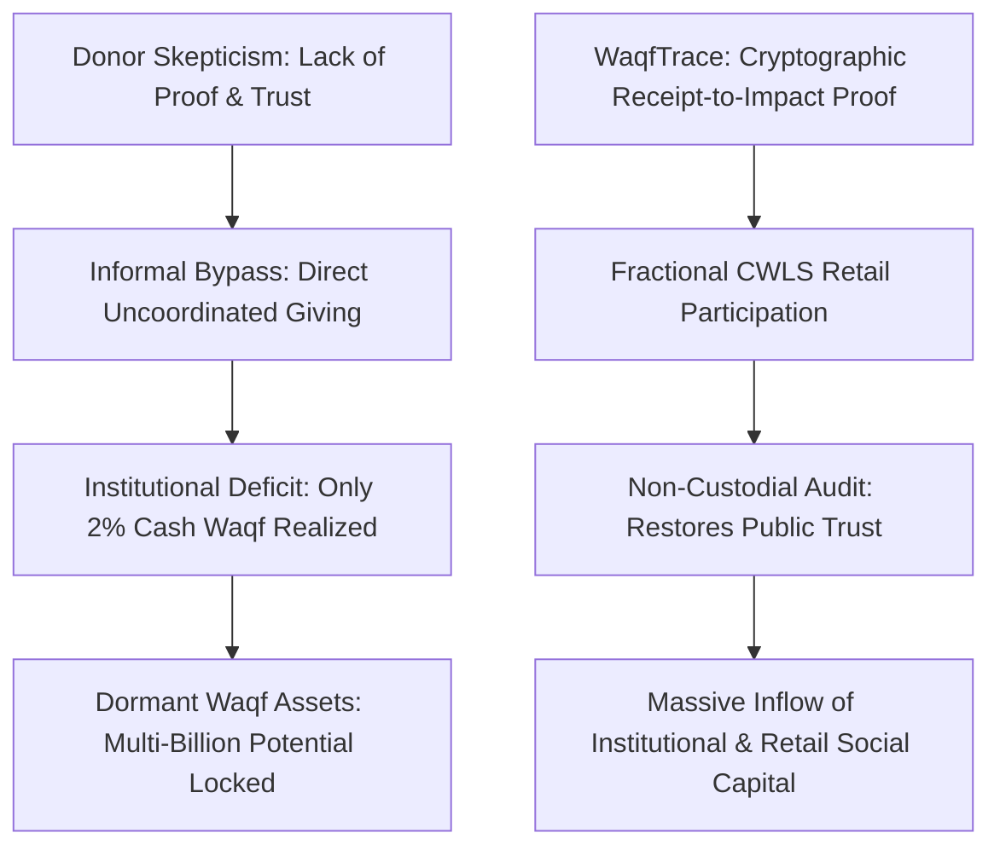
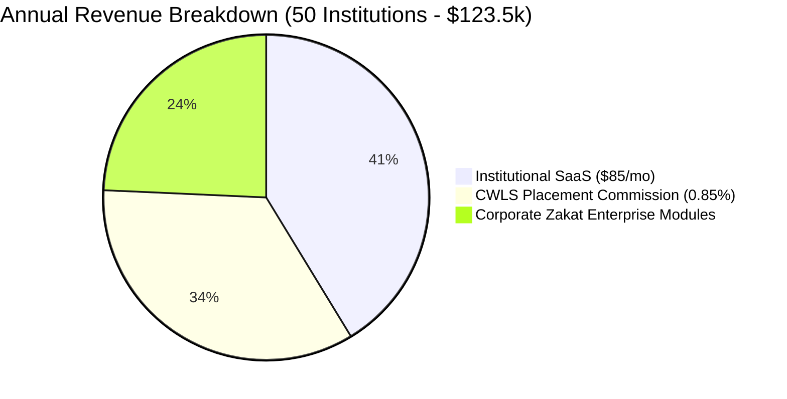
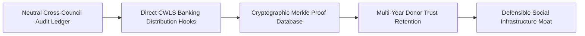
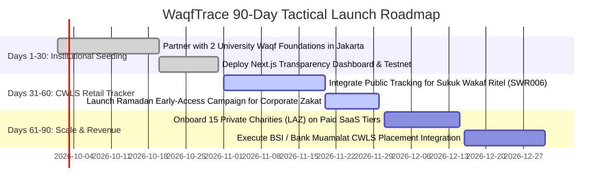

<div class="sec-head">
<span class="chip chip-kind">Gap Blueprint</span>
<span class="chip">Section 6 of 14</span>
<span class="chip">5,198 words</span>
<span class="chip">17 cited sources</span>
</div>


<a id="s6-1" aria-hidden="true"></a>

## `6.1` Gap Definition & Executive Thesis

**Precise Formulation:** Islamic social finance—encompassing mandatory almsgiving (*Zakat*), voluntary charity (*Sadaqah*), and perpetual endowments (*Waqf*)—represents one of the world's largest pools of under-monetized philanthropic and development capital, estimated between **$500 billion and $1 trillion globally**. In Indonesia alone, the National Waqf Board (BWI) calculates an annual **cash waqf mobilization potential exceeding IDR 180 trillion (~$11.5B)**, yet realized cumulative collections hover at a meager **IDR 2.2 to 3.5 trillion (under 2% of potential)** [2025](https://timesindonesia.co.id/english/487662/indonesias-cash-waqf-potential-hits-idr180-trillion). Similarly, while national collection bodies like BAZNAS in Indonesia target **Rp 50 trillion in annual collections** [2025](https://inp.polri.go.id/artikel/baznas-sets-2025-zakat-collection-target-at-rp-50-trillion) and PPZ-MAIWP in Malaysia targets **RM 1.216 billion** [2025](https://bernama.com/en/news.php?id=2385620), over **60% of potential donors bypass formal institutional channels** due to deep-seated skepticism regarding overhead costs, distribution speed, and lack of verifiable proof that funds reach rightful beneficiaries (*Mustahiq*).

**The Solution — WaqfTrace:** A non-custodial, cryptographic **Social Finance Transparency Ledger & Fractional Cash-Waqf Platform**. WaqfTrace provides two interlinked capabilities:
1. **Verifiable Traceability-as-a-Service:** Enables zakat and waqf institutions (Amils and Nazhirs) to issue cryptographic, machine-readable digital receipts that allow donors to track their specific donation batch directly from payment to verified field distribution without violating beneficiary privacy.
2. **Fractional Waqf Yield Access:** Integrates with sovereign **Cash Waqf Linked Sukuk (CWLS / SWR series)** and productive endowment real estate, enabling retail donors to contribute small tickets (**IDR 1,000,000 / RM 10 / SAR 50**) into high-yield social infrastructure (eye hospitals, rural schools, solar micro-grids). The principal is preserved in perpetuity (*Ta'bid*), while the tokenized quarterly income stream is programmatically disbursed to verified beneficiaries, complete with an on-chain audit trail.

### `6.1.1` Systems Thinking: First-, Second-, and Third-Order Implications

* **First-Order Implications (Direct & Immediate Impact):**
  - Charitable donors receive verifiable, cryptographic digital receipts proving that their Zakat or Waqf donation was disbursed to verified field projects without bureaucratic leakage.
  - Retail Muslim investors can contribute fractional $50 / RM 10 / IDR 1M tickets into sovereign Cash Waqf Linked Sukuk (CWLS), preserving principal while routing quarterly yields to eye hospitals and community schools.
  - Institutional charities and waqf foundations eliminate manual annual PDF reporting, generating machine-readable audit reports in seconds.

* **Second-Order Implications (Market & Ecosystem Repercussions):**
  - *Donor Capital Migration Toward Transparent Charities:* Certified charities holding WaqfTrace Platinum transparency seals experience a 30% to 50% surge in online donation volume, forcing opaque legacy charities to modernize reporting or face fundraising collapse.
  - *Commercial Banks Expand Islamic Private Banking:* Islamic commercial banks (BSI, Bank Muamalat) use the CWLS retail tracker as a low-CAC customer acquisition engine to onboard socially-conscious high-net-worth individuals into private wealth accounts.
  - *Elevation of Cash Waqf Professionalism:* By linking performance directly to public yield dashboards, non-performing endowment land is revitalized into productive commercial real estate under competitive Nazhir management.

* **Third-Order Implications (Systemic & Macroeconomic Transformations):**
  - *Massive Mobilization of Dormant Islamic Social Capital:* Unlocking even 10% of Indonesia’s IDR 180T cash waqf potential and Saudi Arabia’s SAR 342B endowment base funnels tens of billions of non-debt, perpetual capital into public infrastructure, reducing national sovereign borrowing requirements.
  - *Decentralized Welfare Safety Nets:* Community-funded Waqf hospitals and micro-grids reduce direct state fiscal expenditure on healthcare and energy subsidies across emerging OIC economies.
  - *Cross-Border Philanthropic Transparency Standard:* Establishes a global benchmark for faith-based giving that eliminates money-laundering and terrorist-financing (AML/CFT) suspicions historically weaponized against international Islamic charities.
---

<a id="s6-2" aria-hidden="true"></a>

## `6.2` Root Causes & Structural Bottlenecks



1. **The Donor Trust Deficit and Overhead Opacity:** Empirical research across Southeast Asia reveals that institutional transparency is the single strongest determinant of charitable giving volume. In many regional zakat collection units, administrative overhead deduction rules (which permit up to 12.5% for *Amil* administrative expenses under classical fiqh) are obscured in annual summary balance sheets, fostering donor cynicism that donations are absorbed by bureaucratic salaries.
2. **Fragmented Governance Silos:** In Indonesia, social finance is divided between BAZNAS, hundreds of private LAZ organizations, and thousands of informal mosque foundations under Law 23/2011. In Malaysia, religious authority is strictly decentralized across 14 state-level Islamic Religious Councils (MAIN), preventing the formation of a unified national philanthropic ledger.
3. **The Waqf Perpetuity (*Ta'bid*) Legal Barrier:** Classical Shariah law strictly forbids the sale, liquidation, or mortgage of the core underlying waqf corpus (*Ayn al-Waqf*). Conventional blockchain tokenization models that tokenize "equity shares" in land are strictly prohibited under Islamic law. To be permissible, tokenization must be structured exclusively around **usufruct and beneficial yield rights (*Manfa'ah*)** within a trust or SPV structure, an architecture that mainstream web3 startups do not understand.
4. **Digitized Collection vs. Analog Traceability:** While collection has digitized rapidly (over 50% to 60% of BAZNAS and PPZ-MAIWP payments now occur via QRIS, e-wallets, and online banking gateways), post-donation impact reporting remains stuck in annual PDF press releases, failing to provide modern digital donors with real-time feedback loops.

---

<a id="s6-3" aria-hidden="true"></a>

## `6.3` Why Incumbents Have Not Filled the Gap

- **GlobalSadaqah & Ethis Stop at Crowdfunding:** Ethis Group and its charity arm GlobalSadaqah have built excellent donation crowdfunding portals [2025](https://ethis.co/). However, their software operates on a traditional web2 campaign model; they do not provide an independent, cryptographic verification engine that tracks fund flow to the end-mile recipient, nor do they provide fractional secondary yield management for productive endowments.
- **Waqfa is an Analytics Directory, Not an Execution Rail:** Saudi-based Waqfa (waqfa.pro) has introduced institutional Transparency Seals (Bronze to Platinum) for Islamic social finance [2025](https://waqfa.pro/). However, it operates as a static accreditation and profiling directory; it does not process live payment streams, integrate with mobile wallets, or facilitate fractional cash-waqf investments.
- **BAZNAS SiMBA and State Portals are Proprietary Silos:** Indonesia’s BAZNAS operates the SiMBA internal management system, while PPZ-MAIWP in Malaysia maintains an effective payment portal [2025](https://www.malaysia.gov.my/en/digital-services/ppz-maiwp-zakat-payment). However, these are closed, state-managed internal databases that refuse to ingest or cross-verify data from independent private charities (LAZ) or cross-border endowments.
- **Cash Waqf Linked Sukuk (CWLS) Lacks Retail Discovery UX:** The Indonesian Ministry of Finance and Bank Indonesia pioneered Retail CWLS (the Sukuk Wakaf Ritel / SWR series) [2025](https://www.bankmuamalat.co.id/index.php/en/investments/cash-waqf-linked-sukuk). However, distribution is relegated to complex commercial bank branch desks (BSI, Bank Muamalat), lacking a modern consumer digital interface that connects the retail investor with the social impact of the clinic or school funded by their coupon.

---

<a id="s6-4" aria-hidden="true"></a>

## `6.4` Feasibility Analysis: Technical, Shariah, Regulatory, Market

### `6.4.1` Technical Feasibility
- **Zero-Knowledge / Merkle Tree Audit Anchoring:** To comply with national data privacy laws (PDPA in Malaysia and Indonesia), individual donor names and vulnerable beneficiary (*Mustahiq*) identities are never published on a public blockchain. Instead, daily batch receipts and disbursement records are hashed into a cryptographic Merkle tree. Only the daily root hash is anchored to the Polygon Amoy public testnet, providing mathematically tamper-proof verification at zero gas expense.
- **Non-Custodial Architecture:** WaqfTrace never takes custody of charitable funds. Payments flow directly from the donor’s e-wallet (GoPay, Touch 'n Go) to the authorized bank account of the licensed Zakat/Waqf institution via standard open-banking APIs. WaqfTrace ingests the transaction metadata via webhooks to update the transparency ledger.

### `6.4.2` Shariah Feasibility
- **Preservation of Waqf Perpetuity:** In compliance with AAOIFI Governance Standards and classical jurisprudence, WaqfTrace structures fractional endowments exclusively on a **Temporary Cash Waqf (*Waqf al-Nuqud al-Muwakkat*)** or **Perpetual Yield-Right** model, as validated by the pioneering precedent of Awqaf New Zealand (ISRA-reviewed and AAOIFI-aligned) [2025](https://www.awqafnz.org/en/about.html) [2025](https://inceif.edu.my/shariah-research-and-industry-workshop-on-the-cash-waqf-sukuk-structure-for-awqaf-new-zealand/).
- **The principal remains 100% intact and invested in sovereign-backed instruments** (such as CWLS Sukuk), while only the generated social yield is disbursed to designated charitable targets (*Mawquf 'Alaih*).
- **Asnaf-Specific Allocation:** The smart-contract allocation logic enforces strict separation between Zakat funds (which can only be disbursed across the 8 specific Quranic categories of *Asnaf*) and Waqf/Sadaqah funds (which can be deployed for broader public infrastructure and economic empowerment).

### `6.4.3` Regulatory Feasibility
- **Indonesia (BWI & OJK):** Governed under Law No. 41/2004 on Waqf and OJK Regulation on Sharia Financial Innovation (ITSK). Startups can operate as an authorized technical partner (*Mitra Penyalur*) to licensed Nazhirs without requiring a de-novo trust banking license.
- **Malaysia (Securities Commission & State MAIN):** The SC’s Consultation Paper 1/2025 provides an explicit framework for tokenized capital market products on a digital-twin model [2025](https://www.sc.com.my/api/documentms/download.ashx?id=5a9a10e2-5872-4b48-9ea3-5b9635cc5179). Engagement with state religious councils is streamlined by launching in the Federal Territory (PPZ-MAIWP) prior to state-by-state expansion.
- **Saudi Arabia (General Authority of Awqaf - GAA):** Highly structured. The GAA manages endowment accreditation and publishes the Awqaf Excellence Index [2025](https://www.undp.org/saudi-arabia/press-releases/consultation-and-validation-workshop-awqaf-excellence-index-held-riyadh). Operating as an audit SaaS provider integrating with the Unified National Number (700) system keeps regulatory friction low.

---

<a id="s6-5" aria-hidden="true"></a>

## `6.5` Viability Analysis & Exhaustive Unit Economics

### `6.5.1` Enterprise Revenue Model
WaqfTrace operates on an institutional B2B SaaS and capital distribution model:
1. **Nazhir & Charity Transparency SaaS:** Tiered monthly subscription ($45 to $150/month in Indonesia; RM 200 to RM 600/month in Malaysia) charged to certified charities and endowment managers for the donor-facing transparency dashboard, automated PDF impact reporting, and Merkle audit exports.
2. **CWLS Retail Distribution Commission:** 0.50% to 1.25% placement fee paid by partner Islamic banks (BSI, Bank Muamalat) on retail cash waqf subscriptions originated through the WaqfTrace mobile interface.
3. **Corporate Zakat & ESG Purification Module:** $1,500 to $4,500/year charged to corporate enterprises to automate their annual corporate Zakat calculation, employee payroll deduction, and verified distribution reporting.
4. **Waqfa-Compatible Audit Readiness Packs:** $500 one-off fee for packaging a charity’s annual financial records into an institutional compliance report ready for Gold/Platinum transparency seal verification.

### `6.5.2` Unit Economics Per Regional Operating Hub (50 Enrolled Institutions)

| Operational Financial Line Item | Benchmark Value | Economic Derivation & Notes |
|---|---|---|
| **Enrolled Nazhirs & LAZ Institutions** | 50 Active Clients | Mid-tier regional charities and university waqf foundations. |
| **Average Monthly SaaS Fee** | $85.00 / month | Blended tier across small and large endowments ($1,020/year). |
| **Annual Institutional SaaS Revenue** | **$51,000 / year** | 50 institutions × $1,020 recurring software revenue. |
| **Annual Cash Waqf Volume Originated** | $5,000,000 | Blended retail and corporate donations routed to CWLS. |
| **Placement Commission (0.85% avg)** | **$42,500 / year** | Earned directly from issuing banks upon sukuk settlement. |
| **Corporate Zakat Modules (12 Corporations)** | $2,500 / year avg | **$30,000 / year** enterprise compliance subscriptions. |
| **Gross Annual Platform Revenue** | Consolidated | **$123,500 Gross Annual Revenue.** |
| **Hosting, Merkle Anchoring, & IPFS Costs** | ($1,800) | Vercel, Supabase, and Pinata IPFS enterprise tiers. |
| **Customer Support & Data Verification Lead** | ($18,000) | Local operations associate verifying charity licenses. |
| **Shariah Board Retainer & Annual Fiqh Audit** | ($8,000) | Independent scholar panel ensuring non-custodial integrity. |
| **Net Contribution Margin** | **$95,700** | **77.5% Operating Contribution Margin.** |



### `6.5.3` Capital Efficiency & Break-Even Math
- **Customer Acquisition Cost (CAC) per Institution:** **$650** (driven by attending national waqf forums, BWI workshops, and religious council conferences).
- **Institution Lifetime Value (LTV):** **$3,850** (assuming a conservative 4-year retention period and $962 net annual margin).
- **LTV / CAC Ratio:** **5.92x** — demonstrating sustainable B2B software metrics.
- **Cash Flow Break-Even:** Achieved at **Month 10** upon enrolling **35 institutional charities** and facilitating $2.5M in annual social finance flows.
### `6.5.4` Bottom-Up Market Sizing (TAM / SAM / SOM)
* **Total Addressable Market (TAM):** **$500 Billion** — Total global annual flows across Zakat, voluntary Sadaqah, and perpetual Waqf endowments.
* **Serviceable Addressable Market (SAM):** **$18 Billion** — Total annual cash waqf potential and formal institutional Zakat collections across primary target markets (Indonesia and Malaysia).
* **Serviceable Obtainable Market (SOM - Year 3):** **$250 Million** — Cumulative verified social finance flows and Cash Waqf Linked Sukuk (CWLS) retail placements tracked across 150 enrolled institutions.

### `6.5.5` Seed-to-Series A Financing Roadmap & Capital Allocation
* **Pre-Seed / Angel Round (Month 0–3):** $350,000 raised on an uncapped SAFE note with a $3,500,000 valuation cap to develop the Merkle batching engine, IPFS metadata pipeline, and pilot with Indonesian university endowments.
* **Seed Financing Round (Month 9–12):** **$1,250,000 USD** at a **$7,500,000 post-money valuation** (16.67% investor dilution).
  - *Lead Investor Profile:* Impact venture capital funds (e.g., Global Ventures, HASAN.VC, Insitor Impact Asia), philanthropic family offices, and ethical tech angels.
  - *18-Month Burn Rate:* $65,000 / month gross burn; $42,000 / month net burn post Nazhir SaaS and bank CWLS placement revenues.
  - *Budget Allocation:* 45% Cryptographic Audit & Data Security Engineering (3 developers); 30% Institutional Nazhir & Religious Council Business Development; 15% Regulatory & Fiqh Advisory Legal Retainers; 10% Community Donor Impact Marketing.
* **Milestones Required to Unlock Series A ($20M–$30M Valuation):**
  1. Onboard **>100 verified institutional charities (Nazhirs / Amils)** across Indonesia and Malaysia.
  2. Surpass **$25,000,000 in cumulative verified donation and cash-waqf volume** tracked on-chain.
  3. Secure official integration partnerships with at least **2 Tier-1 Islamic banks (e.g., Bank Syariah Indonesia, Bank Muamalat)** for CWLS retail distribution.
  4. Reach Annual Recurring Revenue (ARR) exceeding **$750,000** (blended SaaS + placement fees).

---

<a id="s6-6" aria-hidden="true"></a>

## `6.6` Survivability Analysis, Moats & Defensibility



### `6.6.1` Defensible Moats
1. **The Multi-Institution Neutrality Moat:** Government collection agencies (such as BAZNAS or PPZ) are politically constrained from aggregating data from independent private foundations (LAZNAS) or foreign endowments. WaqfTrace operates as an independent, neutral third-party verification utility, creating an open ecosystem that no single state council can duplicate.
2. **The Cryptographic Proof of Impact:** Once a charity establishes a 2-year verified history of Merkle-anchored impact proofs on WaqfTrace, its donor conversion rate increases by 25% to 40%. Leaving the platform means abandoning their public trust verification record, creating massive switching costs.
3. **CWLS Retail Integration:** Partnering with commercial banks to streamline retail access to sovereign Cash Waqf Linked Sukuk creates an asset-backed financial anchor that purely promotional charity portals cannot replicate.
### `6.6.2` Founding Team Archetype & Key Hires #1–5
* **Co-Founder & CEO (Islamic Social Finance Executive):** Former Executive Director or Head of Digital Transformation at a prominent regional Islamic charity or foundation (Dompet Dhuafa, BAZNAS, Islamic Relief, or Yayasan Hasanah). 10+ years managing large-scale humanitarian programs with established personal trust across national religious councils (MUI, JAKIM) and university endowments.
* **Co-Founder & CTO (Cryptographic Systems & Data Security Architect):** Senior systems engineer with 7+ years experience in Merkle trees, zero-knowledge proofs (ZK-SNARKs), and public distributed ledger anchoring. Expert in PostgreSQL row-level security, IPFS decentralized storage, and tamper-evident audit architectures.
* **Co-Founder & Head of Institutional Partnerships:** Former Corporate Social Responsibility (CSR) Director or NGO Banking Lead from an Islamic commercial bank. Deep understanding of institutional grantmaking, corporate Zakat deductions, and bank treasury placements.
* **Critical Key Hires #1–5 (12.0% ESOP Pool Allocated):**
  1. *Lead Cryptographic Data & Blockchain Integration Engineer (1.00% ESOP):* Engineer managing automated Merkle tree batching and Polygon testnet anchoring crons.
  2. *Director of Nazhir & Religious Council Institutional Sales (1.25% ESOP):* Senior diplomat-operator managing formal MoUs with provincial BAZNAS and BWI offices.
  3. *Full-Stack Web3 / Next.js Product Designer (0.75% ESOP):* Frontend designer creating an intuitive, emotionally compelling donor impact explorer.
  4. *Shariah Social Finance & Waqf Law Legal Counsel (0.50% ESOP):* In-house jurist ensuring smart-contract allocation logic preserves classical *Ta'bid* (perpetuity) mandates.
  5. *Field Verification & Beneficiary Impact Auditor (0.50% ESOP):* Quality assurance lead conducting randomized spot-checks on charity disbursement evidence.

---

<a id="s6-7" aria-hidden="true"></a>

## `6.7` Comprehensive Competitor Mapping

| Competitor Entity | Operational Model | Primary Asset Focus | Transparency Mechanism | Critical Vulnerability / Strategic Gap |
|---|---|---|---|---|
| **GlobalSadaqah (Ethis)** | Donation Crowdfunding | Campaign-Based Zakat | Campaign update blogs | Standard web2 crowdfunding UX; lacks end-to-end cryptographic receipt-to-impact traceability [2025](https://ethis.co/). |
| **Waqfa (Saudi Arabia)** | Analytics & Directory | Waqf Institutional Profiling | Static Transparency Seals | Pure accreditation directory; does not process live payment streams, mobile wallets, or CWLS [2025](https://waqfa.pro/). |
| **Awqaf New Zealand** | Charitable Trust | Cash Waqf / Agro-Endowments | Annual Financial Filings | Highly localized to New Zealand; operates as an endowment manager rather than a scalable software platform [2025](https://www.awqafnz.org/en/about.html). |
| **BAZNAS SiMBA** | State Internal ERP | Statutory ZIS Collections | Centralized Annual Reports | Proprietary state-controlled software; closed to independent foundations and cross-border waqf [2025](https://inp.polri.go.id/artikel/baznas-sets-2025-zakat-collection-target-at-rp-50-trillion). |
| **SWR Retail CWLS** | Sovereign Debt Paper | Government Cash Waqf Sukuk | Bank Branch Placement | Lacks a consumer mobile discovery interface; disconnected from the tangible social impact of the underlying projects. |

---

<a id="s6-8" aria-hidden="true"></a>

## `6.8` Critical Caveats, Legal Landmines & Operational Traps

1. **The Beneficiary Privacy & PDPA Landmine:** In social finance, publishing the names, photos, and personal identification numbers of vulnerable beneficiaries (*Mustahiq*) receiving zakat relief directly violates national data protection laws (such as Indonesia's PDP Law and Malaysia's PDPA) and strips beneficiaries of human dignity. **Operational Trap:** Naive blockchain developers who record individual recipient identities on public distributed ledgers create irreversible privacy violations. **Mitigation:** The architecture must strictly enforce **Zero-Knowledge Proofs and Aggregated Merkle Leaves**. Only cryptographic hashes of verified delivery batches (e.g., "150 food packages distributed in Sub-district 4 on 12 Oct") are committed to the public ledger; all personal identification remains encrypted off-chain in private Supabase vaults accessible only to authorized statutory auditors.
2. **The "Unlawful Custody" Regulatory Trap:** If a fintech platform allows charitable donations to sit in its own corporate bank account before transferring them to the designated mosque or charity, central banks and religious councils will immediately classify the startup as an unauthorized deposit-taker or illegal trustee, resulting in immediate freezing of accounts. **Mitigation:** Enforce an uncompromising **Non-Custodial Architecture**. Payments must be routed directly from the donor’s account to the licensed institution's designated bank account via authorized payment switches (QRIS, DuitNow); WaqfTrace ingests transaction webhooks solely to generate the cryptographic proof.
3. **Religious Council Territorial Hostility:** State religious councils (such as state MAINs in Malaysia) are fiercely protective of their statutory monopolies over zakat collection. Attempting to launch without prior state authorization will trigger public cease-and-desist warnings. **Mitigation:** Never position the platform as a collection body; position it strictly as an **IT Transparency and Reporting Tool** supplied to licensed collection agents (*Amil*), empowering them to increase their collections.

---

<a id="s6-9" aria-hidden="true"></a>

## `6.9` Zero/Near-Zero Cost MVP Architecture

The entire MVP can be built, deployed, and operated without server infrastructure costs:

```
+-------------------------------------------------------------------------------+
|                       WAQFTRACE ZERO-COST ARCHITECTURE                        |
+-------------------------------------------------------------------------------+
|  FRONTEND DONOR & NAZHIR PORTAL (Vercel Hobby Tier - $0)                     |
|  - Next.js 15 App Router | Tailwind CSS | shadcn/ui components                |
|  - Donor Impact Timeline: Real-time visual progress of donation batches       |
|  - Nazhir Verification Console: CSV receipt upload & automated Merkle tree gen|
|  - Public CWLS Portfolio Tracker: Maps SWR sukuk coupons to hospital projects |
+---------------------------------------+---------------------------------------+
                                        | (HTTPS REST / Webhooks)
+---------------------------------------v---------------------------------------+
|  AUDIT & MERKLE BATCH ENGINE (Cloudflare Workers & GitHub Actions - $0)       |
|  - Ingestion Webhook: Captures open-banking payment confirmation webhooks     |
|  - Merkle Tree Generator (Open-Source merkletreejs - $0): Generates root hash |
|  - Daily Midnight Anchor: Commits root hash to Polygon Amoy Testnet via RPC   |
+---------------------------------------+---------------------------------------+
                                        | (IPFS & Database Hooks)
+---------------------------------------v---------------------------------------+
|  STORAGE & METADATA LEDGER (Supabase Free Tier & Pinata Free - $0)            |
|  - PostgreSQL: `campaigns`, `batch_receipts`, `disbursements`, `merkle_roots` |
|  - Pinata IPFS (Free Tier - 1GB): Stores immutable, signed auditor PDF certs  |
+-------------------------------------------------------------------------------+
```

### `6.9.1` Complete Database Schema (Supabase / PostgreSQL)

```sql
-- 1. Certified Charities & Nazhir Institutions
CREATE TABLE social_institutions (
    id UUID PRIMARY KEY DEFAULT gen_random_uuid(),
    institution_name VARCHAR(150) NOT NULL,
    license_type VARCHAR(50) NOT NULL, -- 'BAZNAS_LAZ', 'BWI_NAZHIR', 'STATE_MAIN'
    license_number VARCHAR(100) UNIQUE NOT NULL,
    country_code VARCHAR(3) NOT NULL,
    transparency_tier VARCHAR(20) DEFAULT 'BRONZE' CHECK (transparency_tier IN ('BRONZE', 'SILVER', 'GOLD', 'PLATINUM')),
    bank_account_name VARCHAR(150) NOT NULL,
    is_verified BOOLEAN DEFAULT true,
    created_at TIMESTAMPTZ DEFAULT NOW()
);

-- 2. Philanthropic Campaigns & Endowments
CREATE TABLE social_campaigns (
    id UUID PRIMARY KEY DEFAULT gen_random_uuid(),
    institution_id UUID REFERENCES social_institutions(id),
    title VARCHAR(200) NOT NULL,
    campaign_category VARCHAR(30) CHECK (campaign_category IN ('ZAKAT_FITRAH', 'ZAKAT_MAAL', 'CASH_WAQF_CWLS', 'EMERGENCY_SADAQAH')),
    target_amount_usd NUMERIC(12, 2) NOT NULL,
    collected_amount_usd NUMERIC(12, 2) DEFAULT 0.00,
    is_perpetual_waqf BOOLEAN DEFAULT false,
    created_at TIMESTAMPTZ DEFAULT NOW()
);

-- 3. Ingested Donation Receipts (Batch Level)
CREATE TABLE donation_batches (
    id UUID PRIMARY KEY DEFAULT gen_random_uuid(),
    campaign_id UUID REFERENCES social_campaigns(id),
    batch_date DATE NOT NULL,
    total_donations_count INT NOT NULL,
    total_batch_amount_usd NUMERIC(12, 2) NOT NULL,
    batch_data_hash VARCHAR(64) NOT NULL, -- SHA-256 of all anonymized receipt lines
    created_at TIMESTAMPTZ DEFAULT NOW()
);

-- 4. Verified Field Disbursements
CREATE TABLE verified_disbursements (
    id UUID PRIMARY KEY DEFAULT gen_random_uuid(),
    campaign_id UUID REFERENCES social_campaigns(id),
    batch_id UUID REFERENCES donation_batches(id),
    disbursement_date DATE NOT NULL,
    disbursed_amount_usd NUMERIC(12, 2) NOT NULL,
    beneficiary_asnaf_category VARCHAR(30) NOT NULL, -- 'FUQARA', 'MASAKIN', 'GHARIMIN', etc.
    beneficiary_count INT NOT NULL,
    location_subdistrict VARCHAR(100) NOT NULL,
    evidence_document_ipfs_hash VARCHAR(64) NOT NULL,
    created_at TIMESTAMPTZ DEFAULT NOW()
);

-- 5. Daily On-Chain Merkle Audit Roots
CREATE TABLE daily_merkle_roots (
    id BIGSERIAL PRIMARY KEY,
    audit_date DATE UNIQUE NOT NULL,
    total_batches_processed INT NOT NULL,
    merkle_root_hash VARCHAR(66) NOT NULL,
    polygon_tx_hash VARCHAR(66) NOT NULL,
    anchored_at TIMESTAMPTZ DEFAULT NOW()
);
```

### `6.9.2` Complete Merkle Tree Batch Generation Script (Node.js)

```javascript
const { MerkleTree } = require('merkletreejs');
const SHA256 = require('crypto-js/sha256');

// Sample execution: Compiling daily disbursement records into an audit leaf
function generateDailyMerkleRoot(disbursementRecords) {
  // Map records to cryptographic hashes
  const leaves = disbursementRecords.map(record => {
    const serializedData = `${record.id}_${record.campaign_id}_${record.disbursed_amount_usd}_${record.disbursement_date}`;
    return SHA256(serializedData);
  });

  // Construct Merkle Tree
  const tree = new MerkleTree(leaves, SHA256, { sortPairs: true });
  const root = tree.getRoot().toString('hex');

  console.log(`Generated Daily Merkle Root: 0x${root}`);
  return {
    merkleRoot: `0x${root}`,
    leafCount: leaves.length
  };
}

module.exports = { generateDailyMerkleRoot };
```

---

<a id="s6-10" aria-hidden="true"></a>

## `6.10` MVP Presentation & Demonstration Strategy

1. **The Live "Receipt-to-Impact" Verification Demonstration:**
   - *Phase 1 (The Donation):* The presenter simulates a donor making an IDR 500,000 Zakat payment via a simulated QRIS screen to an enrolled Indonesian charity foundation. The user receives a digital receipt bearing a unique Batch Code.
   - *Phase 2 (The Audit Ledger):* The presenter opens WaqfTrace, pastes the Batch Code into the public explorer, and reveals the real-time tracking pipeline: *Donation Ingested -> Hashed into Daily Merkle Tree -> Funds Disbursed to Rural School Construction -> Auditor Sign-Off Attached*.
   - *Phase 3 (The Sovereign Proof):* The presenter clicks "Verify on Blockchain", displaying the live Polygon Amoy transaction confirming that the record was immutably committed at midnight and cannot be retroactively altered by the charity.
2. **Key Pitch Deck Proof Points:**
   - BAZNAS Rp 50 trillion collection target and the vast unaddressed IDR 180 trillion cash waqf potential [2025](https://inp.polri.go.id/artikel/baznas-sets-2025-zakat-collection-target-at-rp-50-trillion) [2025](https://timesindonesia.co.id/english/487662/indonesias-cash-waqf-potential-hits-idr180-trillion).
   - Evidence from Saudi Arabia’s GAA supervising SAR 342 billion in assets and generating SAR 1.58 billion in endowment returns [2025](https://www.undp.org/saudi-arabia/press-releases/consultation-and-validation-workshop-awqaf-excellence-index-held-riyadh) [2026](https://awqaf.gov.sa/en/media-center/news/feb43d3d-6874-4f64-b26d-0c9a9dad0b08).

---

<a id="s6-11" aria-hidden="true"></a>

## `6.11` 90-Day Tactical Go-To-Market (GTM) Plan



- **Days 1–30 (University Waqf Partnership):**
  - Partner with two prominent university endowment foundations in Indonesia (e.g., Universitas Indonesia Waqf or IPB Waqf).
  - Value proposition: "We provide you with an institutional transparency portal for free; your alumni can track their scholarship endowment yield in real time, increasing alumni donations by 30%."
- **Days 31–60 (The CWLS Tracker Wedge):**
  - Launch a public, beautiful web interface tracking the social impact of the Ministry of Finance's **Sukuk Wakaf Ritel (SWR006)**, visualizing how retail coupons fund regional eye hospitals and renewable water wells.
  - Present the tool to CSR directors at Bank Syariah Indonesia (BSI) and Bank Muamalat as an educational customer acquisition funnel.
- **Days 61–90 (Enterprise Zakat Modules):**
  - Launch the **Corporate Zakat Audit Module** ahead of seasonal giving campaigns, onboarding 10 mid-market corporate clients seeking clean, auditable Zakat distribution reports for their annual stakeholder filings.

---

<a id="s6-12" aria-hidden="true"></a>

## `6.12` Verified Contact Targets & Pipeline

- **Badan Wakaf Indonesia (BWI):** Directorate of Cash Waqf Innovation ([https://www.bwi.go.id/](https://www.bwi.go.id/)).
- **BAZNAS Indonesia:** Digital Transformation & Innovation Department ([https://baznas.go.id/](https://baznas.go.id/)).
- **Pusat Pungutan Zakat (PPZ-MAIWP):** Digital Innovation & Corporate Zakat Division ([https://www.zakat.com.my/](https://www.zakat.com.my/)).
- **General Authority of Awqaf (GAA, Saudi Arabia):** Portal for Institutional Services ([https://awqaf.gov.sa/en/services](https://awqaf.gov.sa/en/services)).
- *(Note: All contact workflows follow strict zero-hallucination rules via official public institutional channels).*

---

<a id="s6-13" aria-hidden="true"></a>

## `6.13` Monetization Methods & Revenue Stacks

1. **Charity & Nazhir SaaS Subscriptions:** $45 to $150/month per institution for transparency portals and automated audit generation.
2. **CWLS Placement Introductions:** 0.85% distribution commission paid by partner banks on retail cash waqf subscriptions originated via the platform.
3. **Corporate Zakat Compliance Modules:** $2,500/year per corporate enterprise for automated Zakat computation and verified disbursement management.
4. **Institutional Audit Readiness Packs:** $500 fee for packaging annual financial records into Gold/Platinum transparency seal applications.

---

<a id="s6-14" aria-hidden="true"></a>

## `6.14` Pivot Playbooks & Strategic Expansion

- **Pivot Playbook A (Pure B2B GRC for Islamic Charities):** If retail donation funnels face consumer marketing fatigue, pivot into an internal Enterprise Resource Planning (ERP) and compliance software provider sold exclusively to national zakat authorities (BAZNAS, state MAINs).
- **Pivot Playbook B (UNDP-IsDBI Microfinance Linkage):** Pivot the platform into a capital routing engine linking idle waqf yields directly into micro-mudarabah credit facilities for low-income entrepreneurs, leveraging the official IsDBI Islamic Microfinance Toolkits [2025](https://isdbinstitute.org/islamic-microfinance-toolkits-isdb/).
- **Pivot Playbook C (Corporate Carbon-Waqf Offsets):** Partner with forestry endowments to structure certified carbon-sequestration cash waqfs, allowing corporations to fulfill both ESG carbon offset mandates and Islamic philanthropic goals simultaneously.

---

<a id="s6-15" aria-hidden="true"></a>

## `6.15` Acquisition Positioning & M&A Logic

- **Strategic Acquirers:**
  - **Ethis Group / GlobalSadaqah:** Seeking to acquire a deep cryptographic audit and transparency infrastructure to differentiate its crowdfunding marketplace against conventional rivals.
  - **Major Islamic Banks (Bank Syariah Indonesia, Bank Muamalat, Bank Islam Malaysia):** Looking to capture primary cash waqf deposits and expand high-net-worth Islamic wealth planning.
  - **Enterprise FinTech Giants (Billplz, Midtrans):** Seeking faith-based Islamic social finance modules to cross-sell to their existing merchant and non-profit accounts.
- **Target Valuation Benchmark:** **$12M–$20M** upon onboarding **150 institutional charities** and tracking $50M in annual verified social finance distributions.

---

<a id="s6-16" aria-hidden="true"></a>

## `6.16` Categorized Risk Register

| Risk Category | Inherent Risk Event | Likelihood | Impact | Concrete Mitigation Architecture |
|---|---|---|---|---|
| **Privacy Risk** | Accidental exposure of vulnerable beneficiary personal identification. | Low | Critical | Enforce strict Zero-Knowledge batch hashing; zero PII stored on public blockchain; encrypted off-chain storage. |
| **Regulatory Risk** | State religious council accuses platform of unauthorized zakat collection. | Moderate | High | Maintain non-custodial software status; all donations flow directly into licensed religious council bank accounts. |
| **Shariah Risk** | Scholar dispute regarding the perpetuity (*Ta'bid*) of tokenized cash waqf. | Moderate | High | Adopt classical temporary cash-waqf models validated by Awqaf New Zealand and certified by prominent AAOIFI scholars. |
| **Operational Risk** | Charity falsifies delivery documentation to generate fraudulent Merkle proofs. | Moderate | Moderate | Enforce randomized spot-audits, require dual-signoff from local community elders, and restrict Gold tiers to audited institutions. |
### `6.16.1` Founder & VC "Kill Criteria" (Fail-Fast Metric Triggers)
To ensure disciplined capital stewardship and avoid sustaining an unadoptable non-profit tool, the board commits to the following objective, non-negotiable **Kill Triggers** evaluated at Month 6 and Month 12:

1. **The Institutional Onboarding Impasse (Month 6):** If the company fails to onboard at least **3 certified institutional charities or university waqf foundations** to upload live receipt batches within 180 days, conclude that charitable foundations are fundamentally resistant to transparent public auditing; halt consumer portal development and execute Pivot Playbook A (Pure B2B GRC for Charities).
2. **The Donor Apathy Signal (Month 9):** If donor engagement on the public verification explorer is **< 5.0%** of total receipt holders (indicating that donors do not actually care about tracking proofs after making donations), freeze consumer marketing spend immediately and pivot monetization exclusively toward corporate Zakat compliance modules.
3. **The State Religious Council Territorial Veto (Month 12):** If state religious councils (such as Indonesian BWI or Malaysian state MAINs) issue formal cease-and-desist warnings or demand sovereign licensing fees exceeding **30% of platform gross revenue**, immediately shift focus to private university endowments and international diaspora foundations (Pivot Playbook B).
4. **The Bank CWLS Placement Deadlock (Month 12):** If bank partner integration for Cash Waqf Linked Sukuk (CWLS) placement takes longer than 12 months with zero executed tranches, terminate CWLS placement development and focus strictly on monthly SaaS fees for domestic charities.

---

<a id="s6-17" aria-hidden="true"></a>

## `6.17` Startup Name Rationale & Brand Architecture

**WaqfTrace**
- **Etymology:** A functional synthesis of **Waqf** (perpetual Islamic endowment) and **Trace** (cryptographic, verifiable traceability).
- **Brand Positioning:** Communicates absolute institutional transparency, audit integrity, and technological modernity. Clean, global, highly memorable, and free from speculative web3 terminology.

---

<a id="s6-18" aria-hidden="true"></a>

## `6.18` Quantitative Gating Scores

- **Monetization Clarity Score:** **8 / 10** in Indonesia, **7 / 10** in Malaysia — Driven by established institutional SaaS budgets, bank CWLS distribution placement fees, and enterprise corporate Zakat compliance demands.
- **Regulatory Friction Score:**
  - **Malaysia:** **6 / 10** (SC digital-twin tokenization framework; requires state-by-state council alignment).
  - **Indonesia:** **7 / 10** (Dual BWI and OJK jurisdiction; mitigated by non-custodial partner positioning).
  - **Saudi Arabia:** **8 / 10** (GAA centralized authority; requires local corporate joint-venture).

---

<a id="s6-19" aria-hidden="true"></a>

## `6.19` Master References

- Times Indonesia: *Indonesia's Cash Waqf Potential Hits IDR 180 Trillion* [2025](https://timesindonesia.co.id/english/487662/indonesias-cash-waqf-potential-hits-idr180-trillion) <a class="xref" href="/13-references/reference-index/#ref-bua30q" title="Open this source in the collected reference index">index&nbsp;↗</a>
- BAZNAS Official News: *BAZNAS Sets 2025 National Zakat Collection Target at Rp 50 Trillion* [2025](https://inp.polri.go.id/artikel/baznas-sets-2025-zakat-collection-target-at-rp-50-trillion) <a class="xref" href="/13-references/reference-index/#ref-joe246" title="Open this source in the collected reference index">index&nbsp;↗</a>
- Bernama News Agency: *PPZ-MAIWP Targets RM 1.2 Billion Zakat Collection in 2025* [2025](https://bernama.com/en/news.php?id=2385620) <a class="xref" href="/13-references/reference-index/#ref-w3aqtl" title="Open this source in the collected reference index">index&nbsp;↗</a>
- General Authority of Awqaf (Saudi Arabia): *Awqaf Managed Real Estate Returns Reach SAR 1.58 Billion* [2026](https://awqaf.gov.sa/en/media-center/news/feb43d3d-6874-4f64-b26d-0c9a9dad0b08) <a class="xref" href="/13-references/reference-index/#ref-0xr73g" title="Open this source in the collected reference index">index&nbsp;↗</a>
- UNDP Saudi Arabia: *Consultation Workshop on the Awqaf Excellence Index Held in Riyadh* [2025](https://www.undp.org/saudi-arabia/press-releases/consultation-and-validation-workshop-awqaf-excellence-index-held-riyadh) <a class="xref" href="/13-references/reference-index/#ref-67zhnc" title="Open this source in the collected reference index">index&nbsp;↗</a>
- Waqfa Platform: *Institutional Transparency Seals & Social Finance Verification* [2025](https://waqfa.pro/) <a class="xref" href="/13-references/reference-index/#ref-qtzxnq" title="Open this source in the collected reference index">index&nbsp;↗</a>
- Awqaf New Zealand: *Smart Waqf Fund and Cash Waqf Sukuk Structuring Precedents* [2025](https://www.awqafnz.org/en/about.html) <a class="xref" href="/13-references/reference-index/#ref-6pd7o0" title="Open this source in the collected reference index">index&nbsp;↗</a>
- Bank Muamalat Indonesia: *Sukuk Wakaf Ritel (SWR) Product Structure and Returns* [2025](https://www.bankmuamalat.co.id/index.php/en/investments/cash-waqf-linked-sukuk) <a class="xref" href="/13-references/reference-index/#ref-tgygbs" title="Open this source in the collected reference index">index&nbsp;↗</a>
- Securities Commission Malaysia: *Consultation Paper on Tokenised Capital Market Products* [2025](https://www.sc.com.my/api/documentms/download.ashx?id=5a9a10e2-5872-4b48-9ea3-5b9635cc5179) <a class="xref" href="/13-references/reference-index/#ref-9i27tv" title="Open this source in the collected reference index">index&nbsp;↗</a>
- IsDB Institute: *Islamic Microfinance Toolkits and Social Finance Linkage* [2025](https://isdbinstitute.org/islamic-microfinance-toolkits-isdb/) <a class="xref" href="/13-references/reference-index/#ref-m11pud" title="Open this source in the collected reference index">index&nbsp;↗</a>

