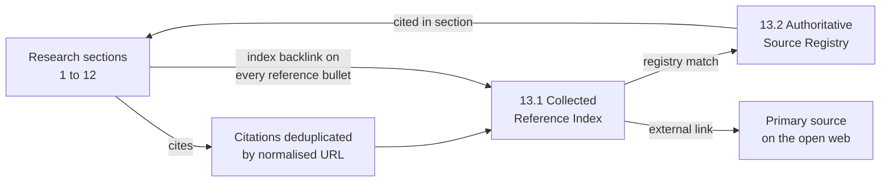

References
Section 13 of 14
226 unique cited sources
1,764 registry entries

## 13.1 How this reference system works

Every empirical claim in this doksite is traceable to a live-retrieved primary source. To keep that traceability usable rather than decorative, all citations were lifted out of the twelve research documents and re-assembled here as three linked layers:

1. **The collected reference index (§13.1)** — every unique source cited anywhere in the corpus, de-duplicated by normalised URL, with the years and the section that cites it.
2. **The authoritative source registry (§13.2)** — the 1764 primary sources discovered during the source-expansion phase, preserved in their original numbering and grouped into seven institutional categories.
3. **Bidirectional cross-links** — 124 of the registry entries resolve to a section that actually cites them, and every reference bullet inside sections 1–12 links back into the index.

### 13.1.1 Citation vocabulary used across the site

| Marker | Meaning |
|---|---|
| `[2025]` / `[2026]` | Inline citation carrying the publication year, linked to the primary source |
| `index ↗` | Sits under every reference bullet and jumps to that source in §13.1 |
| `cited in §1.16` | Sits on an index entry and jumps back to the citing section |
| `registry ↗` | Shown when a cited URL also exists as an entry in §13.2 |

### 13.1.2 Section coverage

| Section | Document | Unique cited sources |
|---|---|---|
| 1 | <a href="/01-master-report/">Master Report — Islamic Fintech Gap Analysis &amp; Startup Blueprint (2026 Edition)</a> | 89 |
| 2 | <a href="/02-gap-01-juzsukuk/">Gap 01 — JuzSukuk</a> | 22 |
| 3 | <a href="/03-gap-02-sanadflow/">Gap 02 — SanadFlow</a> | 21 |
| 4 | <a href="/04-gap-03-halalport/">Gap 03 — HalalPort</a> | 17 |
| 5 | <a href="/05-gap-04-amanpayung/">Gap 04 — AmanPayung</a> | 20 |
| 6 | <a href="/06-gap-05-waqftrace/">Gap 05 — WaqfTrace</a> | 17 |
| 7 | <a href="/07-gap-06-adlscore/">Gap 06 — AdlScore</a> | 16 |
| 8 | <a href="/08-gap-07-siratremit/">Gap 07 — SiratRemit</a> | 15 |
| 9 | <a href="/09-gap-08-fiqhstack/">Gap 08 — FiqhStack</a> | 22 |
| 10 | <a href="/10-gap-09-qisthalal/">Gap 09 — QistHalal</a> | 18 |
| 11 | <a href="/11-gap-10-tayyibledger/">Gap 10 — TayyibLedger</a> | 19 |
| 12 | <a href="/12-llm-usage-and-cost-analysis/">LLM Usage &amp; Cost Intelligence — Research Pipeline Telemetry, Rate Cards &amp; CFO Briefing</a> | 11 |

## 13.2 Reference collections

| Ref | Collection | Entries | Domains | Cross-linked |
|---|---|---|---|---|
| **13.2.1** | <a href="/13-references/source-registry/academic-journals-economic-research/">Academic Journals &amp; Economic Research</a> | 341 | 87 | 14 |
| **13.2.2** | <a href="/13-references/source-registry/multilateral-institutions-standard-setters/">Multilateral Institutions &amp; Standard-Setters (AAOIFI, IFSB, IsDB, WB, BIS, IMF)</a> | 407 | 32 | 33 |
| **13.2.3** | <a href="/13-references/source-registry/regulators-central-banks/">Regulators &amp; Central Banks (BNM, SC, SAMA, CMA, CBUAE, DFSA, ADGM, CBB, OJK, SBP, SECP)</a> | 319 | 34 | 61 |
| **13.2.4** | <a href="/13-references/source-registry/credit-rating-agencies-global-benchmarks/">Credit Rating Agencies &amp; Global Benchmarks (Fitch, S&amp;P, Moody's, DinarStandard, LSEG)</a> | 126 | 14 | 19 |
| **13.2.5** | <a href="/13-references/source-registry/islamic-financial-institutions-fintech-primaries/">Islamic Financial Institutions &amp; Fintech Primaries (Banks, Sukuk, SCF, P2P, Brokerage)</a> | 246 | 41 | 40 |
| **13.2.6** | <a href="/13-references/source-registry/ecosystem-hubs-accelerators-venture-capital/">Ecosystem Hubs, Accelerators &amp; Venture Capital (Hub71, DIFC Hive, BFB, SVC, Jada, HASAN)</a> | 248 | 26 | 25 |
| **13.2.7** | <a href="/13-references/source-registry/frontier-ai-technology-infrastructure/">Frontier AI &amp; Technology Infrastructure (OpenAI, Anthropic, Google, DeepSeek, Alibaba, etc.)</a> | 77 | 26 | 19 |
| | **All collections** | **1764** | **260** | **124** |

:::tip[Cross-linking works in both directions]
Every reference bullet in sections 1–12 carries an `index ↗` link into §13.1. Every entry in §13.1 links back to the section that cites it (`cited in §…`) and, where the same URL exists in the registry, straight into the matching §13.2 category page.
:::
