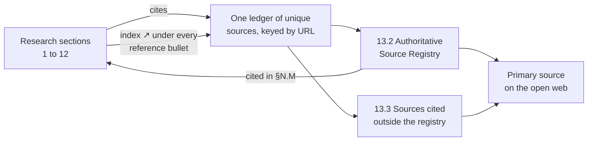

References
Section 13 of 14
1,650 unique sources
226 cited by the research

	

		Section map
		1 sections · 3 parts
	

	<ol class="ga-map-list">
		<li class="ga-map-item">
			<a class="ga-map-link" href="#s13-1">13.1How this reference system works</a>
			<ul class="ga-map-sub">
				<li><a href="#s13-1-1">13.1.1Citation vocabulary used across the site</a></li>
				<li><a href="#s13-1-2">13.1.2What is in this section</a></li>
				<li><a href="#s13-1-3">13.1.3Section coverage</a></li>
			</ul>
		</li>
	</ol>

## `13.1` How this reference system works

Every empirical claim in this doksite resolves to a live-retrieved primary source. Section 13 is a single ledger of 1,650 unique sources, each listed **exactly once**, split into three subsections:

1. **§13.2 The authoritative source registry** — the 1,548 sources retrieved during the source-expansion pass, grouped into 7 institutional categories. In the corpus registry 216 of its 1,764 registry rows repeated a URL that was already listed; each URL is one row here, keeping its first registry number and naming every other number and every section that cites it.
2. **§13.3 Sources cited outside the registry** — the 102 sources the research cites that the registry pass never reached, grouped by the section that cites them first. Registry sources are not repeated here.
3. **Cross-links in both directions** — 124 registry sources carry a `cited in §…` link back to the section that uses them, and every reference bullet in sections 1–12 carries an `index ↗` link that jumps to that source's one row.

### `13.1.1` Citation vocabulary used across the site

| Marker | Meaning |
|---|---|
| `[2025]` / `[2026]` | Inline citation carrying the publication year, linked to the primary source |
| `index ↗` | Under every reference bullet in sections 1–12; jumps to that source's single row in §13.2 or §13.3 |
| `cited in §1.16` | On a source row; jumps back to the section that cites it |
| `r118` | A registry number: stable, and directly linkable as `#r118` |

### `13.1.2` What is in this section

| Subsection | Contents | Sources |
|---|---|---|
| <a href="/13-references/source-registry/">13.2 Authoritative Source Registry</a> | Every source retrieved during the source-expansion pass, by institutional category | **1,548** |
| <a href="/13-references/cited-sources/">13.3 Sources cited outside the registry</a> | Citations the registry pass never picked up, by the section that cites them first | **102** |
| | **Total unique sources** | **1,650** |

Registry numbers preserved from the corpus: **1,764**, covering **1,548** URLs. **1,245** of the 1,548 registry rows and **102** of the 102 citations in §13.3 name their source with its real page title, fetched once by `bun run titles` into a committed cache. Where a source has no title to read — a PDF download endpoint, a site that refuses automated requests — the row shows its domain instead of a guess. Every external link in this section opens in a new window, so the page you are reading stays where it is.

### `13.1.3` Section coverage

| Section | Document | Unique cited sources |
|---|---|---|
| 1 | <a href="/01-master-report/">Master Report — Islamic Fintech Gap Analysis &amp; Startup Blueprint (2026 Edition)</a> | 89 |
| 2 | <a href="/02-gap-01-juzsukuk/">Gap 01 — JuzSukuk</a> | 22 |
| 3 | <a href="/03-gap-02-sanadflow/">Gap 02 — SanadFlow</a> | 21 |
| 4 | <a href="/04-gap-03-halalport/">Gap 03 — HalalPort</a> | 17 |
| 5 | <a href="/05-gap-04-amanpayung/">Gap 04 — AmanPayung</a> | 20 |
| 6 | <a href="/06-gap-05-waqftrace/">Gap 05 — WaqfTrace</a> | 17 |
| 7 | <a href="/07-gap-06-adlscore/">Gap 06 — AdlScore</a> | 16 |
| 8 | <a href="/08-gap-07-siratremit/">Gap 07 — SiratRemit</a> | 15 |
| 9 | <a href="/09-gap-08-fiqhstack/">Gap 08 — FiqhStack</a> | 22 |
| 10 | <a href="/10-gap-09-qisthalal/">Gap 09 — QistHalal</a> | 18 |
| 11 | <a href="/11-gap-10-tayyibledger/">Gap 10 — TayyibLedger</a> | 19 |
| 12 | <a href="/12-llm-usage-and-cost-analysis/">LLM Usage &amp; Cost Intelligence — Research Pipeline Telemetry, Rate Cards &amp; CFO Briefing</a> | 11 |
| | **Sections 1–12** | **226** |

:::tip[Why one ledger instead of two lists]
The collected citation index and the registry used to overlap: 124 sources appeared in both, and the registry repeated 216 further URLs. Each source is now a single row carrying its registry number, its institutional category and every section that cites it.
:::
