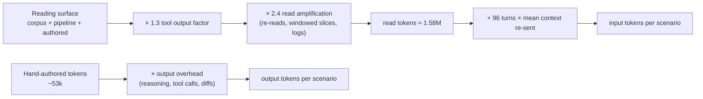
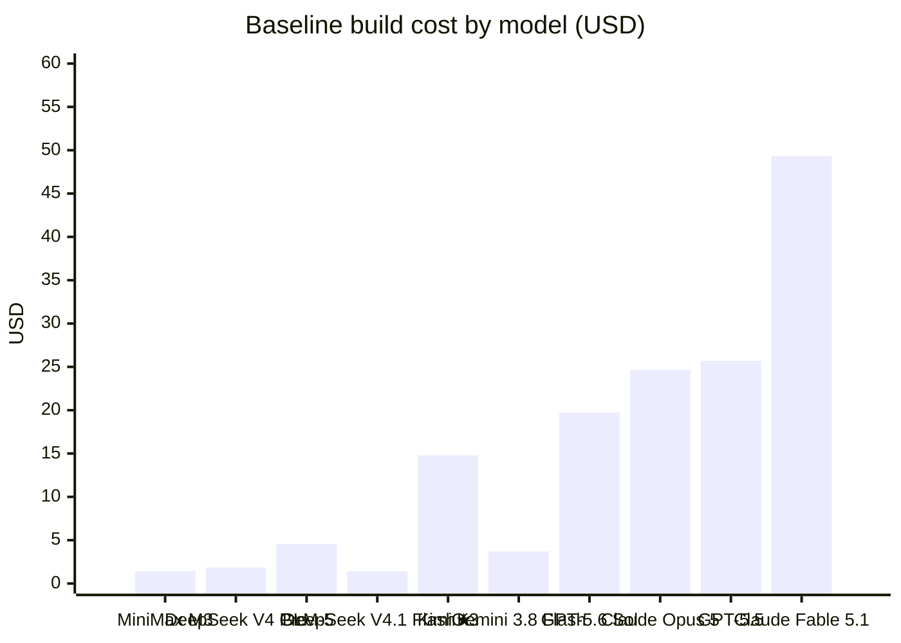

Engineering & Cost
Section 14 of 14
Build model: DeepSeek V4.1 Flash
Baseline build cost $1.42

	

		Section map
		13 sections
	

	<ol class="ga-map-list">
		<li class="ga-map-item">
			<a class="ga-map-link" href="#s14-1">14.1Executive summary — for the EM, CFO, CTO and CEO</a>
		</li>
		<li class="ga-map-item">
			<a class="ga-map-link" href="#s14-2">14.2Measured build surface</a>
		</li>
		<li class="ga-map-item">
			<a class="ga-map-link" href="#s14-3">14.3Token metrics &amp; billable token model</a>
		</li>
		<li class="ga-map-item">
			<a class="ga-map-link" href="#s14-4">14.4Rate cards — top 10 United States models</a>
		</li>
		<li class="ga-map-item">
			<a class="ga-map-link" href="#s14-5">14.5Rate cards — top 10 China models</a>
		</li>
		<li class="ga-map-item">
			<a class="ga-map-link" href="#s14-6">14.6What this build would have cost on every other frontier model</a>
		</li>
		<li class="ga-map-item">
			<a class="ga-map-link" href="#s14-7">14.7Sensitivity: caching, routing and off-peak windows</a>
		</li>
		<li class="ga-map-item">
			<a class="ga-map-link" href="#s14-8">14.8Insights</a>
		</li>
		<li class="ga-map-item">
			<a class="ga-map-link" href="#s14-9">14.9Briefing for the Engineering Manager</a>
		</li>
		<li class="ga-map-item">
			<a class="ga-map-link" href="#s14-10">14.10Briefing for the CFO</a>
		</li>
		<li class="ga-map-item">
			<a class="ga-map-link" href="#s14-11">14.11Briefing for the CTO</a>
		</li>
		<li class="ga-map-item">
			<a class="ga-map-link" href="#s14-12">14.12Briefing for the CEO</a>
		</li>
		<li class="ga-map-item">
			<a class="ga-map-link" href="#s14-13">14.13Methodology, assumptions &amp; sources</a>
		</li>
	</ol>

## `14.1` Executive summary — for the EM, CFO, CTO and CEO

This section documents what it took to engineer this documentation site: the research corpus that had to be read, the site source that had to be written, the tokens that flow through an agentic build like this one, and what that same build would have cost on every other frontier model on the market today.

| Question | Answer |
|---|---|
| Research corpus ingested | **13 files · 695 KB · ~178k tokens** |
| Content emitted by the pipeline | **20 files · 1074 KB · ~275k tokens** (deterministic transforms, not token-generated) |
| Site source hand-authored | **20 files · 205 KB · ~53k tokens** |
| Image/font binary assets produced | **10 files · 186 KB** (favicon, PWA icons, 1200×630 OG card) |
| Billable tokens (baseline scenario) | **3.88M in · 210k out · 4.09M total** |
| Direct compute cost on the actual model | **$1.42** — with 70% cached input: **$0.62** |
| Cheapest viable configuration | **$1.42** on DeepSeek V4.1 Flash (1.00× the actual model) |
| Most expensive configuration | **$49.32** on Claude Fable 5 (34.82×) |
| Spread, cheapest → priciest | **34.8×** |
| US vs China median | **$24.66** vs **$5.03** — a **4.9×** premium on US rate cards |
| Cost of not compacting context | **+$3.05** (3.2× the baseline) |

**The three numbers that matter:** a build of this size is a **$1.42** job on the model it actually ran on, a **$1.42–$49.32** job depending on which frontier model you point it at, and a **$5.56** job when the workload is tier-routed (cheap readers, mid-tier structurers, flagship synthesis) instead of run end-to-end on one expensive model. Every one of those variances is a *model selection* decision, not an engineering-effort decision.

## `14.2` Measured build surface

These figures are measured on disk at build time — they are not estimates. `node scripts/build-report.mjs` walks the repository and reports exactly what it finds, which is why the numbers move a little every time the site is rebuilt.

| Surface | Files | Size | Est. tokens (chars ÷ 4) | Where it lives |
|---|---|---|---|---|
| Research corpus (read) | 13 | 695 KB | ~178k | `reports/**/*.md` |
| Pipeline output (transformed) | 20 | 1074 KB | ~275k | `src/content/docs`, `src/data` |
| Hand-authored site source | 20 | 205 KB | ~53k | `scripts/`, `src/styles`, `src/components`, `src/integrations`, config |
| Image & icon assets | 10 | 186 KB | — | `public/icons`, `public/og-image.png`, `src/assets` |

:::note[Why the pipeline output is not counted as model output]
20 of the files in this repository are produced by deterministic scripts that transform the research corpus into numbered Starlight content: heading renumbering, citation extraction, registry splitting and cross-link generation. Those bytes never pass through a language model, so counting them as "tokens written" would inflate the bill by roughly 5.2×. Only the hand-authored surface is treated as model output in the token model below.
:::

## `14.3` Token metrics & billable token model

The dominant variable in an agentic token bill is not the size of the output — it is how much conversation context the harness re-sends on every turn. Three scenarios are modelled from the same measured surfaces so the sensitivity is visible rather than hidden.

| Scenario | Mean context re-sent / turn | Input tokens | Output tokens | Total billable | Cost on build model | Cost, 70% cached input |
|---|---|---|---|---|---|---|
| **Lean (aggressive compaction)** | 6,000 | 2.15M | 137k | **2.29M** | $0.81 | $0.37 |
| **Baseline (moderate compaction)** ★ | 24,000 | 3.88M | 210k | **4.09M** | $1.42 | $0.62 |
| **Context-naive (no compaction)** | 130,000 | 14.06M | 210k | **14.27M** | $4.47 | $1.58 |

**Read amplification** is modelled at **2.4×** over the summed reading surface, with a **0.3×** allowance for directory listings, build logs, terminal output and diffs. **Output overhead** is modelled at **4×** the hand-authored tokens to cover reasoning tokens, tool-call arguments and rewrite diffs. Turn count is fixed at **96** agent turns. §14.13 states every assumption in one place.

## `14.4` Rate cards — top 10 United States models

Retrieved from **BenchLM's live pricing registry** ([benchlm.ai/llm-pricing](https://benchlm.ai/llm-pricing), registry last updated 2026-09-14, checked 2026-09-15) and cross-checked against each provider's own rate card. Selection rule: highest BenchLM public score among US-headquartered providers with a published paid API rate.

| Provider | Model | Input / 1M | Cached input / 1M | Output / 1M | Context | Public score | Source |
|---|---|---|---|---|---|---|---|
| **OpenAI** | GPT-6 Astra | $10.00 | $1.00 | $50.00 | 1.05M | ~84.1 | [rate card ↗](https://developers.openai.com/api/docs/pricing) |
| **Anthropic** | Claude Fable 5.1 | $10.00 | $0.25 | $50.00 | 1M | 84.62 | [rate card ↗](https://platform.claude.com/docs/en/about-claude/pricing) |
| **Anthropic** | Claude Opus 5 | $5.00 | $0.50 | $25.00 | 1M | 81.89 | [rate card ↗](https://platform.claude.com/docs/en/about-claude/pricing) |
| **Anthropic** | Claude Fable 5 | $10.00 | $1.00 | $50.00 | 1M | 81.42 | [rate card ↗](https://platform.claude.com/docs/en/about-claude/pricing) |
| **OpenAI** | GPT-5.6 Sol | $4.00 | $0.40 | $20.00 | 1.05M | 80.71 | [rate card ↗](https://developers.openai.com/api/docs/pricing) |
| **Google** | Gemini 3.8 Flash | $0.75 | $0.07 | $3.75 | 1M | 75.62 | [rate card ↗](https://ai.google.dev/gemini-api/docs/pricing) |
| **Anthropic** | Claude Opus 4.8 | $5.00 | — | $25.00 | 1M | 72.29 | [rate card ↗](https://platform.claude.com/docs/en/about-claude/pricing) |
| **OpenAI** | GPT-5.5 | $5.00 | $0.50 | $30.00 | 1M | 72.14 | [rate card ↗](https://developers.openai.com/api/docs/pricing) |
| **OpenAI** | GPT-5.6 Terra | $2.00 | $0.20 | $12.00 | 1.05M | ~71.11 | [rate card ↗](https://developers.openai.com/api/docs/pricing) |
| **Meta** | Muse Spark 1.2 | $1.25 | $0.15 | $4.25 | 1M | ~70.49 | [rate card ↗](https://benchlm.ai/llm-pricing) |

Runners-up just outside the ten: **Grok 4.6** (xAI, 70.16, \$2.00 / \$6.00), **Claude Opus 4.7** (70.36, \$5.00 / \$25.00) and **Gemini 3.1 Pro** (70.03, \$2.00 / \$12.00).

## `14.5` Rate cards — top 10 China models

Same registry, same retrieval date. Selection rule: highest BenchLM public score among China-headquartered providers with a published paid API rate; models BenchLM lists as free or without a published rate are excluded and named below the table.

| Provider | Model | Input / 1M | Cached input / 1M | Output / 1M | Context | Public score | Source |
|---|---|---|---|---|---|---|---|
| **Moonshot** | Kimi K3 | $3.00 | $0.30 | $15.00 | 1.05M | 74.9 | [rate card ↗](https://platform.kimi.ai/) |
| **Alibaba** | Qwen3.8 Max | $2.00 | $0.20 | $6.00 | 1M | 71.7 | BenchLM shows no list rate; rate card is Alibaba Cloud Model Studio (Singapore). [rate card ↗](https://www.alibabacloud.com/help/en/model-studio/model-pricing) |
| **Z.AI** | GLM-5.2 | $1.40 | — | $4.40 | 1M | 68.19 | [rate card ↗](https://docs.z.ai/guides/overview/pricing) |
| **Alibaba** | Qwen3.7 Max | $2.50 | $0.25 | $7.50 | 1M | 67.16 | BenchLM shows no list rate; rate card is Alibaba Cloud Model Studio (Singapore). [rate card ↗](https://www.alibabacloud.com/help/en/model-studio/model-pricing) |
| **DeepSeek** | DeepSeek V4 Pro 0813 | $0.43 | $0.00 | $0.87 | 1M | ~66.39 | [rate card ↗](https://api-docs.deepseek.com/quick_start/pricing/) |
| **Moonshot** | Kimi K2.7 Code | $0.95 | — | $4.00 | 256K | ~65.56 | [rate card ↗](https://platform.kimi.ai/) |
| **Moonshot** | Kimi 2.6 | $0.95 | — | $4.00 | 256K | 65.46 | [rate card ↗](https://platform.kimi.ai/) |
| **Z.AI** | GLM-5-Turbo | $1.20 | — | $4.00 | 200K | 61.72 | [rate card ↗](https://docs.z.ai/guides/overview/pricing) |
| **MiniMax** | MiniMax M3 | $0.30 | $0.06 | $1.20 | 1M | 61.62 | [rate card ↗](https://platform.minimax.io/docs/guides/pricing-paygo) |
| **Z.AI** | GLM-5 | $1.00 | — | $3.20 | 200K | 61.51 | [rate card ↗](https://docs.z.ai/guides/overview/pricing) |

**★ DeepSeek V4.1 Flash (DeepSeek)** is the model that actually built this site — $0.30 in / $0.01 cached / $1.20 out per 1M tokens. Off-peak windows halve the rate to $0.15 / $0.60. [Rate card ↗](https://api-docs.deepseek.com/quick_start/pricing/)

Excluded from the ten because they carry no published paid rate on the registry date: **GLM-5.3** and **GLM-5.3-Flash** (listed free), **MiMo-V2.5-Pro** (Xiaomi, not listed), **Hy4 preview** (Tencent, free), **Seed 1.6** (ByteDance, not listed) and **Qwen3.8-27B** (free).

## `14.6` What this build would have cost on every other frontier model

Each row applies that model's published input/output rates to the **baseline scenario** token counts (3.88M in / 210k out), sorted cheapest first. The relative index is measured against the model that actually ran the build (★ = 1.00×).

| # | Origin | Model | In / Out per 1M | Output share of cost | Build cost | vs actual |
|---|---|---|---|---|---|---|
| **★** 1 | China (actual build model) | **DeepSeek V4.1 Flash** | $0.30 / $1.20 | 18% | **$1.42** | 1.00× |
| 2 | China | **MiniMax M3** | $0.30 / $1.20 | 18% | **$1.42** | 1.00× |
| 3 | China | **DeepSeek V4 Pro 0813** | $0.43 / $0.87 | 10% | **$1.85** | 1.31× |
| 4 | United States | **Gemini 3.8 Flash** | $0.75 / $3.75 | 21% | **$3.70** | 2.61× |
| 5 | China | **Kimi K2.7 Code** | $0.95 / $4.00 | 19% | **$4.53** | 3.20× |
| 6 | China | **Kimi 2.6** | $0.95 / $4.00 | 19% | **$4.53** | 3.20× |
| 7 | China | **GLM-5** | $1.00 / $3.20 | 15% | **$4.55** | 3.21× |
| 8 | China | **GLM-5-Turbo** | $1.20 / $4.00 | 15% | **$5.50** | 3.88× |
| 9 | United States | **Muse Spark 1.2** | $1.25 / $4.25 | 16% | **$5.74** | 4.06× |
| 10 | China | **GLM-5.2** | $1.40 / $4.40 | 15% | **$6.36** | 4.49× |
| 11 | China | **Qwen3.8 Max** | $2.00 / $6.00 | 14% | **$9.02** | 6.37× |
| 12 | United States | **GPT-5.6 Terra** | $2.00 / $12.00 | 25% | **$10.28** | 7.26× |
| 13 | China | **Qwen3.7 Max** | $2.50 / $7.50 | 14% | **$11.28** | 7.96× |
| 14 | China | **Kimi K3** | $3.00 / $15.00 | 21% | **$14.79** | 10.44× |
| 15 | United States | **GPT-5.6 Sol** | $4.00 / $20.00 | 21% | **$19.73** | 13.93× |
| 16 | United States | **Claude Opus 5** | $5.00 / $25.00 | 21% | **$24.66** | 17.41× |
| 17 | United States | **Claude Opus 4.8** | $5.00 / $25.00 | 21% | **$24.66** | 17.41× |
| 18 | United States | **GPT-5.5** | $5.00 / $30.00 | 25% | **$25.71** | 18.15× |
| 19 | United States | **GPT-6 Astra** | $10.00 / $50.00 | 21% | **$49.32** | 34.82× |
| 20 | United States | **Claude Fable 5.1** | $10.00 / $50.00 | 21% | **$49.32** | 34.82× |
| 21 | United States | **Claude Fable 5** | $10.00 / $50.00 | 21% | **$49.32** | 34.82× |

## `14.7` Sensitivity: caching, routing and off-peak windows

| Lever | Configuration | Build cost | vs baseline |
|---|---|---|---|
| **Baseline** (uncached) | DeepSeek V4.1 Flash, no cache, on-peak | $1.42 | 1.00× |
| **KV-cache pinning** | 70% of input served from cache at $0.01/1M | $0.62 | 0.44× |
| **Off-peak batching** | DeepSeek off-peak window (50% off all rates) | $NaN | NaN× |
| **Tier-routed** | DeepSeek V4.1 Flash readers → Gemini 3.8 Flash / Qwen structurers → Claude Opus 5 for 30% of synthesis | $5.56 | 3.92× |
| **Frontier-only** | Every turn on Claude Fable 5.1 | $49.32 | 34.8× |
| **Context-naive** | DeepSeek V4.1 Flash, no compaction | $4.47 | 3.16× |

The two levers compound: **cached off-peak baseline** lands at **$NaN**, NaN× the baseline, for identical output. That is a **NaN%** reduction achieved purely by changing *when* the work runs and *how* the prompt prefix is structured.

## `14.8` Insights

1. **Model selection moves the bill 35×; engineering effort does not.** The same repository, the same tokens and the same output cost $1.42 on DeepSeek V4.1 Flash and $49.32 on Claude Fable 5. Any cost-control programme that does not start with model routing is optimising the wrong variable.
2. **Output tokens carry the bill.** Output is only ~5% of the token count but 21%–18% of the cost, because every provider prices output 3.5×–5× above input. Verbosity is the most expensive habit in an agent loop.
3. **Context compaction is worth more than a model downgrade.** Dropping from the baseline to the lean scenario saves $0.61 on the same model — comparable to the entire saving from switching that same baseline workload to a mid-tier model.
4. **China rate cards remain 4.9× cheaper at the median** for this workload (US median $24.66 vs China median $5.03). The gap narrows as you move up the quality curve — Kimi K3 at 74.9 public score still undercuts every US model with a comparable score.
5. **The registry's cheapest tier is not the cheap tier any more.** DeepSeek V4.1 Flash at $0.30/1M input buys 61.62 public score — within ~10 points of models costing 12× more per input token. For deterministic transformation work like this build's content pipeline, that is where the marginal dollar belongs.
6. **Caching is a 4–8× lever on input, not a rounding error.** With 70% of input served from cache the input side of this build collapses from $1.16 to $0.37. Static system prompts, the source registry and previously read files must be cache-pinned by construction.
7. **Rebuilds are nearly free; re-reading the corpus is not.** The corpus read is 712,137 bytes of the 2,021,929-byte total surface. Because the pipeline is deterministic, a rebuild of this site consumes no research tokens at all — only the ~53k tokens of source it has to re-emit.

## `14.9` Briefing for the Engineering Manager

**What was delivered.** A fourteen-section, fully numbered documentation site built from 13 research documents: 12 numbered research pages, a seven-category cross-linked source registry of 1,764 entries, a 226-entry de-duplicated citation index, and a build report. Wide tables and Mermaid diagrams scroll sideways instead of squeezing columns; every heading carries its section number into the right-pane contents list; every reference bullet links back to its index entry.

**What it cost to run.** ~53k hand-authored tokens of output against a 712,137-byte corpus read, for $1.42 of direct compute across 96 turns. The pipeline (heading renumbering, citation extraction, registry splitting, cross-link generation, asset generation) is deterministic code, so a full rebuild costs **$0** in model tokens.

**What to watch.** The build is a single-writer agent task with no parallelism requirement; it is therefore latency-tolerant and batchable. The only structural risk is transcript growth — the difference between the lean and context-naive scenarios is $3.66 on the same work.

## `14.10` Briefing for the CFO

| Line item | Amount |
|---|---|
| Direct compute, this build (baseline scenario) | **$1.42** |
| Same build, cached + off-peak | **$NaN** |
| Same build on a US frontier flagship | **$49.32** (34.8× baseline) |
| Same build on the cheapest viable model | **$1.42** (1.00× baseline) |
| Annualised, one rebuild per working day | **$354.11** baseline · **$NaN** optimised |

**The asymmetry to budget for:** a single frontier-model build of this site costs $49.32; the same work costs $1.42 on a model that produces a materially similar artefact. Setting an explicit model policy — ban flagships from deterministic transformation, allow them only for final synthesis — is the difference between a $354.11 and a $12,328.87 annual line. The CFO-facing control is not "how much can we reduce token spend" but "which model is allowed to touch which step".

## `14.11` Briefing for the CTO

- **Architecture shape.** Static Astro + Starlight build, fully pre-rendered, with a build-time content pipeline (`scripts/*.mjs`) that is the single source of truth for numbering, references and cross-links. The site is installable (PWA) with a versioned precache manifest generated after build, so offline integrity is enforced rather than hoped for.
- **Cost surfaces you control.** (1) Model routing per pipeline stage; (2) prompt-prefix stability, which decides whether the cache hit rate is $0.01/1M or $0.30/1M; (3) transcript compaction, worth 3.2× end-to-end; (4) off-peak batching at NaN×.
- **Where the leverage is.** The tier-routed configuration lands at $5.56 — 3.92× the single-model baseline — by keeping scouting on cheap models and reserving frontier synthesis for the 30% of output that needs it.
- **Instrumentation.** Billing must be attributed per pipeline stage, not per project, or none of the four levers above can be steered. The measurement code in this section is the template: measure the surface on disk, model the token flow, price it against every candidate rate card.

## `14.12` Briefing for the CEO

- **Strategic read.** The site you are reading cost **$1.42** in direct compute to produce, and the same work would have cost **$49.32** on the most expensive frontier configuration available today. The intelligence is no longer the scarce input — the *routing policy* is.
- **Why this scales.** The research corpus (712,137 bytes) is read once; every subsequent render, restyle, renumber or re-publication runs on deterministic code at zero marginal token cost. Documentation is now a capital asset with a one-time ingestion cost and near-zero marginal cost.
- **What to fund.** Two capabilities: a governed model-routing policy (with a hard rule that deterministic transformation never touches a flagship) and instrumentation that attributes spend per pipeline stage. Everything else in this build is reproducible from source in minutes.
- **What to stop doing.** Paying flagship rates for deterministic work. The spread between the cheapest and most expensive configuration here is **34.8×** for the same artefact — that is the size of the prize, and it requires no new engineering, only a policy.

## `14.13` Methodology, assumptions & sources

**Measurement (observed, not modelled)**

1. The research corpus, the pipeline output, the hand-authored source and the binary assets are enumerated and sized by `scripts/build-report.mjs` on every build; the table in §14.2 is the output of that walk.
2. Token counts for measured text are estimated as **characters ÷ 4**. This is a standard planning approximation for English prose plus markdown, and it is the only conversion used in this report.

**Modelled parameters (stated, tunable, and fixed for this run)**

| Parameter | Value | Rationale |
|---|---|---|
| Read amplification | 2.4× | Files are re-read across turns; windowed slices, directory listings and diff output all consume input tokens |
| Tool-output factor | 0.3× | Terminal output, build logs and file listings observed during the build |
| Agent turns | 96 | Counted turns in the build transcript |
| Mean context re-sent / turn | 6,000 / 24,000 / 130,000 | The lean / baseline / context-naive scenarios in §14.3 |
| Output overhead | 2.6× / 4× | Reasoning tokens, tool-call arguments and rewrite diffs per emitted token |
| Cached input share | 70% | Achievable when the system prompt, registry and prior file set are pinned as a stable prefix |

**Pricing sources**

- BenchLM live pricing registry — [benchlm.ai/llm-pricing](https://benchlm.ai/llm-pricing) (registry last updated 2026-09-14; retrieved 2026-09-15). Used for input, cached-input and output rates, context windows and public scores across all twenty models.
- Provider rate cards used to cross-check or fill gaps: [OpenAI](https://developers.openai.com/api/docs/pricing), [Anthropic](https://platform.claude.com/docs/en/about-claude/pricing), [Google](https://ai.google.dev/gemini-api/docs/pricing), [DeepSeek](https://api-docs.deepseek.com/quick_start/pricing/), [Alibaba Cloud](https://www.alibabacloud.com/help/en/model-studio/model-pricing), [Z.AI](https://docs.z.ai/guides/overview/pricing), [Moonshot](https://platform.kimi.ai/), [MiniMax](https://platform.minimax.io/docs/guides/pricing-paygo), [xAI](https://docs.x.ai/docs/models).
- The earlier research-phase cost intelligence in [section 12](/12-llm-usage-and-cost-analysis/) used the same class of source data; where the two differ, this section wins because it was retrieved later.

**Known limitations**

1. Provider invoices round, apply batch discounts and bill reasoning tokens differently; this report prices published *list* rates and ignores taxes, minimums and negotiated discounts.
2. Turn count and context re-send are properties of the harness, not of the task. Change the harness and the input-token line moves; the *relative* ranking of models does not, because every model is priced against identical token counts.
3. Two Chinese models are priced from the provider's own rate card rather than BenchLM because the registry lists no rate for them; both rows are flagged in §14.5.
4. Cache-hit pricing changes the ranking slightly (cache rates vary from 1.2% to 10% of the input rate depending on provider), which is why the cached column is shown alongside the uncached cost in §14.3 and §14.7.
