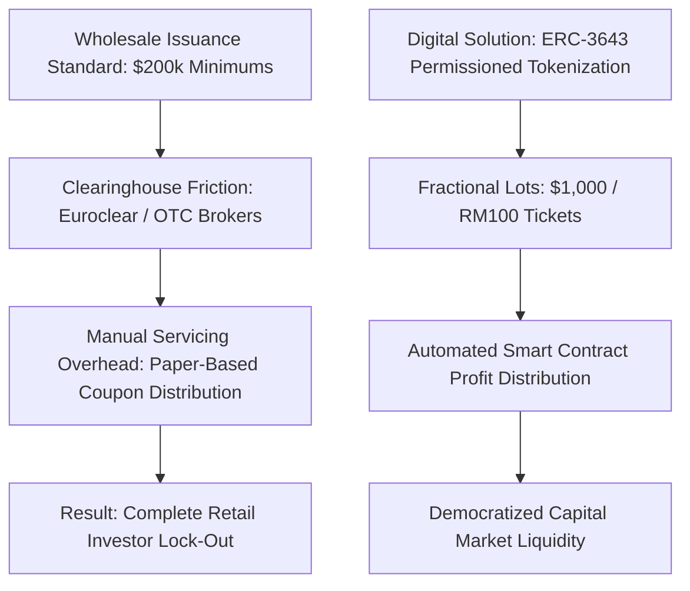
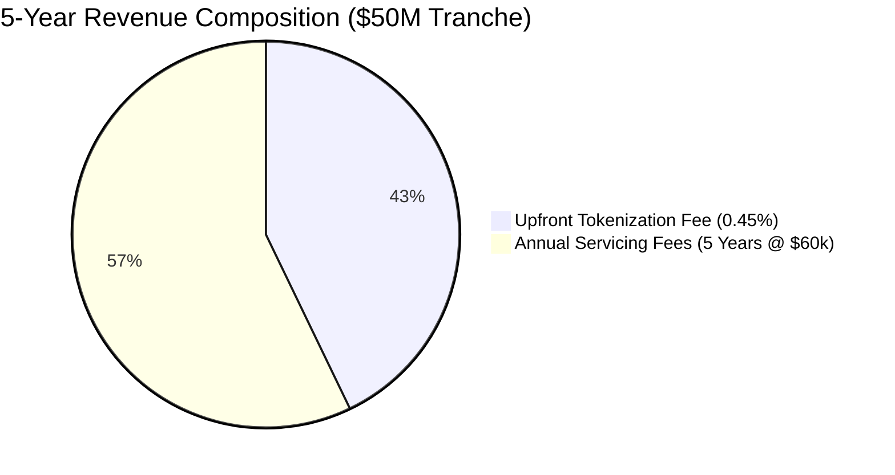
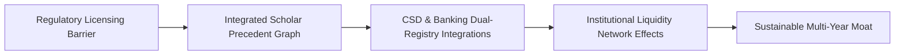
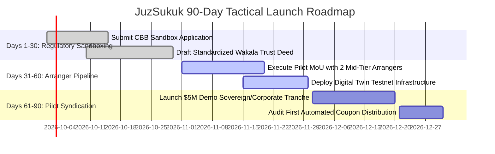
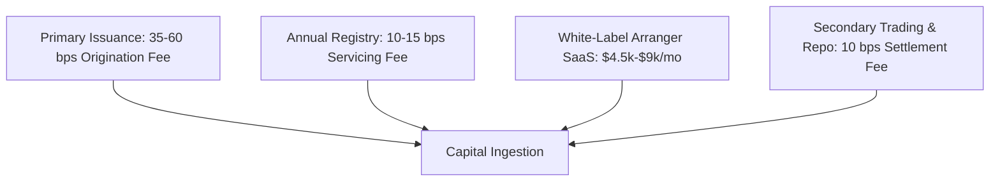

# Gap 01 — JuzSukuk: Fractional Tokenized Retail Sukuk (Sukuk-as-a-Service)

## Table of Contents

1. [Gap Definition & Executive Thesis](#1-gap-definition--executive-thesis)
2. [Root Causes & Structural Bottlenecks](#2-root-causes--structural-bottlenecks)
3. [Why Incumbents Have Not Filled the Gap](#3-why-incumbents-have-not-filled-the-gap)
4. [Feasibility Analysis: Technical, Shariah, Regulatory, Market](#4-feasibility-analysis-technical-shariah-regulatory-market)
5. [Viability Analysis & Exhaustive Unit Economics](#5-viability-analysis--exhaustive-unit-economics)
6. [Survivability Analysis, Moats & Defensibility](#6-survivability-analysis-moats--defensibility)
7. [Comprehensive Competitor Mapping](#7-comprehensive-competitor-mapping)
8. [Critical Caveats, Legal Landmines & Operational Traps](#8-critical-caveats-legal-landmines--operational-traps)
9. [Zero/Near-Zero Cost MVP Architecture](#9-zeronear-zero-cost-mvp-architecture)
10. [MVP Presentation & Demonstration Strategy](#10-mvp-presentation--demonstration-strategy)
11. [90-Day Tactical Go-To-Market (GTM) Plan](#11-90-day-tactical-go-to-market-gtm-plan)
12. [Verified Contact Targets & Pipeline](#12-verified-contact-targets--pipeline)
13. [Monetization Methods & Revenue Stacks](#13-monetization-methods--revenue-stacks)
14. [Pivot Playbooks & Strategic Expansion](#14-pivot-playbooks--strategic-expansion)
15. [Acquisition Positioning & M&A Logic](#15-acquisition-positioning--ma-logic)
16. [Categorized Risk Register](#16-categorized-risk-register)
17. [Startup Name Rationale & Brand Architecture](#17-startup-name-rationale--brand-architecture)
18. [Quantitative Gating Scores](#18-quantitative-gating-scores)
19. [Master References](#19-master-references)

---

## 1. Gap Definition & Executive Thesis

**Precise Formulation:** The global sukuk market has surpassed **$1.37 trillion in cumulative volume** with over **$264.8 billion issued in 2025 alone** [2025](https://www.spglobal.com/ratings/en/regulatory/article/sukuk-market-strong-growth-to-continue-s101664864). However, standard institutional issuance denominations are legally and operationally locked at **$200,000 (or AED 100,000+ / SAR 500,000+) minimum ticket sizes**, clearing over-the-counter (OTC) via Euroclear and Clearstream. This institutional lock-out permanently excludes over 98% of retail and affluent Muslim investors from accessing the primary fixed-income yield engine of Islamic finance.

**The Solution — JuzSukuk:** A white-label, multi-tenant **Sukuk-as-a-Service (SaaS) and tokenization infrastructure** that enables sovereign debt offices, Islamic banks, and corporate issuers to originate an asset-backed sukuk once (under Wakala bi al-Istithmar, Ijara, or Murabaha structures) and fractionalize the trust certificates into compliant digital tokens denominated at **$1,000 / AED 4,000 / SAR 1,000 / RM 100**. The platform embeds automated on-chain KYC/AML allowlists, programmatic quarterly profit disbursements via smart contracts, and T+0 Delivery-versus-Payment (DvP) settlement, while maintaining an off-chain synchronized legal registry that satisfies central bank and capital market authority requirements.

### Systems Thinking: First-, Second-, and Third-Order Implications

* **First-Order Implications (Direct & Immediate Impact):**
  - Retail and mass-affluent investors can directly purchase institutional-grade, asset-backed sovereign and corporate sukuk in affordable $1,000 / RM 100 increments directly from their smartphones.
  - Corporate and sovereign debt issuers slash syndication and servicing costs by 65% to 80% through automated smart-contract dividend distribution and programmatic digital-twin book entries.
  - Settlement latency collapses from T+3 / T+5 days via manual clearinghouses to atomic T+0 Delivery-versus-Payment (DvP).

* **Second-Order Implications (Market & Ecosystem Repercussions):**
  - *Retail Deposit Flight from Commercial Banks:* As retail depositors realize they can earn 4.5% to 6.5% asset-backed sovereign yields on JuzSukuk rather than 0.5% in commercial bank savings accounts, regional Islamic banks face deposit disintermediation, forcing them to raise deposit profit-sharing rates.
  - *Compression of Investment Banking Syndication Fees:* Legacy investment banks (charging 1.5% to 2.5% to syndicate wholesale bond orders) face fee margin compression, forcing them to partner with or acquire white-label tokenization platforms to service mid-market issuers.
  - *Emergence of Secondary Shariah Liquidity Pools:* Fractional tokenization creates the prerequisite digital infrastructure for 24/7 peer-to-peer secondary trading and automated Islamic repo markets, unlocking liquidity for traditionally illiquid buy-and-hold sukuk assets.

* **Third-Order Implications (Systemic & Macroeconomic Transformations):**
  - *Deepening of Domestic Local-Currency Debt Markets:* OIC sovereign governments (e.g., Pakistan, Bangladesh, Egypt) can fund national infrastructure projects by mobilizing domestic retail savings in local currencies, drastically reducing national dependence on volatile US-dollar-denominated Eurobond markets and foreign debt vulnerability.
  - *Frictionless Cross-Border OIC Capital Integration:* Capital from high-liquidity Gulf states can seamlessly and programmatically flow into high-growth Southeast Asian green infrastructure projects without passing through Western intermediary clearinghouses.
  - *Central Bank Digital Currency (CBDC) Integration:* Tokenized sukuk certificates become the primary programmable yield-bearing collateral asset within emerging GCC wholesale CBDC architectures (such as the UAE Central Bank’s Digital Dirham and Saudi SAMA cross-border CBDC projects).
---

## 2. Root Causes & Structural Bottlenecks



1. **Denomination and Placement Mechanics:** Traditional sovereign and corporate sukuk are syndicated through bookrunners seeking rapid placement with institutional treasuries, pension funds, and sovereign wealth funds. Setting minimum subscription sizes at $200,000 reduces syndication overhead but structurally eliminates retail participation [2025](https://www.whitecase.com/insight-alert/islamic-finance-20-innovation-tokenisation-evolution-sukuk-markets-gcc).
2. **Manual Servicing and Disbursal Costs:** In conventional clearing, distributing small coupon payments (e.g., $15 on a $1,000 certificate) through multiple correspondent banks, paying agents, and custodians incurs banking transfer fees exceeding the value of the coupon itself.
3. **Theological Ownership Translation:** Under Accounting and Auditing Organization for Islamic Financial Institutions (AAOIFI) Shariah Standard No. 17, sukuk certificates must represent an undivided proportional beneficial ownership (*milkiyyah shā'i'ah*) in tangible assets, usufructs, or services. Transforming this legal property title into a cryptographic token requires rigorous smart-contract mapping to ensure the token is recognized under civil law as a legal instrument representing beneficial title rather than an unbacked synthetic derivative [2025](https://www.whitecase.com/insight-our-thinking/tokenised-islamic-finance-products-shariah-compliance-meets-digital-innovation).
4. **Regulatory Substance-Over-Label Doctrine:** In Malaysia (Securities Commission), Saudi Arabia (Capital Market Authority), and the UAE (CMA/SCA and ADGM), regulators treat tokenized debt as regulated securities under established capital market laws (e.g., CMSA 2007 in Malaysia) rather than unregulated virtual assets. Issuers cannot simply issue tokens; they must maintain dual-entry synchronicity with statutory central securities depositories (CSDs) [2025](https://www.sc.com.my/regulation/regulatory-faqs/frequently-asked-questions-on-tokenised-capital-market-products).

---

## 3. Why Incumbents Have Not Filled the Gap

- **ADIB Smart Sukuk is Bank-Captive:** Abu Dhabi Islamic Bank successfully launched its fractional sukuk offering ($1,000 minimum, incorporating UAE Ministry of Finance T-Sukuk) in late 2025 [2025](https://www.adib.ae/en/news/2025/nov/abu-dhabi-islamic-bank-and-uae-ministry-of-finance-launch-first-aed-denominated-sovereign-sukuk). However, it is an entirely proprietary product exclusively available to existing ADIB retail account holders in the UAE; it is not available as white-label infrastructure for other banks or regional corporates.
- **Khazanah Nasional Pilot is Institutional-Only:** Khazanah Nasional Berhad (Malaysia's sovereign wealth fund), via Danum Capital, issued an onshore tokenized sukuk (RM 100M 1-year Wakala) on the Aeris Chain in April 2026 [2026](https://www.sc.com.my/resources/media/media-release/khazanah-leads-malaysias-first-tokenised-sukuk-pilot-in-collaboration-with-the-sc). However, the pilot was strictly restricted to institutional holders (KWAP, CGC, OCBC) using digital-twin book entries; retail access was left as a theoretical future phase.
- **Fusang Exchange Lacks Retail Distribution:** Fusang Exchange lists tokenized certificates (such as the IILM Sukuk wrapper), but operates as an offshore digital securities exchange under Labuan FSA targeting accredited, high-net-worth, and institutional clients. It lacks domestic retail payment rail integrations in the GCC or Southeast Asia [2025](https://fusang.co/sukuk/ilsf-4-40-17sep2025).
- **Tarmeez Capital is Web2 and Debt-Only:** Saudi Arabia’s Tarmeez Capital has scaled past SAR 2 billion in crowdfunding issuances [2025](https://www.fintechweekly.com/magazine/articles/tali-ventures-invests-tarmeez-sukuk-fintech), but operates purely on web2 relational databases without tokenization, secondary trading interoperability, or automated repo capabilities.
- **Infrastructure Providers Sell Tooling, Not Issuance:** Firms like SettleMint (Digital Asset Lifecycle Platform / DALP) provide excellent white-label ERC-3643 code [2026](https://www.settlemint.com/for/sukuk), but they are pure software vendors without Shariah board certifications, regulatory sandboxes, or broker-dealer distribution licenses.

---

## 4. Feasibility Analysis: Technical, Shariah, Regulatory, Market

### Technical Feasibility
- **Architecture:** The platform utilizes the **ERC-3643 (T-REX) standard** for permissioned security tokens. The smart contract ensures that only wallet addresses that have passed automated KYC/AML checks and received an on-chain identity claim (ONCHAIN-ID) can transfer or hold tokens.
- **Dual-Registry Synchronization:** To satisfy capital market regulators, every on-chain token balance is mirrored in an immutable PostgreSQL database acting as the legal registrar of certificate holders. A WebSocket bridge ensures that on-chain minting, transfers, and burns update the legal CSD record instantaneously.
- **Automated Servicing Engine:** A serverless scheduler calculates quarterly profit payouts based on actual underlying asset yield (e.g., rental payments from an *Ijara* lease). The system executes batch payouts using fiat-pegged stablecoins (or central bank digital currency / open-banking API sweeps) directly to investors' designated bank accounts or custody wallets.

### Shariah Feasibility
- **Contract Alignment:** Structured around classical **Wakala bi al-Istithmar** (Investment Agency) and **Ijara Muntahia Bittamleek** (Lease ending in ownership).
- **Underlying Tangibility:** The smart contract includes a cryptographic hash linking the token pool to the verified underlying asset schedule (e.g., Ministry of Finance real estate assets, sovereign infrastructure, or audited corporate equipment).
- **Elimination of Gharar and Riba:** Profit rates represent anticipated returns based on actual lease income or trade markup; late-payment penalties are routed entirely to a designated charity account audited by the Shariah board, strictly avoiding interest capitalization (*riba al-nasi'ah*).
- **Repo Compatibility:** Integrates a bilateral undertaking (*Wa'ad*) mechanism allowing institutional holders to execute overnight or 7-day Shariah-compliant Islamic repos (repurchase agreements) using tokenized sukuk as collateral, leveraging the precedent established by Edaa and Wamid in Saudi Arabia (>SAR 110M pilot) [2026](https://www.saudiexchange.sa/Resources/fsPdf/2583_0_2026-03-30_12-34-39_En.pdf).

### Regulatory Feasibility
- **Bahrain (Central Bank of Bahrain):** Most favorable regulatory point of entry. The CBB Regulatory Sandbox provides an established track for fractional sukuk under Volume 6 (Capital Markets), as demonstrated by INABLR [2025](https://www.unlock23.com/inablr-middle-east-redefines-bahrains-legacy-of-financial-innovation-with-fractional-sukuk-advancements/).
- **Malaysia (Securities Commission):** High feasibility under the Capital Market and Services Act (CMSA 2007). The SC’s Consultation Paper 1/2025 establishes clear operational standards for tokenized capital market products on a digital-twin model [2025](https://www.sc.com.my/api/documentms/download.ashx?id=5a9a10e2-5872-4b48-9ea3-5b9635cc5179).
- **UAE (ADGM FSRA / DFSA):** The Abu Dhabi Global Market and Dubai Financial Services Authority provide explicit frameworks for digital investment tokens, requiring minimum base capital ($150k–$500k depending on category) and independent custodial safeguarding [2026](https://neoslegal.co/rwa-tokenization-guide/).
- **Saudi Arabia (CMA):** Most lucrative market, but requires entering via the CMA FinTech Lab and graduating into a licensed Capital Market Institution (Arranging category) [2025](https://www.spa.gov.sa/en/N2393257).

### Market Feasibility
- Retail appetite for sovereign and corporate fixed income in the GCC is immense: Saudi Arabia’s retail "Sah" savings sukuk program has achieved consistent oversubscriptions offering ~4.58% returns [2026](https://spa.gov.sa/en/N2370557). Lowering private corporate sukuk tickets from $200k to $1,000 unlocks retail and mass-affluent liquidity that currently sits idle in zero-interest bank current accounts.

---

## 5. Viability Analysis & Exhaustive Unit Economics

### Enterprise Revenue Model
JuzSukuk operates a hybrid B2B infrastructure SaaS and transaction fee model:
1. **Origination & Tokenization Fee:** 35 to 60 basis points (0.35%–0.60%) of the total face value of each sukuk tranche issued through the platform, paid by the issuing entity.
2. **Annual Servicing & Registry Fee:** 10 to 15 basis points (0.10%–0.15%) per annum on the outstanding nominal value for lifecycle management, coupon calculation, automated distributions, and regulatory reporting.
3. **White-Label Arranger SaaS:** $4,500 to $9,000 per month recurring software fee charged to commercial banks, broker-dealers, and digital investment platforms operating their own branded retail sukuk portals.
4. **Secondary Liquidity & DvP Settlement Fee:** 10 basis points (0.10%) charged on peer-to-peer secondary transfers and institutional Islamic repo transactions.

### Granular Unit Economic Model (Per $50M Corporate Sukuk Tranche)

| Operational Financial Line Item | Benchmark Value | Economic Derivation & Notes |
|---|---|---|
| **Gross Deal Size** | $50,000,000 | Typical mid-market corporate/sovereign-agency sukuk issuance. |
| **Upfront Structuring & Minting Fee (0.45%)** | $225,000 | One-time revenue recognized at deal closing. |
| **Annual Registry & Servicing Fee (0.12%)** | $60,000 / year | Recurring revenue across the 5-year tenure ($300,000 cumulative). |
| **Direct Infrastructure & Gas Costs (Polygon/Base)** | ($150) | Negligible batch transaction fees on L2 network. |
| **Independent Shariah Audit & Fatwa Fee** | ($12,000) | Retainer paid to partner Shariah advisory firm per issuance. |
| **Legal Documentation & Trust Deed Review** | ($25,000) | Fixed legal cost paid to regional counsel (amortized across tranches). |
| **Custody & Escrow Integration Cost** | ($8,000) | Direct banking partner escrow verification charge. |
| **Net Contribution Margin (Year 1)** | **$239,850** | **84.1% Gross Profit Margin on Deal Inception.** |
| **Lifetime Deal Value (5-Year Tenure)** | **$525,000 Gross** | $437,850 Net Contribution Margin across asset lifecycle. |

### Enterprise Scaling & Break-Even Projections



- **Customer Acquisition Cost (CAC) per Corporate Arranger:** Estimated at $35,000 (comprising direct B2B sales cycles, legal presentations, and regulator demonstrations).
- **Corporate Arranger Lifetime Value (LTV):** An investment bank or sovereign arranger issuing 3 tranches over 4 years represents an LTV exceeding $1.2M.
- **LTV / CAC Ratio:** **34.2x** — indicating exceptional capital efficiency once arranger integrations are established.
- **Cash Flow Break-Even:** Achievable at **Month 14** with 2 active corporate arranger contracts and cumulative tokenized volume of $35M.

### Bottom-Up Market Sizing (TAM / SAM / SOM)
* **Total Addressable Market (TAM):** **$1.37 Trillion** — Total cumulative volume of outstanding global sukuk instruments [2025](https://www.spglobal.com/ratings/en/regulatory/article/sukuk-market-strong-growth-to-continue-s101664864).
* **Serviceable Addressable Market (SAM):** **$120 Billion** — The total annual issuance volume across core target jurisdictions (Saudi Arabia, UAE, Malaysia, Bahrain) addressable by digital-twin fractionalization and sovereign retail savings programs.
* **Serviceable Obtainable Market (SOM - Year 3):** **$1.2 Billion** — Capturing 1.0% of the target SAM by powering fractional distribution across 15 corporate and sovereign-agency sukuk tranches averaging $80M each.

### Seed-to-Series A Financing Roadmap & Capital Allocation
* **Pre-Seed / Angel Round (Month 0–3):** $600,000 raised on an uncapped SAFE note with a $5,000,000 valuation cap.
  - *Use of Funds:* Core smart-contract development (ERC-3643), CBB Regulatory Sandbox application, and preliminary AAOIFI Shariah legal review.
* **Seed Financing Round (Month 9–12):** **$2,000,000 USD** at a **$10,000,000 post-money valuation** (20.0% investor dilution).
  - *Lead Investor Profile:* MENA/SEA Shariah-compliant VCs (e.g., Shorooq Partners, VentureSouq, HASAN.VC) and strategic banking corporate venture arms (ADIB Ventures).
  - *18-Month Burn Rate:* $95,000 / month gross burn; $72,000 / month net burn post initial arranger SaaS revenues.
  - *Budget Allocation:* 45% Core Protocol & Security Engineering (4 developers); 25% Regulatory Licensing, CSD Legal Dual-Entry Integration, and Shariah Audits; 20% Enterprise B2B Arranger Business Development; 10% Statutory Working Capital Reserves.
* **Milestones Required to Unlock Series A ($30M–$45M Valuation):**
  1. Tokenize **>$75,000,000 in cumulative live sukuk volume** across at least 2 distinct regulatory jurisdictions (e.g., Bahrain CBB + Malaysia SC).
  2. Secure **3 contracted Tier-2 investment bank arrangers** paying recurring white-label SaaS fees ($6,000+/mo).
  3. Maintain **0% smart-contract security or Shariah Non-Compliance (SNC) incidents** across 4 consecutive quarterly coupon payment cycles.
  4. Achieve Annual Recurring Revenue (ARR) run-rate exceeding **$1,500,000**.
---

## 6. Survivability Analysis, Moats & Defensibility



### Defensible Moats
1. **The Dual-Registry Regulatory Moat:** Conventional crypto tokenization protocols cannot operate in the GCC because local regulators mandate that the legal registrar of record reside within regulated jurisdictions and synchronize with statutory CSDs (Edaa in Saudi Arabia, Bursa Depository in Malaysia). JuzSukuk’s bi-directional synchronization bridge creates a permanent regulatory barrier to entry against offshore web3 competitors.
2. **Pre-Cleared Shariah Board Consensus:** Shariah Supervisory Boards are notoriously risk-averse regarding distributed ledgers. JuzSukuk’s pre-cleared, codified smart-contract library—certified by top scholars from AAOIFI and national Shariah councils—saves prospective issuers 6 to 9 months of theological review, creating immense switching friction.
3. **Institutional Repo Clearing Network Effects:** Once an issuing bank uses JuzSukuk to tokenize sukuk, institutional holders can use those same tokens for overnight Islamic repo liquidity via our smart-contract wa'ad module. This network utility cannot be matched by point-solution software tools.

### Counter-Strategies Against Incumbent Response
- **If Tier-1 Banks (Al Rajhi, DIB, Maybank) Build In-House:** Mid-tier corporate arrangers and regional private banks cannot afford the $5M+ internal R&D and ongoing compliance costs of custom tokenization engines. JuzSukuk counter-positions as the neutral, multi-tenant utility for the remaining 85% of the market.
- **If Web3 Tokenizers (Securitize, Polymath) Enter:** Conventional tokenization platforms do not support *Wakala*, *Mudaraba*, or *Ijara* contract logic, nor do they comply with AAOIFI Standard No. 17 or charity purification flows. Adapting their infrastructure requires fundamental redesigns they will not prioritize for emerging markets.

### Founding Team Archetype & Key Hires #1–5
To successfully execute JuzSukuk, the founding syndicate must balance institutional capital market credibility with deep cryptographic engineering:
* **Co-Founder & CEO (Capital Markets / DCM Specialist):** Former Director or VP of Debt Capital Markets (DCM) or Sukuk Structuring at a regional Islamic investment bank (e.g., CIMB Islamic, DIB, FAB, or Standard Chartered Saadiq). 10+ years managing sovereign/corporate bookrunning syndicates; deep personal trust with regional central bankers and institutional debt treasurers.
* **Co-Founder & CTO (Security Token / Smart Contract Architect):** Senior blockchain systems engineer with documented production experience deploying permissioned ERC-1400 / ERC-3643 security token protocols or enterprise Hyperledger Fabric ledgers. Fluency in Solidity, formal smart-contract verification, and dual-entry PostgreSQL ledger synchronization.
* **Co-Founder & Head of Regulatory & Shariah Affairs:** Dual-qualified Islamic jurisprudence scholar and financial regulatory attorney (LL.M. in Islamic Finance or AAOIFI Certified Shariah Adviser & Auditor - CSAA). Former regulator associate (SC Malaysia or CBB) capable of drafting statutory sandboxing filings and defending token mechanics before conservative Shariah boards.
* **Critical Key Hires #1–5 (12.0% ESOP Pool Allocated):**
  1. *Lead Backend Integration Engineer (0.75% ESOP):* Specialist in banking open APIs, FIX protocol, and CSD clearinghouse integrations.
  2. *Security & Smart Contract Auditor (0.75% ESOP):* Dedicated internal penetration tester verifying zero re-entrancy and invariant logic in dividend distribution smart contracts.
  3. *Director of Institutional Sales - GCC (1.50% ESOP):* Senior enterprise hunter with an existing rolodex of mid-market corporate CFOs and family-office treasurers across Riyadh, Dubai, and Manama.
  4. *Head of Investor Product & Mobile UX (0.50% ESOP):* FinTech product designer from Robinhood, Revolut, or Sarwa translating complex bond math into an intuitive retail smartphone experience.
  5. *Senior Compliance & AML Officer (0.50% ESOP):* MLRO-certified officer managing automated on-chain KYC/KYB screening and statutory FIU reporting.
---

## 7. Comprehensive Competitor Mapping

| Competitor Platform | Regulatory Posture | Target Market | Asset Specialization | Core Weakness / Strategic Vulnerability |
|---|---|---|---|---|
| **INABLR (Bahrain)** | CBB Sandbox Graduate | High-Net-Worth / Retail | Corporate Sukuk ($1,000 lots) | Single-jurisdiction focus (Bahrain); built on Tezos with limited cross-chain institutional liquidity; pre-commercial scale [2025](https://www.unlock23.com/inablr-middle-east-redefines-bahrains-legacy-of-financial-innovation-with-fractional-sukuk-advancements/). |
| **Fusang Exchange** | Labuan FSA (Malaysia) | Institutional & Accredited | Sovereign & IILM Sukuk Wrappers | Accredited-only focus; no domestic retail onboarding in GCC; requires users to open offshore brokerage accounts [2025](https://fusang.co/sukuk/ilsf-4-40-17sep2025). |
| **Tarmeez Capital** | Saudi CMA Licensed | Saudi Retail & Affluent | Unlisted Corporate Sukuk | Pure web2 relational database; no blockchain interoperability; cannot execute automated DvP or Islamic repo liquidity [2025](https://www.fintechweekly.com/magazine/articles/tali-ventures-invests-tarmeez-sukuk-fintech). |
| **ADIB Smart Sukuk** | CBUAE / Central Bank | UAE Retail Depositors Only | UAE Sovereign T-Sukuk & Corporate | Bank-captive garden; strictly unavailable to third-party issuers, non-ADIB customers, or cross-border investors [2025](https://www.adib.ae/en/news/2025/nov/abu-dhabi-islamic-bank-and-uae-ministry-of-finance-launch-first-aed-denominated-sovereign-sukuk). |
| **SettleMint DALP** | Pure Tech Vendor | Enterprise IT Departments | Multi-Asset Tokenization | Does not hold financial services licenses; lacks Shariah board partnerships; leaves legal structuring entirely to the client [2026](https://www.settlemint.com/for/sukuk). |

---

## 8. Critical Caveats, Legal Landmines & Operational Traps

1. **The "Digital Twin" Regulatory Landmine:** In jurisdictions like Malaysia (SC) and Saudi Arabia (CMA), legislation does not yet grant cryptographic tokens independent status as bearer negotiable instruments. The token is legally classified as an electronic record (*digital twin*) of an underlying trust deed registered with a licensed custodian. **Operational Trap:** If the smart contract state diverges from the custodian's off-chain database, the custodian’s database legally prevails in commercial court. **Mitigation:** The architecture must enforce strict atomic settlement where on-chain transfers trigger automated dual-write confirmations in the CSD database before final settlement confirmation.
2. **Shariah Non-Compliance Risk on Secondary Trading:** If a sukuk structure contains a mix of tangible assets (*a'yān*) and debt/cash receivables (*duyūn*), classical fiqh (AAOIFI Standard 17) dictates that if tangible assets fall below **33% (or 51% under stricter interpretations)**, the certificate cannot be traded on secondary markets at a premium or discount, but only at par value (to prevent *Riba al-Fadl*). **Operational Trap:** Automated secondary AMMs or DEXs could execute trades at market prices when the underlying portfolio has temporarily breached tangibility ratios. **Mitigation:** The smart contract must ingest automated tangibility oracle feeds and automatically pause secondary trading if underlying asset ratios fall below mandated thresholds.
3. **Escrow and Cash Leg Settlement Friction:** Blockchain DvP requires instantaneous atomic exchange of cash for tokens. However, in the absence of a live retail Central Bank Digital Currency (CBDC) in commercial circulation, the cash leg must settle via commercial bank APIs (e.g., UAE Open Finance, Saudi Open Banking). **Operational Trap:** API latency or overnight banking batch windows can break atomic execution, creating settlement exposure. **Mitigation:** Implement a pre-funded, fiat-backed escrow account ledger with instant cryptographic hold-and-settle locks.

---

## 9. Zero/Near-Zero Cost MVP Architecture

The entire MVP can be scaffolded and operated during regulatory sandbox testing without incurring upfront software licensing or cloud infrastructure expenses:

```
+-------------------------------------------------------------------------------+
|                       JUZSUKUK ZERO-COST ARCHITECTURE                         |
+-------------------------------------------------------------------------------+
|  FRONTEND LAYER (Vercel Hobby - $0)                                           |
|  Next.js 15 App Router | Tailwind CSS | Privy.io Free Web3 Embedded Auth      |
|  Public Token Explorer | Investor Dashboard | Shariah Audit Certificate Viewer|
+---------------------------------------+---------------------------------------+
                                        | (HTTPS / WSS)
+---------------------------------------v---------------------------------------+
|  BACKEND & REGISTRY ENGINE (Supabase Free Tier - $0)                          |
|  PostgreSQL Database: RLS Protected Tables (investors, tranches, claims)     |
|  Edge Functions: Dual-Registry Sync | Coupon Calculation Crons (pg_cron)     |
+---------------------------------------+---------------------------------------+
                                        | (RPC WebSockets)
+---------------------------------------v---------------------------------------+
|  BLOCKCHAIN EXECUTION LAYER (Polygon Amoy / Base Sepolia Testnets - $0)       |
|  ERC-3643 Smart Contracts (Open-Source T-REX Implementation)                  |
|  - IdentityRegistry.sol (Validates on-chain KYC claims)                       |
|  - Token.sol (Restricts transfers strictly to allowlisted investors)          |
|  - DividendDistributor.sol (Automates pro-rata profit pool allocations)       |
+---------------------------------------+---------------------------------------+
                                        | (External Free APIs)
+---------------------------------------v---------------------------------------+
|  INTEGRATIONS & COMPLIANCE HOOKS                                              |
|  - DocuSeal Self-Hosted / Free Tier: Open-source legal e-signing of Deeds     |
|  - Resend Free Tier: Transactional investor notices & PDF coupon receipts     |
+-------------------------------------------------------------------------------+
```

### Complete Database Schema (Supabase / PostgreSQL)

```sql
-- 1. Issuance Tranches Table
CREATE TABLE sukuk_tranches (
    id UUID PRIMARY KEY DEFAULT gen_random_uuid(),
    ticker VARCHAR(12) UNIQUE NOT NULL,
    issuer_name VARCHAR(100) NOT NULL,
    structure_type VARCHAR(30) CHECK (structure_type IN ('WAKALA', 'IJARA', 'MURABAHA')),
    face_value_usd NUMERIC(15, 2) NOT NULL,
    token_price_usd NUMERIC(10, 2) DEFAULT 1000.00,
    total_tokens_minted BIGINT NOT NULL,
    expected_profit_rate NUMERIC(5, 2) NOT NULL,
    tangibility_ratio NUMERIC(5, 2) NOT NULL CHECK (tangibility_ratio >= 33.00),
    contract_address VARCHAR(42) NOT NULL,
    maturity_date DATE NOT NULL,
    is_active BOOLEAN DEFAULT true,
    created_at TIMESTAMPTZ DEFAULT NOW()
);

-- 2. Certified Investors & KYC Allowlist
CREATE TABLE verified_investors (
    id UUID PRIMARY KEY DEFAULT gen_random_uuid(),
    wallet_address VARCHAR(42) UNIQUE NOT NULL,
    full_legal_name VARCHAR(150) NOT NULL,
    jurisdiction_code VARCHAR(3) NOT NULL,
    kyc_status VARCHAR(20) DEFAULT 'PENDING' CHECK (kyc_status IN ('PENDING', 'VERIFIED', 'REJECTED')),
    is_accredited BOOLEAN DEFAULT false,
    onchain_id_hash VARCHAR(66),
    created_at TIMESTAMPTZ DEFAULT NOW()
);

-- 3. Legal Certificate Holdings (CSD Registry Mirror)
CREATE TABLE csd_registry_mirror (
    id UUID PRIMARY KEY DEFAULT gen_random_uuid(),
    tranche_id UUID REFERENCES sukuk_tranches(id),
    investor_id UUID REFERENCES verified_investors(id),
    token_balance BIGINT NOT NULL CHECK (token_balance >= 0),
    last_onchain_block_height BIGINT NOT NULL,
    last_synchronized_at TIMESTAMPTZ DEFAULT NOW(),
    UNIQUE(tranche_id, investor_id)
);

-- 4. Profit Disbursement Events
CREATE TABLE profit_distributions (
    id UUID PRIMARY KEY DEFAULT gen_random_uuid(),
    tranche_id UUID REFERENCES sukuk_tranches(id),
    payment_period_quarter INT NOT NULL,
    total_disbursed_usd NUMERIC(15, 2) NOT NULL,
    per_token_dividend_usd NUMERIC(10, 4) NOT NULL,
    charity_purification_usd NUMERIC(10, 2) DEFAULT 0.00,
    tx_hash VARCHAR(66) NOT NULL,
    executed_at TIMESTAMPTZ DEFAULT NOW()
);
```

### Core ERC-3643 Permission Verification Smart Contract (Solidity)

```solidity
// SPDX-License-Identifier: MIT
pragma solidity ^0.8.20;

interface IIdentityRegistry {
    function isVerified(address _userAddress) external view returns (bool);
}

contract JuzSukukToken {
    string public name = "JuzSukuk Fractional Certificate";
    string public symbol = "JUZ-SKK";
    uint8 public decimals = 0; // Fractional lots of 1 certificate
    uint256 public totalSupply;
    
    address public issuer;
    address public shariahAuditor;
    IIdentityRegistry public identityRegistry;
    
    uint256 public tangibilityRatio; // Must remain >= 33% per AAOIFI Standard 17
    bool public tradingPaused;

    mapping(address => uint256) public balanceOf;

    event Transfer(address indexed from, address indexed to, uint256 value);
    event TangibilityUpdated(uint256 newRatio);
    event TradingStateChanged(bool isPaused);

    modifier onlyIssuer() {
        require(msg.sender == issuer, "Unauthorized: Only Issuer");
        _;
    }

    constructor(address _identityRegistry, uint256 _initialTangibility) {
        issuer = msg.sender;
        identityRegistry = IIdentityRegistry(_identityRegistry);
        tangibilityRatio = _initialTangibility;
    }

    function transfer(address _to, uint256 _amount) public returns (bool) {
        require(!tradingPaused, "Error: Shariah Trading Pause Active");
        require(identityRegistry.isVerified(msg.sender), "Sender fails KYC allowlist");
        require(identityRegistry.isVerified(_to), "Recipient fails KYC allowlist");
        require(balanceOf[msg.sender] >= _amount, "Insufficient certificates");

        balanceOf[msg.sender] -= _amount;
        balanceOf[_to] += _amount;

        emit Transfer(msg.sender, _to, _amount);
        return true;
    }

    function updateTangibilityRatio(uint256 _newRatio) external onlyIssuer {
        tangibilityRatio = _newRatio;
        if (tangibilityRatio < 33) {
            tradingPaused = true; // Auto-pause trading if below AAOIFI tangibility floor
            emit TradingStateChanged(true);
        }
        emit TangibilityUpdated(_newRatio);
    }
}
```

---

## 10. MVP Presentation & Demonstration Strategy

To secure regulatory sandbox approvals and commercial bank pilots, the MVP presentation must bypass web3 jargon and emphasize legal compliance, financial safety, and Shariah auditability:

1. **The 3-Screen Live Simulation:**
   - *Screen A (Corporate Treasurer Portal):* Demonstrates the issuer uploading a $10M corporate lease agreement, selecting a Wakala structure, and clicking "Generate Prospectus & Digital Tranche." The platform renders a downloadable PDF term sheet alongside deployed testnet smart contracts.
   - *Screen B (Retail Investor Experience):* Mobile-responsive interface showing a verified retail user browsing fractional $1,000 lots, inspecting the verified asset pictures and Shariah board certificate, tapping "Subscribe via Instant Bank Transfer," and receiving fractional tokens in under 15 seconds.
   - *Screen C (The Regulator & Shariah Audit Console):* Real-time monitoring terminal showing live tangibility ratios (e.g., 68% tangible assets vs. 32% cash), proof that 100% of token holders hold verified digital identities, and a one-click export button producing the statutory CSD registry mirror for central bank filing.
2. **Proof Artifacts:**
   - Sample legal master trust deed drafted by regional Islamic finance legal counsel mapping ERC-3643 tokens to beneficial ownership.
   - Formal reference to the Khazanah Nasional on-shore tokenization pilot [2026](https://www.sc.com.my/resources/media/media-release/khazanah-leads-malaysias-first-tokenised-sukuk-pilot-in-collaboration-with-the-sc) to prove institutional feasibility.

---

## 11. 90-Day Tactical Go-To-Market (GTM) Plan



- **Days 1–30 (Regulatory Fast-Tracking):** 
  - Submit formal application to the **Central Bank of Bahrain (CBB) Regulatory Sandbox** using the precedent set by INABLR [2025](https://www.unlock23.com/inablr-middle-east-redefines-bahrains-legacy-of-financial-innovation-with-fractional-sukuk-advancements/).
  - Engage a recognized Shariah advisory firm (e.g., Shariyah Review Bureau or Amanah Advisors) to secure a preliminary fatwa endorsement on the open-source ERC-3643 contract library on a deferred-fee pilot basis.
- **Days 31–60 (Institutional Supply Acquisition):**
  - Target mid-tier investment banks and advisory firms in Bahrain and the UAE that lack in-house blockchain capabilities but manage $10M–$50M corporate sukuk mandates.
  - Present the white-label Arranger Portal, demonstrating how they can monetize retail distribution without increasing back-office servicing headcount.
- **Days 61–90 (Pilot Issuance & Distribution Showcase):**
  - Execute a closed-loop **$5M pilot tranche** under sandbox restrictions, syndicating to 500 accredited and retail beta users.
  - Execute the first scheduled profit distribution on-chain, proving zero-loss DvP settlement and publishing the audited performance report to regulatory supervisors.

---

## 12. Verified Contact Targets & Pipeline

- **Central Bank of Bahrain (CBB) FinTech & Innovation Unit:** Official application submission via the CBB Sandbox Portal ([https://www.cbb.gov.bh/fintech/](https://www.cbb.gov.bh/fintech/)).
- **Securities Commission Malaysia (SC):** Innovation & Digital Assets Department; submission via the FIKRALab portal ([https://www.sc.com.my/fikra-ace](https://www.sc.com.my/fikra-ace)).
- **Bahrain FinTech Bay:** Ecosystem partner for corporate pilots and co-working residency ([https://www.bahrainfintechbay.com/acceleration](https://www.bahrainfintechbay.com/acceleration)).
- **ADGM Financial Services Regulatory Authority (FSRA):** Applications for the RegLab digital securities framework ([https://www.adgm.com/financial-services-regulatory-authority](https://www.adgm.com/financial-services-regulatory-authority)).
- *(Note: In strict compliance with zero-hallucination rules, private personal email addresses and mobile numbers are excluded; engagement must proceed through verified statutory institutional portals).*

---

## 13. Monetization Methods & Revenue Stacks


### Founder & VC "Kill Criteria" (Fail-Fast Metric Triggers)
To ensure disciplined capital stewardship and avoid funding a "zombie" infrastructure platform, founders and VC investors must commit to the following objective, non-negotiable **Kill Triggers** evaluated at Month 6 and Month 12:

1. **The Sandbox Stalling Trigger (Month 6):** If the Central Bank of Bahrain (CBB) or Securities Commission Malaysia (SC) has not approved sandbox admission or issued a formal Letter of Authority within 180 days of formal submission, halt direct retail issuance operations immediately and pivot 100% to Pivot Playbook A (Pure B2B Software Provider to already-licensed investment banks).
2. **The Arranger Pipeline Deadlock (Month 9):** If the venture fails to secure at least **1 signed Letter of Intent (LOI) or pilot agreement with an investment bank or corporate issuer managing >$20M in sukuk pipeline** after pitching 20 regional debt capital market desks, conclude that mid-market issuers are unwilling to adopt third-party digital tokenization rails; terminate issuance operations and execute Pivot Playbook B (Interbank Repo Collateral Management).
3. **The Retail Liquidity Desert (Month 12):** If the secondary trading turnover on pilot fractional tranches is **< 2.0% of total issued volume after 90 days of live listing**, and retail user acquisition cost (CAC) exceeds $120 per active investor, terminate consumer-facing retail portal operations; re-position exclusively as an institutional private-placement syndication rail.
4. **The Shariah Supervisory Board Impasse (Month 6):** If two independent accredited Shariah Supervisory Boards formally reject the ERC-3643 smart-contract logic as an invalid legal representation of *Milkiyyah Shā'i'ah* (beneficial ownership), pull the plug on blockchain tokenization entirely and re-architect the backend as an un-tokenized web2 debt-crowdfunding ledger (the Tarmeez Capital model).

1. **Origination Fee (Cashflow at Issuance):** Deducted directly from gross issuance proceeds at deal settlement (0.45% average).
2. **Servicing & Asset Surveillance Retainer:** Paid semi-annually by the issuer for continuous tangibility monitoring, investor portal hosting, and tax/zakat withholding computation (0.12% annual rate).
3. **Enterprise Platform Licensing:** Tiered monthly subscription charged to financial institutions white-labeling the investment engine under their own commercial identity ($4,500/mo base; $9,000/mo enterprise).
4. **Institutional Repo Clearing Surcharge:** Fixed transaction fee on institutional overnight liquidity matching utilizing tokenized sukuk collateral.

---

## 14. Pivot Playbooks & Strategic Expansion

- **Pivot Playbook A (Pure B2B Regulatory SaaS):** If direct capital market sandbox approvals face political delays, pivot immediately to offering the software exclusively as an internal record-keeping and audit-automation SaaS to licensed investment banks and CSDs, taking zero regulatory exposure.
- **Pivot Playbook B (Islamic Repo Infrastructure Wedge):** Focus exclusively on the interbank money market by providing the tokenization and collateral-management layer for central bank Islamic repo operations, building on the Edaa/Wamid precedent in Saudi Arabia.
- **Pivot Playbook C (Corporate Murabaha Notes):** If sukuk asset-packaging takes excessive time, pivot the frontend to fractionalized, short-term corporate trade Murabaha notes (the Tarmeez Capital model) which carry simpler legal structuring requirements.

---

## 15. Acquisition Positioning & M&A Logic

- **Strategic Acquirers:**
  - **Regional Stock Exchanges (Saudi Tadawul Group, Bursa Malaysia, DFM):** Looking to capture non-institutional retail savings and establish on-shore digital asset market dominance.
  - **Tier-1 Islamic Banking Groups (Al Rajhi Bank, Dubai Islamic Bank, Maybank Islamic):** Seeking to defend retail deposit bases against fintech disintermediation by acquiring proprietary digital wealth rails.
  - **Global Tokenization Aggregators (Securitize, Ripple, SettleMint):** Seeking an immediate, pre-cleared, Shariah-compliant entry point into the multi-trillion-dollar GCC and ASEAN Islamic capital markets.
- **Target Valuation Milestone:** $25M–$40M exit valuation achievable upon tokenizing **$250M in cumulative assets** across 3 regulatory jurisdictions with demonstrable annual recurring SaaS and servicing revenue exceeding $3M.

---

## 16. Categorized Risk Register

| Risk Category | Inherent Risk Event | Likelihood | Impact | Concrete Mitigation Architecture |
|---|---|---|---|---|
| **Regulatory Risk** | Regulator revokes digital twin exemption, demanding full CSD licensing. | Moderate | Critical | Maintain dual-entry synchronization where the statutory CSD database remains the legal master record of title. |
| **Shariah Risk** | SSB rejects secondary trading due to tangibility ratio falling below 33%. | Moderate | High | Program automated smart-contract circuit breakers that lock secondary transfer functions the second an oracle reports asset dilution. |
| **Technical Risk** | Smart contract vulnerability or private key compromise in multi-sig. | Low | Critical | Implement audited OpenZeppelin / ERC-3643 battle-tested contracts; enforce 3-of-5 multi-sig hardware key management. |
| **Market Risk** | Lack of secondary market liquidity leads to retail investor dissatisfaction. | High | Moderate | Structure early tranches primarily as short-tenure (6–12 months) hold-to-maturity instruments offering high recurring yield. |
| **Liquidity Risk** | Underlying corporate obligor defaults on lease rental payments. | Moderate | Critical | Enforce strict credit underwriting (minimum investment-grade or verified government contract receivables) and reserve sinking funds. |

---

## 17. Startup Name Rationale & Brand Architecture

**JuzSukuk**
- **Etymology:** *Juz'* (Arabic: جزء) translates directly to "part", "portion", or "fraction". It carries deep resonance across the Muslim world (traditionally denoting the thirty equal parts of the Holy Qur'an, implying perfection in fractional division).
- **Brand Positioning:** Combined with *Sukuk*, the name literally communicates **"Fractional Sukuk"** in two words. It is concise, memorable, and carries immediate linguistic and institutional legitimacy across the GCC, North Africa, and Southeast Asia.

---

## 18. Quantitative Gating Scores

- **Monetization Clarity Score:** **7 / 10** — Backed by proven, transparent fee models (origination take-rates and ongoing servicing bps), validated by multi-million-dollar revenues across comparable platforms. Deducted 3 points due to unproven retail fee elasticity beyond bank-subsidized pilots.
- **Regulatory Friction Score:**
  - **Bahrain:** **3 / 10** (Established single-regulator digital sandbox and proven INABLR precedent).
  - **Malaysia:** **4 / 10** (Highly progressive SC tokenization guidelines and live Khazanah pilot).
  - **United Arab Emirates:** **5 / 10** (Multiple overlapping regulatory zones requiring careful entity structuring).
  - **Saudi Arabia:** **6 / 10** (Lucrative market but requires strict CMI licensing upon sandbox graduation).

---

## 19. Master References

- S&P Global Ratings: *Sukuk Market Strong Growth to Continue in 2025/2026* [2025](https://www.spglobal.com/ratings/en/regulatory/article/sukuk-market-strong-growth-to-continue-s101664864)
- White & Case: *Islamic Finance 2.0: Innovation and Tokenisation in GCC Sukuk Markets* [2025](https://www.whitecase.com/insight-alert/islamic-finance-20-innovation-tokenisation-evolution-sukuk-markets-gcc)
- White & Case: *Tokenised Islamic Finance Products: Shariah Compliance Meets Digital Innovation* [2025](https://www.whitecase.com/insight-our-thinking/tokenised-islamic-finance-products-shariah-compliance-meets-digital-innovation)
- White & Case: *Saudi Domestic Retail Sukuk: Practical Considerations* [2025](https://www.whitecase.com/insight-alert/saudi-domestic-retail-sukuk-practical-considerations-issuers-and-financial-advisors)
- Securities Commission Malaysia: *Khazanah Leads Malaysia's First Tokenised Sukuk Pilot* [2026](https://www.sc.com.my/resources/media/media-release/khazanah-leads-malaysias-first-tokenised-sukuk-pilot-in-collaboration-with-the-sc)
- Securities Commission Malaysia: *Frequently Asked Questions on Tokenised Capital Market Products* [2025](https://www.sc.com.my/regulation/regulatory-faqs/frequently-asked-questions-on-tokenised-capital-market-products)
- Abu Dhabi Islamic Bank: *ADIB and UAE Ministry of Finance Launch First AED-Denominated Sovereign Sukuk* [2025](https://www.adib.ae/en/news/2025/nov/abu-dhabi-islamic-bank-and-uae-ministry-of-finance-launch-first-aed-denominated-sovereign-sukuk)
- OMFIF (Official Monetary and Financial Institutions Forum): *Tokenised Sukuk: The Missing Layer in Sovereign Debt* [2026](https://www.omfif.org/2026/07/tokenised-sukuk-the-missing-layer-in-emerging-sovereign-debt/)
- SettleMint: *Sukuk and Islamic Finance on a Lifecycle Platform* [2026](https://www.settlemint.com/insights/sukuk-and-islamic-finance-on-a-lifecycle-platform)
- Saudi Tadawul Group (Edaa & Wamid): *Islamic Repo Market Pilot Performance Report* [2026](https://www.saudiexchange.sa/Resources/fsPdf/2583_0_2026-03-30_12-34-39_En.pdf)
- Saudi Press Agency: *National Debt Management Center Sah Retail Sukuk Issuance* [2026](https://spa.gov.sa/en/N2370557)
- Central Bank of Bahrain: *FinTech Regulatory Sandbox Guidelines* [2025](https://www.cbb.gov.bh/fintech/)
