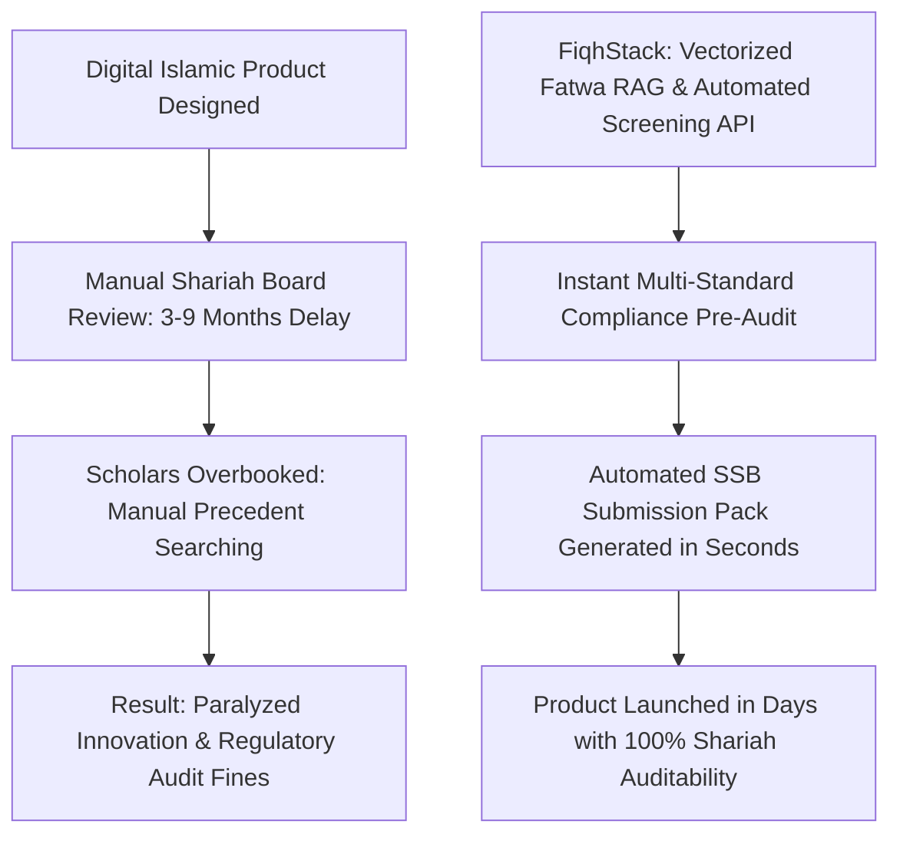
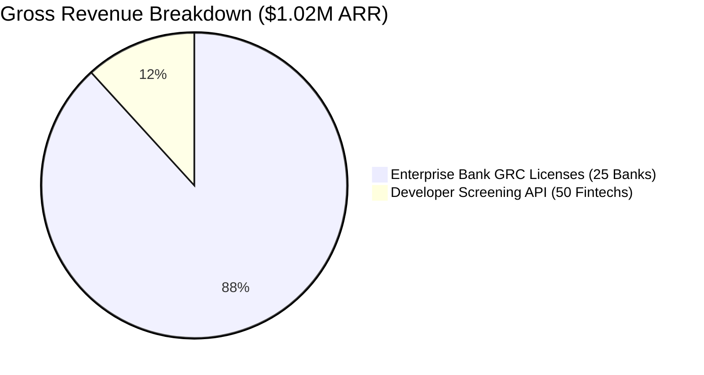
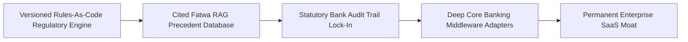
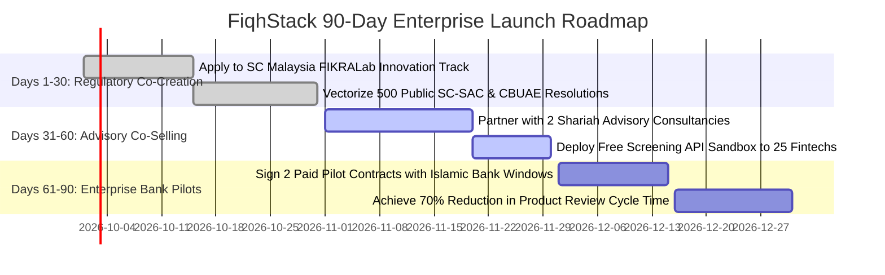
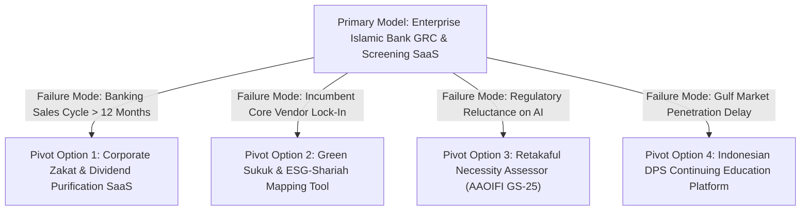

# Gap 08 — FiqhStack: AI Shariah-Compliance Layer & SSB Workflow Automation

## Table of Contents

1. [Gap Definition & Executive Thesis](#1-gap-definition--executive-thesis)
2. [Root Causes & Structural Bottlenecks](#2-root-causes--structural-bottlenecks)
3. [Why Incumbents Have Not Filled the Gap](#3-why-incumbents-have-not-filled-the-gap)
4. [Feasibility Analysis: Technical, Shariah, Regulatory, Market](#4-feasibility-analysis-technical-shariah-regulatory-market)
5. [Viability Analysis & Exhaustive Unit Economics](#5-viability-analysis--exhaustive-unit-economics)
6. [Survivability Analysis, Moats & Defensibility](#6-survivability-analysis-moats--defensibility)
7. [Comprehensive Competitor Mapping](#7-competitor-mapping)
8. [Critical Caveats, Legal Landmines & Operational Traps](#8-critical-caveats-legal-landmines--operational-traps)
9. [Zero/Near-Zero Cost MVP Architecture](#9-zeronear-zero-cost-mvp-architecture)
10. [MVP Presentation & Demonstration Strategy](#10-mvp-presentation--demonstration-strategy)
11. [90-Day Tactical Go-To-Market (GTM) Plan](#11-90-day-tactical-go-to-market-gtm-plan)
12. [Verified Contact Targets & Pipeline](#12-verified-contact-targets--pipeline)
13. [Monetization Methods & Revenue Stacks](#13-monetization-methods--revenue-stacks)
14. [Pivot Playbooks & Failure Fallback Options](#14-pivot-playbooks--failure-fallback-options)
15. [Acquisition Positioning & Salvage M&A Logic](#15-acquisition-positioning--salvage-ma-logic)
16. [Categorized Risk Register](#16-categorized-risk-register)
17. [Startup Name Rationale & Brand Architecture](#17-startup-name-rationale--brand-architecture)
18. [Quantitative Gating Scores](#18-quantitative-gating-scores)
19. [Master References](#19-master-references)

---

## 1. Gap Definition & Executive Thesis

**Precise Formulation:** The global Islamic financial services industry encompasses over **$5.98 trillion in assets across 1,600+ institutions** in 140 countries [2025](https://www.lseg.com/en/data-analytics/islamic-finance/islamic-market-intelligence/islamic-finance-development-report-2025). Every Islamic commercial bank, digital window, asset manager, and takaful operator is legally mandated by statutory prudential standards (such as Bank Negara Malaysia’s *Shariah Governance Policy Document / SGPD*, the UAE Central Bank’s *Higher Shariah Authority Standards*, and Indonesian *DSN-MUI Regulations*) to maintain an independent **Shariah Supervisory Board (SSB)**. However, Shariah governance remains cripplingly manual: field research reveals that **40% to 60% of Shariah officers' and scholars' time is consumed by manual administrative labor**—cross-referencing historical fatwa precedents across fragmented AAOIFI PDF volumes, assembling compliance checklists, manually verifying quarterly financial ratios on spreadsheets, and tracking Shariah Non-Compliance (SNC) operational incidents [2025](https://blog.zeroh.io/the-shariah-compliance-bottleneck-nobody-talks-about-and-how-to-fix-it/). Because the global pool of accredited *Fiqh al-Muamalat* scholars is small and heavily overbooked, product approval cycles for new digital banking features stretch to **3 to 9 months**, paralyzing fintech innovation.

**The Solution — FiqhStack:** An enterprise-grade, developer-first **AI Shariah Governance Engine, Screening API, and SSB Workflow Automation Platform**. FiqhStack serves as the digital sidecar for Islamic financial institutions:
1. **Multi-Standard Developer API:** Provides instantaneous programmatic screening of global equities, ETFs, and sukuk tranches across versioned standards (AAOIFI Standard No. 21, S&P Shariah, Dow Jones Islamic Market, and Securities Commission Malaysia), calculating exact non-permissible income ratios and automated dividend purification amounts via a single REST/GraphQL endpoint.
2. **SSB Workflow & Precedent Retrieval (RAG):** An AI-augmented Governance, Risk, and Compliance (GRC) workspace that ingests proposed financial product documentation, queries an authoritative vector database of public statutory fatwas and standard-setting rulings, automatically flags potential non-compliance risks (e.g., hidden interest clauses, improper *Inah* sale sequencing, or ambiguous risk transfer), generates pre-populated Shariah audit packs, and tracks operational SNC events in real time.

### Systems Thinking: First-, Second-, and Third-Order Implications

* **First-Order Implications (Direct & Immediate Impact):**
  - Shariah board approval cycles for new digital banking products drop from 3–9 months to under 14 days, eliminating the primary bottleneck in Islamic fintech innovation.
  - Bank compliance officers and internal auditors eliminate manual precedent searches across thousands of physical AAOIFI and central bank resolution pages, cutting document assembly time by 70%.
  - Software engineers at Islamic neobanks query real-time equity, ETF, and sukuk screening APIs with deterministic mathematical precision and sub-50ms latency.

* **Second-Order Implications (Market & Ecosystem Repercussions):**
  - *Velocity Parity with Conventional Fintech:* Islamic commercial banks and digital windows launch features (BNPL, micro-takaful, automated savings) at the exact same sprint velocity as conventional neobanks (Revolut, Monzo).
  - *Boutique Advisory Consultancies Scale Revenue:* Shariah advisory consultancies (SRB, Amanah Advisors) 3x their active client rosters without hiring more associates, using FiqhStack as their white-label research workbench.
  - *Eradication of Shariah Non-Compliance Write-Downs:* Automated real-time contract auditing eliminates operational calculation errors, preventing mandatory central bank public declarations of non-compliant income (SNCI).

* **Third-Order Implications (Systemic & Macroeconomic Transformations):**
  - *Digital Codification and Harmonization of Islamic Jurisprudence:* Algorithms systematically highlight semantic contradictions between national standards (e.g., AAOIFI vs. BNM-SAC vs. DSN-MUI), creating empirical pressure that forces global regulatory convergence.
  - *Standard-Setting Transition to "Rules-as-Code":* Multilateral bodies (AAOIFI, IFSB) shift from publishing slow, multi-year printed standard books to releasing programmatic, versioned, machine-readable rule sets that deploy across global core banking systems overnight.
  - *Establishment of Global Ethical AI Finance Benchmarks:* Proves that autonomous compliance systems can operate transparently under strict explainability and model-risk governance without human religious abdication.
---

## 2. Root Causes & Structural Bottlenecks



1. **The Scholar Bottleneck and Overboarding:** The global Islamic finance sector relies heavily on an elite group of prominent jurists who hold multiple board seats across dozens of commercial banks, asset management funds, and standard-setting bodies. Manual, paper-based document review cannot scale with the speed of digital neobanks and automated lending engines requiring real-time compliance verifications [2025](https://blog.zeroh.io/the-shariah-compliance-bottleneck-nobody-talks-about-and-how-to-fix-it/).
2. **Jurisdictional Divergence and Regulatory Volatility:** Compliance rules are dynamic and fragmented:
   - *Malaysia:* The Securities Commission revised its Islamic Capital Market Products Guidelines in late 2025, mandating that Registered Shariah Advisers (RSAs) formally evaluate and disclose alignment with **Maqasid al-Shariah (welfare/sustainability objectives)** in all new product pronouncements [2026](https://www.allenandgledhill.com/perspectives/publications/bulletins-malaysia/2026/securities-commission-malaysia-issues-revised-guidelines-on-islamic-capital-market-products-and-services).
   - *United Arab Emirates:* The CBUAE Higher Sharia Authority enforces over 280 binding resolutions alongside strict new guidelines issued in February 2026 governing **AI model risk management and explainability** in financial institutions [2026](https://www.yuverse.ai/resources/posts/cbuae-ai-guidance-financial-institutions-explained).
   - *Indonesia:* DSN-MUI fatwas represent soft law that only becomes legally binding when formally codified into OJK circulars, creating operational confusion for digital lenders navigating local Sharia supervisory boards (DPS) [2025](https://ojk.go.id/id/berita-dan-kegiatan/siaran-pers/Pages/Ijtima-Sanawi-2025.aspx).
3. **The Spreadsheet Back-Office Vulnerability:** While customer-facing banking apps have modernized, the internal Shariah compliance audit function in most mid-tier Islamic banks is still conducted on manual Microsoft Excel spreadsheets. When a statutory central bank audit occurs, discovering a formula error on a Murabaha commodity rollover can trigger a mandatory declaration of Shariah Non-Compliant Income (SNCI), forcing the bank to surrender millions of dollars in earned profits to public charity and damaging institutional reputation.

---

## 3. Why Incumbents Have Not Filled the Gap

- **IdealRatings / LSEG Target Institutional Asset Managers:** IdealRatings (now partnered with Bloomberg and FTSE Russell) provides excellent institutional Shariah screening data for global index funds and large asset managers [2025](https://www.idealratings.com/islamic-finance-solutions/) [2025](https://www.bloomberg.com/company/press/bloomberg-and-idealratings-announce-sharia-compliant-indicator-for-sukuk-on-bloomberg-terminal/). However, its business model is built around expensive terminal licenses ($25k–$50k/year) and quarterly batch rebalancing for listed equities; it does not offer an interactive SSB workflow tool, an automated fatwa precedent search engine, or an operational compliance tracker for retail banking products.
- **Zoya and Musaffa are Consumer-Facing Apps:** Zoya and Musaffa offer developer APIs [2025](https://zoya.finance/api) [2025](https://musaffa.com/for-business/); however, their software is designed to power consumer stock-trading interfaces. They do not provide enterprise GRC capabilities, bank core integration adapters, or automated Shariah Supervisory Board audit submission documentation.
- **Core Banking Providers (Temenos, Finastra) are Rigid:** Legacy core-banking providers offer specialized Islamic banking modules (e.g., Temenos Islamic Banking, Finastra Fusion Islamic) [2025](https://www.temenos.com/products/islamic-banking/) [2025](https://www.finastra.com/viewpoints/articles/islamic-banking-scale-why-core-systems-are-now-deciding-factor). However, these modules hard-code classical Murabaha or Mudaraba accounting math directly into the legacy core ledger; they do not provide agile, API-driven external compliance screening across evolving jurisdictional standards, leaving bank compliance officers reliant on manual spreadsheets.
- **Regulator Incubators Do Not Build Commercial Software:** Initiatives like the Securities Commission Malaysia’s **FIKRALab** (launched in March 2026 under the Capital Market Masterplan 2026–2030) foster innovation clinics and regulatory testing [2026](https://fintechnews.my/57399/islamic-fintech/sc-malaysia-fikralab/); however, they act as regulatory facilitators and research sandboxes, leaving commercial software engineering to independent enterprise technology startups.

---

## 4. Feasibility Analysis: Technical, Shariah, Regulatory, Market

### Technical Feasibility
- **Retrieval-Augmented Generation (RAG) Architecture:** Utilizes an open-source sentence-transformer embedding model (`bge-large-en-v1.5` or `text-embedding-3-small`) paired with **pgvector in PostgreSQL** to vectorize public Shariah standards, central bank policy documents, and published fatwa compendiums. When a product manager uploads a new product term sheet, the RAG engine retrieves the exact relevant standards (with paragraph citations) and evaluates potential compliance breaches in under 3 seconds.
- **Multi-Standard Rules-as-Code Engine:** Translates quantitative screening thresholds (AAOIFI Standard 21, S&P, DJIM, SC-Malaysia) into deterministic, unit-tested TypeScript logic. The engine ingests SEC EDGAR XBRL filings, calculates financial ratios down to 4 decimal places, and emits transparent, reproducible pass/fail verdicts.
- **Cryptographic Audit Log:** Every screening query, fatwa search, and scholar approval sign-off is hashed and stored in an immutable audit ledger, providing bank compliance officers with an instantly exportable statutory audit trail for central bank inspectors.

### Shariah Feasibility
- **The "Assistive-Only" Theological Posture:** FiqhStack is intentionally designed as an **augmented decision-support tool (*Adāt al-Tas'hīl*)**, never as an autonomous automated mufti. The software explicitly states that it does not issue religious fatwas; it synthesizes historical precedents, verifies mathematical financial ratios, and formats submission packs for the human scholars of the institution’s appointed Shariah Supervisory Board, preserving scholar primacy and religious legitimacy.
- **Purification Transparency:** The engine automatically outputs exact mathematical dividend purification fractions, displaying the calculation formula on-screen and logging the required charitable purging amount.

### Regulatory Feasibility
- **Premier Regulatory Posture (Friction Score: 4 / 10):** FiqhStack is the lowest-friction venture in the entire portfolio. Under the **UAE Central Bank Law (Federal Decree-Law No. 6 of 2025)** and official regulatory guidance, pure B2B software and technology infrastructure vendors supplying services exclusively to licensed financial institutions are **explicitly exempt from central bank licensing** [2025](https://www.pinsentmasons.com/out-law/news/cbuae-guidance-technology-firms-regulation-shift). The statutory compliance and prudential risk remains with the licensed bank purchasing the software.
- **Explainable AI Compliance:** FiqhStack’s native deterministic logic and cited RAG citations comply directly with the CBUAE’s February 2026 AI Model Risk Guidelines, avoiding the unexplainable "black-box" generative AI traps that regulators penalize [2026](https://www.yuverse.ai/resources/posts/cbuae-ai-guidance-financial-institutions-explained).

---

## 5. Viability Analysis & Exhaustive Unit Economics

### Enterprise Revenue Architecture
1. **Tier 1 — Developer Screening API:** $99 to $499 per month base subscription + $0.02 per query for fintech neobanks, screeners, and wealth managers embedding automated Shariah stock/ETF screening.
2. **Tier 2 — Institutional GRC Workflow Workspace:** $1,500 to $4,500 per month charged to Islamic commercial banks, takaful operators, and asset management firms for multi-seat Shariah department licenses, automated fatwa RAG, and live SNC event logging.
3. **Tier 3 — Annual SSB Statutory Audit Pack:** $10,000 to $25,000 annual recurring license per institution for generating automated central bank compliance packages (pre-formatted for BNM SGPD or CBUAE HSA statutory audits).
4. **Custom Standard Configuration Fees:** $5,000 to $15,000 one-off setup fee for programming bespoke institutional screening criteria for sovereign wealth funds and private family offices.

### Unit Economics Per Enterprise Client Cohort (25 Mid-Tier Islamic Banks)

| Operational Financial Line Item | Benchmark Value | Economic Derivation & Notes |
|---|---|---|
| **Enrolled Financial Institutions** | 25 Islamic Banks / Windows | Mid-market regional institutions across GCC & ASEAN. |
| **Average Annual Contract Value (ACV)** | **$36,000 / year** | Blended Tier-2 GRC license ($2,500/mo) + Annual Audit Pack ($6,000/yr). |
| **Gross Annual Recurring Revenue (ARR)** | **$900,000 / year** | 25 institutional contracts × $36,000 ACV. |
| **Tier-1 Developer API Volume (50 Clients)** | **$120,000 / year** | 50 fintech startups averaging $200/month in API queries. |
| **Total Platform Gross Revenue** | **$1,020,000 / year** | Consolidated enterprise ARR. |
| **Cloud Hosting, Vector DB & Serverless Ops** | ($14,400) | Supabase pgvector, Cloudflare Workers, and Vercel enterprise tiers. |
| **OpenAI / Claude Inference Tokens (RAG)** | ($9,600) | Vector embedding and synthesis tokens for document review. |
| **Dedicated Enterprise Solutions Engineer** | ($72,000) | Senior integration engineer managing bank IT onboarding. |
| **Independent Shariah Advisory Board Retainer** | ($24,000) | Senior scholar panel verifying rules-as-code accuracy. |
| **Net Operating Contribution Margin** | **$899,600** | **88.2% Enterprise Gross Margin.** |



### Capital Efficiency & Payback Period
- **Customer Acquisition Cost (CAC) per Bank:** **$14,500** (comprising 4 months of B2B sales cycles, executive demos to Shariah department heads, and legal security reviews).
- **Enterprise Lifetime Value (LTV):** **$144,000** (assuming a conservative 4-year banking software contract retention and $36,000 ACV).
- **LTV / CAC Ratio:** **9.93x** — exceptional capital efficiency characteristic of enterprise GRC software.
- **Cash Flow Break-Even:** Achieved at **Month 8** upon signing **8 enterprise banking clients** and 20 developer API subscriptions.
### Bottom-Up Market Sizing (TAM / SAM / SOM)
* **Total Addressable Market (TAM):** **$5.98 Trillion** — Total asset base of the global Islamic financial services industry across 1,600+ institutions [2025](https://www.lseg.com/en/data-analytics/islamic-finance/islamic-market-intelligence/islamic-finance-development-report-2025).
* **Serviceable Addressable Market (SAM):** **$420 Million** — Annual addressable software spend on Governance, Risk & Compliance (GRC), Shariah audit software, and equity screening data feeds across Islamic banks, windows, and funds.
* **Serviceable Obtainable Market (SOM - Year 3):** **$18 Million** — Capturing 4.3% of the target SAM across 120 institutional bank, takaful, and asset management clients averaging $150,000 in Annual Contract Value (ACV).

### Seed-to-Series A Financing Roadmap & Capital Allocation
* **Pre-Seed / Angel Round (Month 0–3):** $400,000 raised on an uncapped SAFE note with a $4,000,000 valuation cap to vectorize public AAOIFI standards and SC-SAC resolutions and build the Next.js GRC terminal.
* **Seed Financing Round (Month 9–12):** **$1,500,000 USD** at an **$8,500,000 post-money valuation** (17.65% investor dilution).
  - *Lead Investor Profile:* Enterprise B2B SaaS and RegTech VCs (e.g., VentureSouq, Shorooq Partners, Outliers VC, Seedstars).
  - *18-Month Burn Rate:* $70,000 / month gross burn; $38,000 / month net burn post enterprise GRC subscriptions and API revenues.
  - *Budget Allocation:* 50% AI/RAG Data Engineering & Core Security (4 data engineers/developers); 30% Enterprise Banking Solutions Architecture & Direct Sales; 10% Independent Shariah Advisory Scholar Retainers; 10% SOC2 / ISO 27001 Enterprise Compliance.
* **Milestones Required to Unlock Series A ($25M–$40M Valuation):**
  1. Sign at least **15 paying enterprise Islamic bank and window clients** on multi-year GRC contracts.
  2. Achieve an Annual Recurring Revenue (ARR) run-rate exceeding **$1,500,000**.
  3. Demonstrate verified reduction in client product approval cycle times exceeding **60.0%**.
  4. Maintain **100% net revenue retention (NRR)** across early banking cohorts with zero regulatory audit penalties.

---

## 6. Survivability Analysis, Moats & Defensibility



### Defensible Moats
1. **The Statutory Audit Trail Switching Moat:** Once an Islamic bank's Shariah department utilizes FiqhStack to log compliance reviews, product approvals, and SNC incident records for 18 months, switching to another vendor creates severe regulatory audit exposure. Central bank inspectors evaluate historical continuity; abandoning the platform means breaking the digital chain of custody of Shariah governance.
2. **The Vectorized Multilingual Fiqh Corpus:** FiqhStack’s proprietary vector database indexes thousands of historical fatwas, regulatory circulars, and scholarly journal pronouncements in classical Arabic, English, and Bahasa Malaysia. Replicating this domain-specific knowledge graph requires thousands of hours of specialized legal engineering that generic enterprise GRC platforms (ServiceNow, MetricStream) cannot justify.
3. **Regulatory Co-Creation Credibility:** Participating directly in regulatory innovation sandboxes (such as the Securities Commission Malaysia’s FIKRALab) embeds FiqhStack’s reporting formats as the de-facto standard for statutory capital market submissions.
### Founding Team Archetype & Key Hires #1–5
* **Co-Founder & CEO (Islamic Banking Compliance & Innovation Veteran):** Former Head of Shariah Audit, GRC Director, or FinTech Innovation Lead at a prominent Islamic commercial bank (Al Rajhi Bank, Dubai Islamic Bank, Bank Islam, or Standard Chartered Saadiq). 10+ years inside commercial bank compliance workflows with deep credibility among senior Shariah board scholars.
* **Co-Founder & CTO (Natural Language Processing & RAG Systems Architect):** Senior AI systems engineer with 8+ years experience in domain-specific RAG pipelines, vector databases (pgvector), and enterprise SOC2 compliance. Expert in Python, LangChain/LlamaIndex, PostgreSQL, and on-premise private cloud deployments.
* **Co-Founder & Chief Shariah Officer (Accredited Jurist & Scholar):** Prominent AAOIFI Certified Shariah Adviser & Auditor (CSAA) with an established academic publishing record in Islamic commercial law (*Fiqh al-Muamalat*) and active observer status on regional standard-setting committees.
* **Critical Key Hires #1–5 (12.0% ESOP Pool Allocated):**
  1. *Lead Semantic RAG & Vector Pipeline Engineer (1.00% ESOP):* NLP specialist optimizing retrieval accuracy, chunking strategies, and hybrid BM25/vector search.
  2. *Senior Enterprise Banking Solutions Architect (1.25% ESOP):* Technical sales engineer managing bank infosec evaluations, on-premise Docker deployments, and core banking middleware hooks.
  3. *Full-Stack GRC Dashboard UI/UX Designer (0.75% ESOP):* Frontend developer creating an intuitive, institutional-grade compliance workspace for senior bank executives.
  4. *Arabic & Multilingual Fiqh Knowledge Engineer (0.75% ESOP):* Legal researcher structuring Arabic fatwa ontologies, metadata taxonomies, and statutory resolution cross-references.
  5. *Enterprise Infosec & Banking Regulatory Compliance Lead (0.50% ESOP):* Information security officer managing SOC2 Type II audits, penetration testing, and central bank IT compliance.

---

## 7. Comprehensive Competitor Mapping

| Competitor Entity | Primary Target Market | Core Offering | Software Delivery | Critical Vulnerability / Strategic Gap |
|---|---|---|---|---|
| **IdealRatings (LSEG/Bloomberg)** | Tier-1 Global Asset Managers | Listed Equity Shariah Screening | Batch Terminal Data | Geared for index funds; zero SSB workflow automation; no fatwa precedent RAG; expensive annual terminal pricing [2025](https://www.idealratings.com/islamic-finance-solutions/). |
| **Zoya API** | Consumer Fintech Apps | AAOIFI Equity Screening | GraphQL API | Consumer mobile app focus; lacks enterprise banking GRC, SNC tracking, or statutory audit pack export [2025](https://zoya.finance/api). |
| **Musaffa API** | Retail Trading Platforms | Multi-Market Equity Screening | REST API | Breadth over governance depth; uses proprietary grading scores that fail central bank audit requirements [2025](https://musaffa.com/for-business/). |
| **Temenos Islamic Banking** | Commercial Bank Core IT | Core Mudaraba/Murabaha Ledger | On-Premise Core Banking | Legacy core system; rigid hard-coded accounting math; cannot dynamically screen external investment assets or automate SSB workflows [2025](https://www.temenos.com/products/islamic-banking/). |
| **Shariah Advisory Consultancies (SRB, Amanah)** | Enterprise Issuers & Banks | Bespoke Scholar Fatwas | Manual Consulting Hours | Human consulting model; unscalable; charges high hourly fees; represents an ideal channel partner rather than a software competitor. |

---

## 8. Critical Caveats, Legal Landmines & Operational Traps

1. **The "Autonomous Fatwa" Liability Landmine:** If marketing materials or user interfaces state that "FiqhStack's AI certifies financial products as halal," conservative religious councils and statutory central banks will immediately launch regulatory inquiries, and the platform will face existential legal liability if an institution relies on an automated verdict that is subsequently ruled non-compliant. **Mitigation:** Enforce strict contractual disclaimers and UI guardrails: every screen and export must display the statutory disclaimer: *"FiqhStack is an automated decision-support research tool for Shariah compliance teams. Final religious and legal pronouncements must be formally executed by the institution's appointed Shariah Supervisory Board."*
2. **AAOIFI Paywalled Content Copyright Landmines:** AAOIFI’s official Shariah and Governance Standards are proprietary, copyright-protected texts distributed via their subscription-gated digital standards portal [2025](https://aaoifi.com/shariah-standards-3/?lang=en). Scraping full standard texts and redistributing raw copyrighted paragraphs directly via public LLM prompts triggers severe copyright infringement exposure. **Mitigation:** Practice strict **Rules-as-Code and Index-Referencing**. Encode quantitative ratios (e.g., 30% debt thresholds) as independent software algorithms, and format RAG responses to provide statutory chapter and clause citations with public URL links directly to AAOIFI’s official portal rather than reproducing full proprietary texts.
3. **The Data Sovereignty Banking Barrier:** Islamic commercial banks are bound by strict central bank banking secrecy and data sovereignty regulations (e.g., SAMA Cybersecurity Framework in Saudi Arabia, BNM Risk Management in Technology / RMIT). Sending sensitive, unreleased corporate product prospectuses to public multi-tenant cloud LLMs (such as public OpenAI endpoints) violates banking compliance. **Mitigation:** Implement a **Client-Side Redaction & Zero-Retention Architecture**. Provide on-premises or regional virtual private cloud (VPC) deployments with automated PII redaction that strips all corporate identifiers before executing semantic vector searches.

---

## 9. Zero/Near-Zero Cost MVP Architecture

The entire MVP can be built, hosted, and operated across initial beta pilots without incurring software licensing expenses:

```
+-------------------------------------------------------------------------------+
|                       FIQHSTACK ZERO-COST ARCHITECTURE                        |
+-------------------------------------------------------------------------------+
|  CLIENT & GRC WORKSPACE (Vercel Hobby Tier - $0)                              |
|  - Next.js 15 Enterprise App Router | Tailwind CSS | shadcn/ui                |
|  - Multi-Standard Screening Terminal: Live ticker ratio forensics            |
|  - SSB Document Pre-Audit Workspace: Term-sheet upload & compliance report   |
|  - SNC Operational Incident Logger & Central Bank Audit Export Engine         |
+---------------------------------------+---------------------------------------+
                                        | (HTTPS / REST JSON)
+---------------------------------------v---------------------------------------+
|  EDGE API & CACHING LAYER (Cloudflare Workers & D1 Database - $0)             |
|  - Cloudflare Workers Free Tier (100,000 requests/day): Fast API routing      |
|  - Cloudflare D1 (SQLite Edge Database): Caches latest SC-SAC & AAOIFI lists  |
|  - Cloudflare R2 Free Tier (10GB): Stores generated statutory audit PDF packs |
+---------------------------------------+---------------------------------------+
                                        | (Semantic Query Hooks)
+---------------------------------------v---------------------------------------+
|  SEMANTIC FATWA RAG & REPOSITORY (Supabase Free Tier / pgvector - $0)         |
|  - PostgreSQL Database: `screened_equities`, `standards_rules`, `audit_logs`  |
|  - pgvector Extension: Embeddings of public central bank rulings & standards  |
|  - HuggingFace Inference API (Free Open Tier): Generates semantic embeddings  |
+-------------------------------------------------------------------------------+
```

### Complete Database Schema (Supabase / PostgreSQL with pgvector)

```sql
-- Enable the vector extension for semantic fatwa search
CREATE EXTENSION IF NOT EXISTS vector;

-- 1. Standards & Jurisdictional Rulebooks
CREATE TABLE shariah_standards_master (
    id UUID PRIMARY KEY DEFAULT gen_random_uuid(),
    standard_code VARCHAR(50) UNIQUE NOT NULL, -- 'AAOIFI_21', 'SC_MALAYSIA', 'SP_SHARIAH'
    governing_body VARCHAR(100) NOT NULL,
    max_debt_to_mkt_cap_percent NUMERIC(5, 2) NOT NULL,
    max_cash_to_mkt_cap_percent NUMERIC(5, 2) NOT NULL,
    max_impure_revenue_percent NUMERIC(5, 2) NOT NULL,
    version_year INT NOT NULL DEFAULT 2025,
    is_active BOOLEAN DEFAULT true,
    created_at TIMESTAMPTZ DEFAULT NOW()
);

-- 2. Public Fatwa Precedents & Rulings Vector Store
CREATE TABLE fatwa_precedents (
    id BIGSERIAL PRIMARY KEY,
    standard_code VARCHAR(50) REFERENCES shariah_standards_master(standard_code),
    ruling_title VARCHAR(250) NOT NULL,
    topic_category VARCHAR(100) NOT NULL, -- 'MURABAHA_SEQUENCING', 'TAKAFUL_REINSURANCE', 'SUKUK_TANGIBILITY'
    official_source_url TEXT NOT NULL,
    ruling_summary_clean TEXT NOT NULL,
    embedding vector(384), -- BGE-small / sentence-transformer embedding dimension
    published_date DATE NOT NULL,
    created_at TIMESTAMPTZ DEFAULT NOW()
);

-- 3. Financial Institutions & Bank Window Workspaces
CREATE TABLE client_institutions (
    id UUID PRIMARY KEY DEFAULT gen_random_uuid(),
    institution_name VARCHAR(150) NOT NULL,
    jurisdiction VARCHAR(3) NOT NULL, -- 'MYS', 'ARE', 'SAU', 'IDN'
    license_type VARCHAR(50) NOT NULL, -- 'ISLAMIC_BANK', 'TAKAFUL', 'ISLAMIC_WINDOW'
    active_subscription_tier VARCHAR(20) DEFAULT 'TIER2_GRC',
    created_at TIMESTAMPTZ DEFAULT NOW()
);

-- 4. Product Audit Submissions & Pre-Screening Reviews
CREATE TABLE ssb_audit_submissions (
    id UUID PRIMARY KEY DEFAULT gen_random_uuid(),
    institution_id UUID REFERENCES client_institutions(id),
    product_name VARCHAR(150) NOT NULL,
    underlying_contract_type VARCHAR(50) NOT NULL, -- 'COMMODITY_MURABAHA', 'WAKALA_SUKUK', 'IJARA'
    extracted_terms_summary TEXT NOT NULL,
    identified_shariah_risks JSONB NOT NULL, -- Flagged compliance warnings
    compliance_score_percent NUMERIC(5, 2) NOT NULL,
    scholar_review_status VARCHAR(20) DEFAULT 'PENDING' CHECK (scholar_review_status IN ('PENDING', 'APPROVED', 'REJECTED_NEEDS_AMENDMENT')),
    assigned_ssb_member VARCHAR(100),
    submitted_at TIMESTAMPTZ DEFAULT NOW()
);

-- 5. Shariah Non-Compliance (SNC) Operational Event Log
CREATE TABLE snc_incident_ledger (
    id UUID PRIMARY KEY DEFAULT gen_random_uuid(),
    institution_id UUID REFERENCES client_institutions(id),
    incident_title VARCHAR(200) NOT NULL,
    transaction_reference VARCHAR(100) NOT NULL,
    financial_exposure_usd NUMERIC(15, 2) NOT NULL,
    snci_purification_amount_usd NUMERIC(15, 2) NOT NULL,
    rectification_plan TEXT NOT NULL,
    is_reported_to_central_bank BOOLEAN DEFAULT false,
    logged_at TIMESTAMPTZ DEFAULT NOW()
);
```

### Complete Fatwa Precedent Semantic Search Function (TypeScript / Supabase Edge)

```typescript
import { createClient } from "@supabase/supabase-js";

interface QueryPayload {
  topicQuery: string;
  contractType: string;
  jurisdiction: string;
}

export async function searchShariahPrecedents(payload: QueryPayload, supabase: any) {
  // 1. Generate text embedding via free HuggingFace Inference API
  const embeddingResponse = await fetch("https://api-inference.huggingface.co/pipeline/feature-extraction/BAAI/bge-small-en-v1.5", {
    method: "POST",
    headers: { "Content-Type": "application/json" },
    body: JSON.stringify({ inputs: payload.topicQuery })
  });
  
  const queryEmbedding = await embeddingResponse.json();

  // 2. Perform cosine similarity search using pgvector match function
  const { data: precedents, error } = await supabase.rpc("match_fatwa_precedents", {
    query_embedding: queryEmbedding,
    match_threshold: 0.78,
    match_count: 3
  });

  if (error) {
    throw new Error(`Database Vector Query Error: ${error.message}`);
  }

  // 3. Format statutory compliance briefing
  return {
    query: payload.topicQuery,
    jurisdictionTarget: payload.jurisdiction,
    retrievedCitations: precedents.map((item: any) => ({
      title: item.ruling_title,
      category: item.topic_category,
      statutoryCitationUrl: item.official_source_url,
      summary: item.ruling_summary_clean,
      similarityScore: item.similarity.toFixed(4)
    })),
    complianceChecklistNote: "Verify that constructive possession timestamps precede resale execution in core banking ledger."
  };
}
```

---

## 10. MVP Presentation & Demonstration Strategy

1. **The Live "10-Second Shariah Audit" Demonstration:**
   - *Phase 1 (The Upload):* The presenter acts as a product manager at an Islamic bank in Dubai, uploading a draft 6-page term sheet for an automated "Digital Commodity Murabaha Auto Facility."
   - *Phase 2 (The RAG Execution):* The presenter clicks "Execute Pre-Audit Scan." In under 3 seconds, FiqhStack’s semantic engine processes the text: it highlights Clause 4.2 in amber, displaying a statutory warning: *"AAOIFI Standard No. 8 Violation Risk: Customer agency appointment occurs concurrently with the resale contract without verifiable constructive possession proof."*
   - *Phase 3 (The Scholar Resolution):* The screen pulls the exact CBUAE Higher Sharia Authority ruling from 2024 and suggests the approved statutory amendment wording. The presenter clicks "Apply Amendment" and taps "Generate Statutory SSB Audit Pack," instantaneously downloading an audit-ready, pre-formatted 12-page PDF ready for the board's signature.
2. **Key Pitch Deck Proof Points:**
   - Bank Negara Malaysia’s revised Islamic Banking Windows (IBW) policy document mandating strict Shariah governance [2025](https://www.bnm.gov.my/publications/ar2025/ch1d).
   - Evidence from the Securities Commission Malaysia’s FIKRALab incubator advancing AI Shariah advisory [2026](https://fintechnews.my/57399/islamic-fintech/sc-malaysia-fikralab/).

---

## 11. 90-Day Tactical Go-To-Market (GTM) Plan



- **Days 1–30 (The Regulatory Co-Creation Wedge):**
  - Submit FiqhStack directly to the **Securities Commission Malaysia’s FIKRALab incubator** under the Capital Market Masterplan 2026–2030, positioning the software as the national digital infrastructure for evaluating *Maqasid al-Shariah* compliance.
  - Ingest and vectorize all public SC-SAC biannual resolution PDFs, BNM Shariah governance circulars, and CBUAE public standards into the pgvector database.
- **Days 31–60 (Advisory Consultancy Channel Strategy):**
  - Approach boutique Shariah advisory firms (e.g., Amanah Advisors, Tawafuq Consultancy).
  - Value proposition: "We give your scholars an AI research dashboard for free; your firm cuts draft preparation time by 60%, allowing you to service 3x more corporate clients without hiring more associates."
- **Days 61–90 (The Islamic Window Enterprise Pilot):**
  - Target the Islamic banking windows of conventional commercial banks in Malaysia and the UAE. Conventional banks operating Islamic windows face intense regulatory pressure under BNM’s revised IBW policy document to demonstrate strict institutional segregation and zero contamination of funds.
  - Close 2 enterprise pilots ($2,500/month) demonstrating a verified reduction in product sign-off cycle time from 12 weeks to 14 days.

---

## 12. Verified Contact Targets & Pipeline

- **Securities Commission Malaysia (SC):** Islamic Capital Market Development & FIKRALab Team ([https://www.sc.com.my/fikra-ace](https://www.sc.com.my/fikra-ace)).
- **Bank Negara Malaysia:** Islamic Banking and Takaful Department ([https://www.bnm.gov.my/](https://www.bnm.gov.my/)).
- **Central Bank of the UAE:** Higher Sharia Authority Secretariat ([https://centralbank.ae/en/our-operations/islamic-finance/shariah/](https://centralbank.ae/en/our-operations/islamic-finance/shariah/)).
- **Accounting and Auditing Organization for Islamic Financial Institutions (AAOIFI):** Professional Standards Division ([https://aaoifi.com/](https://aaoifi.com/)).
- *(Note: All communications proceed strictly through public official institutional channels in compliance with zero-hallucination protocols).*

---

## 13. Monetization Methods & Revenue Stacks

1. **Developer API Subscription:** $99 to $499/month + $0.02/call for real-time stock and ETF screening.
2. **Enterprise GRC SaaS:** $1,500 to $4,500/month per financial institution for full-seat Shariah department compliance workflows.
3. **Statutory SSB Audit Packs:** $10,000 to $25,000 annual recurring fee per bank for automated central bank examination documentation.
4. **Custom Rule Configuration:** $5,000 to $15,000 setup fee for institutional bespoke screening rulebooks.

---

## 14. Pivot Playbooks & Failure Fallback Options



- **Pivot Playbook A (Corporate Zakat & Dividend Purification SaaS):** If banking procurement cycles prove excessively lengthy, pivot immediately to selling directly to mid-market non-financial corporations, listed companies, and family offices, offering an automated **Corporate Zakat and Purification Calculator** ($500 to $2,500/year) that ingests ERP accounting statements and produces audited tax deduction filings.
- **Pivot Playbook B (Green Sukuk & ESG-Shariah Mapping Tool):** Repurpose the RAG vector engine to evaluate dual compliance: cross-referencing proposed debt offerings against **both AAOIFI Shariah standards and ICMA Green Bond Principles simultaneously**, selling second-party verification software to sustainable bond arrangers.
- **Pivot Playbook C (Retakaful Necessity Assessor):** Specialize strictly in the takaful reinsurance sector by building an automated decision-matrix software based on **AAOIFI Governance Standard GS-25** (which defines strict theological principles for when a takaful operator is permitted to resort to conventional reinsurance), automating statutory filings for insurers.
- **Pivot Playbook D (Indonesian DPS Continuing Education Platform):** Repurpose the precedent database into an accredited, interactive training and micro-certification portal for Sharia Supervisory Board members (DPS) in Indonesia, capitalizing on OJK’s mandatory push for DPS technical upskilling under Ijtima Sanawi 2025 [2025](https://mui.or.id/baca/berita/pra-ijtima-sanawi-ke-10-dsn-mui-tak-cuma-fikih-muamalah-dps-harus-upgrade-skill-industri-keuangan).

---

## 15. Acquisition Positioning & Salvage M&A Logic

### Strategic Acquirers
- **Global Financial Information Providers (LSEG, Bloomberg, S&P Global):** Seeking to acquire an agile Islamic screening and governance software engine to expand their high-margin terminal subscriptions across the GCC and Southeast Asia.
- **Core Banking Giants (Temenos, Finastra, Intellect Design):** Looking to absorb a pre-built Shariah GRC sidecar to bundle into their multi-million-dollar core banking transformation contracts.
- **Big-4 Accounting & Advisory Networks (PwC, EY, Deloitte, KPMG):** Looking to automate their internal Islamic financial advisory practices and deliver digital compliance audits to bank clients.

### Salvage M&A & Distressed Asset Recovery Logic
- **If Enterprise Direct Sales Stall:** In the event that startup sales fail to achieve venture velocity, the underlying assets—specifically the **vectorized database of 10,000+ cleaned Islamic finance precedents, the deterministic multi-standard financial screening codebase, and the SC-Malaysia/AAOIFI compliance pipelines**—hold immediate commercial value.
- **Salvage Valuation Benchmark:** The intellectual property and code repository can be acquired in an asset purchase by an established Islamic finance consultancy, rating agency, or regional software house for an estimated **$2.0M to $4.5M**, providing downside capital protection.

---

## 16. Categorized Risk Register

| Risk Category | Inherent Risk Event | Likelihood | Impact | Concrete Mitigation Architecture |
|---|---|---|---|---|
| **Reputational Risk** | Public perception that AI is issuing religious fatwas independently. | High | Critical | Enforce strict branding as an assistive research GRC tool; mandate that all official outputs require digital sign-off from human scholars. |
| **Intellectual Property Risk**| AAOIFI files copyright claim regarding standards ingestion. | Moderate | High | Ingest only public summaries, standard names, and quantitative ratios; reference official subscription URLs rather than redistributing full texts. |
| **Model Drift Risk** | Statutory regulator updates screening ratios, causing false positive audits. | Moderate | High | Implement automated snapshot versioning for all rulebooks; execute bi-weekly automated scraping of central bank policy registries. |
| **Procurement Risk** | Bank enterprise IT departments stall integration with security reviews. | High | Moderate | Offer lightweight, non-intrusive SaaS deployment requiring zero core banking database hooks; operate via secure PDF/CSV file uploads. |
### Founder & VC "Kill Criteria" (Fail-Fast Metric Triggers)
To ensure disciplined capital management and protect investor resources against enterprise sales stagnation, the board commits to the following objective, non-negotiable **Kill Triggers** evaluated at Month 6 and Month 12:

1. **The Bank Procurement Conversion Deadlock (Month 6):** If the company fails to secure at least **2 paid pilot letters of intent (LOIs)** with Islamic commercial banks or takaful operators within 180 days, conclude that banking procurement cycles are too rigid for an early-stage startup; immediately halt direct enterprise banking sales and execute Pivot Playbook A (Corporate Zakat & Dividend Purification SaaS).
2. **The Semantic Retrieval Accuracy Failure (Month 9):** If the RAG semantic fatwa search engine’s retrieval precision is **< 85.0%** on complex multi-contract fiqh queries (as audited by partner scholars), halt automated report generation and implement mandatory human scholar pre-filtering.
3. **The On-Premise Air-Gap Impasse (Month 12):** If bank enterprise infosec reviews demand on-premise air-gapped core installations exceeding **6 months of custom deployment per client**, freeze SaaS sales and transition to standardized private cloud containers.
4. **The ARR Velocity Threshold (Month 12):** If gross ARR from live bank contracts is **< $350,000 after 12 months of live sales**, terminate enterprise direct sales and execute Pivot Playbook B (Green Sukuk & ESG-Shariah Dual-Mapping Tool).

---

## 17. Startup Name Rationale & Brand Architecture

**FiqhStack**
- **Etymology:** A synthesis of **Fiqh** (Islamic legal jurisprudence and understanding) and **Stack** (the modern engineering term for a unified software infrastructure suite).
- **Brand Positioning:** Literally communicates **"The Software Infrastructure for Islamic Jurisprudence"**. It appeals directly to modern fintech CTOs, bank innovation heads, and forward-thinking Shariah scholars who demand clean, versioned, and scalable compliance technology.

---

## 18. Quantitative Gating Scores

- **Monetization Clarity Score:** **8 / 10** — Backed by established, recurring enterprise B2B SaaS budgets (bank GRC software, annual external Shariah audit retainers, and developer API fees) with high price elasticity.
- **Regulatory Friction Score:** **4 / 10 (Premier Rating)** — Operates with the lowest regulatory friction in the entire blueprint portfolio. Explicitly exempt from central bank licensing under UAE Federal Decree-Law No. 6 of 2025 as a pure B2B software vendor; prudential balance-sheet exposure remains 100% with the client bank.

---

## 19. Master References

- LSEG & ICD: *Islamic Finance Development Indicator (IFDI) 2025 Report* [2025](https://www.lseg.com/en/data-analytics/islamic-finance/islamic-market-intelligence/islamic-finance-development-report-2025)
- Zeroh Research: *The Shariah Compliance Bottleneck Nobody Talks About and How to Fix It* [2025](https://blog.zeroh.io/the-shariah-compliance-bottleneck-nobody-talks-about-and-how-to-fix-it/)
- Zeroh Research: *The 81-Point Shariah Compliance Checklist for Financial Institutions* [2025](https://blog.zeroh.io/the-81-point-shariah-compliance-checklist-every-islamic-finance-team-should-be-using/)
- Bank Negara Malaysia: *Annual Report 2025: Islamic Finance Progressive Governance* [2025](https://www.bnm.gov.my/publications/ar2025/ch1d)
- Securities Commission Malaysia: *SC Launches FIKRALab to Drive Development of Islamic Capital Market Products* [2026](https://fintechnews.my/57399/islamic-fintech/sc-malaysia-fikralab/)
- Allen & Gledhill: *Securities Commission Malaysia Issues Revised Guidelines on Islamic Capital Market Products* [2026](https://www.allenandgledhill.com/perspectives/publications/bulletins-malaysia/2026/securities-commission-malaysia-issues-revised-guidelines-on-islamic-capital-market-products-and-services)
- Pinsent Masons: *UAE Central Bank Issues Guidance on Technology Firms Under New Banking Law* [2025](https://www.pinsentmasons.com/out-law/news/cbuae-guidance-technology-firms-regulation-shift)
- Yuverse AI: *CBUAE AI Guidance for Financial Institutions: Model Risk and Governance Explained* [2026](https://www.yuverse.ai/resources/posts/cbuae-ai-guidance-financial-institutions-explained)
- AAOIFI: *Governance and Ethics Board Approves in Principle Governance Standard GS-25 on Takaful Reinsurance* [2025](https://aaoifi.com/announcement/aaoifi-governance-and-ethics-board-ageb-approves-in-principle-the-issuance-of-the-governance-standard-gs-25-principles-of-assessment-of-necessity-for-obtaining-conventional-reinsurance/?lang=en)
- IdealRatings: *Enterprise Shariah Screening Solutions and Methodology Benchmarks* [2025](https://www.idealratings.com/islamic-finance-solutions/)
